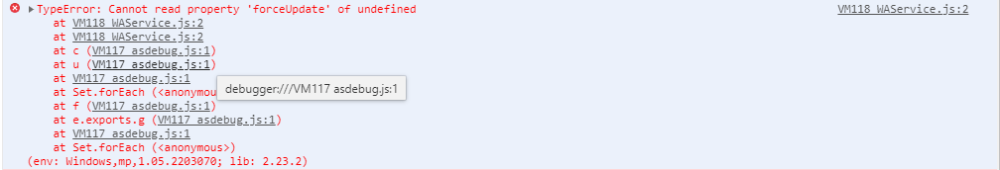

### 基础

#### 页面跳转

```
// 参考地址
https://uniapp.dcloud.net.cn/api/router.html

uni.navigateTo()
```

### 功能

#### 下拉刷新

页面基础下拉刷新要配置两个地方：

1）`pages.json`中的`pages`配置

```
// pages.json
{
	"pages": [
		{
			"path"： "pages/start/start",
			"style": {
				"navigationBarTitleText": "标题"，
				"enablePullDownRefresh": true  // 是否开启下拉刷新 1. true 是 2. false 否
			}
		}
	]
}
```

2）页面中写入对应功能

```
export default {
	onPullDownRefresh(){
		// 异步方法执行完，要执行停止下拉刷新，否则可能出现问题
		try{
			// ...
    }catch(e){
    	console.log(e.message)
    }finally{
    	if(type){
    		// 停止下拉刷新的方法
    		uni.stopPullDownRefresh()
   	 	}
    }
	}
}
```

#### `getApp()`

`getApp()`方法用来获取`App()`实例

##### 操作全局变量

使用`uniapp`开发的微信小程序中操作全局变量

1）定义全局变量

在`App.vue`中定义变量

```
export default {
	// 定义全局变量
	globalData: {
    openid:""
  },
  
  onLaunch: function(){
  	// ...
  }
}
```

2） 其他组件中使用全局变量

```
// 赋值
getApp().globalData.openid = 1

// 取值
const openid = getApp().globalData.openid
```

#### 文档预览

`uni.openDocument(OBJECT)`支持在新页面打开文档

支持格式：`doc, xls, ppt, pdf, docx, xlsx, pptx`

在开发者工具上会打开对应的预览文件，手机端才能看到真实效果

```
wx.downloadFile({
	url: 'http://xxx', // 文档的原地址
  success: function (res) {
  	const filePath = res.tempFilePath
    wx.openDocument({
        filePath: filePath,
        success: function (res) {
          console.log('打开文档成功')
        }
    })
   },
})
```

##### 头部显示文件名称

由于微信默认存储文件位置是文件的临时路径，所以，新页面文件的头部名称会是一个字符串


为了解决上述问题，需要定义，文件的下载路径：

```
wx.downloadFile({
	url: 'http://xxx',
	// 定义文件名称
	filePath: wx.env.USER_DATA_PATH + '/' + 'xx.doc',
  success: function (res) {
  	// 更换此处取值，不是用微信默认的 tempFilePath
  	const filePath = res.filePath
    wx.openDocument({
        filePath: filePath,
        success: function (res) {
          console.log('打开文档成功')
        }
    })
   },
})
```

效果展示：

1）有个不足之处，头部没法不展示后缀


#### 自定义底部导航

`uniapp` 官方推荐使用微信小程序的自定义底部`tab`，所以语法都要按小程序的来。不能是`uniapp` 语法

将小程序文档中的自定义导航`demo`复制到`uniapp`项目中

```
// 小程序 tabbar文档地址
https://developers.weixin.qq.com/miniprogram/dev/framework/ability/custom-tabbar.html
// 将 custom-tab-bar 目录复制
// 若uniapp 项目中存在 src 目录，则拷贝到src目录下， 若不存在，直接放在根目录,切组件名称不能变

// demo
../demo/uniapp/tabbar/custom-tab-bar
```


### 报错

#### 编译时报错

新建 `uniapp` 时，运行到微信小程序，微信开发者工具报错如下；



缺少应用的 `appId`， 注册流程：

```
// 登录地址
// 注册成为开发者，并创建应用，应用名称要与本地项目名称一致
https://dev.dcloud.net.cn/

// 在本地 manifest.json - 微信小程序配置 - 基础配置 - uni-app 应用标识（AppId）
// 2. 微信小程序AppId， 微信小程序开发者工具获取,如果要用测试号，在创建小程序那里取一个即可
```