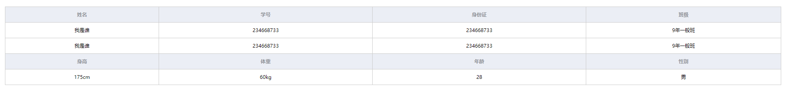
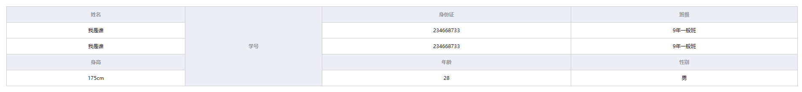
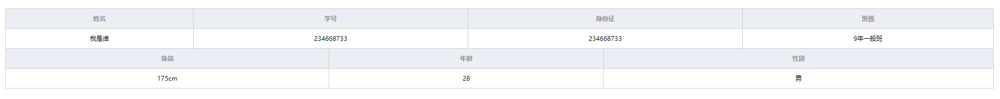

### 基本的多行间隔表头

#### 实现功能



#### 组件代码

\<template>  

```
<div class="base-muti-table">
		<table border="0" cellspacing="0" cellpadding="0">
			<tr v-for="(item, index) in dataList" :key="index">
				<template v-if="item.th">
					<th
						v-for="(list, listIndex) in item.list"
						:key="listIndex"
						:rowspan="list.rowspan"
						:colspan="list.colspan"
					>
						{{ list.label }}
					</th>
				</template>
				<template v-else>
					<td
						v-for="(list, listIndex) in item.list"
						:key="listIndex"
						:rowspan="list.rowspan"
						:colspan="list.colspan"
					>
						<el-input 
							v-model="data[list.prop]"
							v-if="list.isEdit"
						>
						</el-input>
						<span v-else>
							{{data[list.prop]? data[list.prop] : '暂无' }}
						</span>
					</td>
				</template>
			</tr>
		</table>
</div>
```

\<script>

```
export default {
	props: {
		data: {
			type: Object,
			default: ()=> ({
				name: '我是谁',
				class: '9年一般班',
				studentNum: '234668733',
				height:'175cm',
				weight: '60kg',
				years: '28',
				sex: '男'
			}),
		},

		dataList: {
			type: Array,
			// 以下是数组的基本格式
			//如果 th 为 true 说明是表头，false 则为正常列

			default: () => [
				{
					th: true,
					list: [
						{
							label: '姓名',
						},
						{
							label: '学号',
						},
						{
							label: '身份证',
						},
						{
							label: '班级',
						}
					],
				},
				{
					th: false,
					list: [
						{
							prop: 'name',
						},
						{
							prop: 'studentNum',
						},
						{
							prop: 'studentNum',
						},
						{
							prop: 'class',
						}
					],
				},
				{
					th: false,
					list: [
						{
							prop: 'name',
						},
						{
							prop: 'studentNum',
						},
						{
							prop: 'studentNum',
						},
						{
							prop: 'class',
						}
					],
				},
				{
					th: true,
					list: [
						{
							label: '身高',
						},
						{
							label: '体重',
						},
						{
							label: '年龄',
						},
						{
							label: '性别',
						}
					],
				},
				{
					th: false,
					list: [
						{
							prop: 'height',
						},
						{
							prop: 'weight',
						},
						{
							prop: 'years',
						},
						{
							prop: 'sex',
						}
					],
				},
			],
		},
	},
	
};
```

\<style>

```
<style scoped lang="scss">
    table{
        // table-layout: fixed;
        border-collapse: collapse;
        padding: 5px;
        // margin: 20px;
        width: 100%;
        th,td{
            padding: 12px;
            font-size: 12px;
            border: 1px solid #ccc;
        }
        th{
            background: #ebeef5;
            color: #909399;
        }
        td{
            text-align: center;	
        }
    }


    .base-muti-table {
        width: 100%;
        padding: 20px;
        box-sizing: border-box;
    }
</style>
```


### 实现独占列的实现

#### 实现功能



#### 实现代码

这里其实有点不太智能的感觉，因为设置相应列的时候需要去控制列的数组长度，对比以上，只是参数做了改变

\<script> 代码如下

```
dataList: {
			type: Array,
			
			default: () => [
				{
					th: true,
					list: [
						{
							label: '姓名',
						},
						{
							label: '学号',
							rowspan: 5  //新增此项，并将对应列的参数删除
						},
						{
							label: '身份证',
						},
						{
							label: '班级',
						}
					],
				},
				{
					th: false,
					list: [
						{
							prop: 'name',
						},
						//删除此处
						{
							prop: 'studentNum',
						},
						{
							prop: 'class',
						}
					],
				},
				{
					th: false,
					list: [
						{
							prop: 'name',
						},
						//删除此处
						{
							prop: 'studentNum',
						},
						{
							prop: 'class',
						}
					],
				},
				{
					th: true,
					list: [
						{
							label: '身高',
						},
						//删除此处
						{
							label: '年龄',
						},
						{
							label: '性别',
						}
					],
				},
				{
					th: false,
					list: [
						{
							prop: 'height',
						},
						//删除此处
						{
							prop: 'years',
						},
						{
							prop: 'sex',
						}
					],
				},
			],
		},
```

### 实现参差不齐的表头

#### 实现功能



#### 实现代码

\<script>

实现方法： 计算每列数，取最小公倍数（例如 上图 （4 * 3）再平均给每个列的 colspan 属性，即得到每列的 colspan 值）

```
dataList: {
			type: Array,

			default: () => [
				{
					th: true,
					list: [
						{
							label: '姓名',
							colspan: 3
						},
						{
							label: '学号',
							colspan: 3
						},
						{
							label: '身份证',
							colspan: 3
						},
						{
							label: '班级',
							colspan: 3
						}
					],
				},
				{
					th: false,
					list: [
						{
							prop: 'name',
							colspan: 3
						},
						{
							prop: 'studentNum',
							colspan: 3
						},
						{
							prop: 'studentNum',
							colspan: 3
						},
						{
							prop: 'class',
							colspan: 3
						}
					],
				},

				{
					th: true,
					list: [
						{
							label: '身高',
							colspan: 4
						},
						
						{
							label: '年龄',
							colspan: 4
						},
						{
							label: '性别',
							colspan: 4
						}
					],
				},
				{
					th: false,
					list: [
						{
							prop: 'height',
							colspan: 4
						},
						{
							prop: 'years',
							colspan: 4
						},
						{
							prop: 'sex',
							colspan: 4
						}
					],
				},
			],
		},
```

