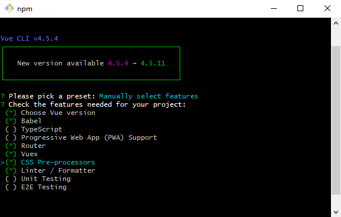
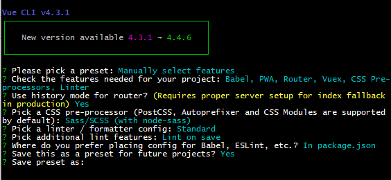
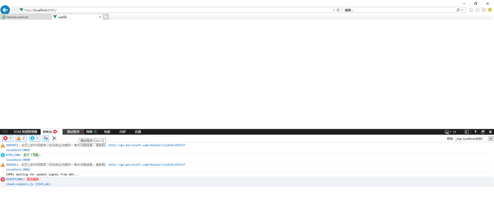
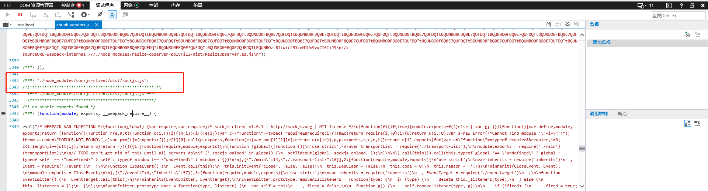

### `vue-cli`

#### 卸载旧版

如果有全局安装了旧版本`vue-cli`(`1.x`或者 `2.x`)，使用以下命令卸载：

```
npm uninstall vue-cli -g
# OR
yarn global remove vue-cli
```

#### 安装

##### 全局安装

使用如下命令安装新的包：

```npm
npm install -g @vue/cli
# OR
yarn global add @vue/cli
```

检查是否安装成功

```
vue --version
```


##### 局部安装

```
// 初始化 package.json
npm init -y

// 安装 vue-cli
yarn add -D @vue/cli
or
npm i -D @vue/cli

// 查看是否安装成功
npx vue -V

// 创建项目
npx winpty vue.cmd create project-one
```


### `vue`项目

#### 创建项目

##### `vue create`

```
//Windows 上通过 minTTY 使用 Git Bash，交互提示符并不工作
$ winpty vue.cmd create [项目名称]
OR
$ vue create [项目名称]
```

##### 预设选择



##### 自定义选择

1）使用回车确定

2）使用空格选择



##### 启动服务

```
cd [项目名称]
yarn serve
```

##### 参考链接

```
https://www.jb51.net/article/160146.htm

// config 配置
https://juejin.im/post/5bd02f98e51d457a944b634f
```


### `vue.config.js`

以下为 `vue-cli` 配置

#### `devServer`

##### 自动打开浏览器

```
module.exports = {
  devServer: {
    open: true,  //自动开启浏览器
    port: 8099 //配置端口号
  }
}
```

##### 反向代理配置

```
// vue.config.js 配置
module.exports = {
  // 开启代理服务器
  devServer: {
		proxy: {
			'/api': { // 将以 /api 开头的请求转发到 https://danjuanapp.com 底下
        target: 'https://danjuanapp.com',
        ws: true, // 用于支持 websocket
        changeOrigin: true, // 用于控制请求头中的 host 值
        secure: false,
   			// pathrRewrite 匹配前缀，不然代理服务器会将前缀 '/api',作为请求路径
   			// { 正则 , 匹配后的值 }
        pathRewrite:{'^/api': ''}
      },
		}
  },
}

// index.vue 使用
<script>
	import axios from 'axios'
	export default {
		mounted(){
			// 发送 axios 请求
      axios.get('/api/v3/filter/fund?type=1&order_by=1m&size=10&page=1')
    }
	}
</script>
```

#### `source map`

```
module.exports = {
  // 不需要生产环境的 source map
  productionSourceMap: false,
}
```

#### `eslint`

##### 关闭`eslint`

1）配置`vue.config.js`文件

```
module.exports = {
	lintOnSave: false
}

// 需要重新运行项目
```

2）注释或删除掉 `eslintrc`配置文件

可能是在`package.json` ，也可能是在  `.eslintrc.js`


### `package.json`

#### 配置局域网访问变量

```
"scripts": {
	// --host 后面为 ip 地址 
	//--port 端口号，可以不用配置，默认端口号
	"dev": "vue-cli-service serve --host 192.168.199.126" --port 9082,
}
```


### 模式和环境变量

#### `vue-cli` 默认模式

##### 三个默认模式

```
development 模式用于 vue-cli-service serve

test 模式用于 vue-cli-service test:unit

production 模式用于 vue-cli-service build 和 vue-cli-service test:e2e
```

##### 修改默认模式

```
// 使用 --mode 选项修改模式

vue-cli-service build --mode development
```

#### 环境变量

##### 环境变量与模式的关系

```
// 1. 文件 .env.[mode] 这个 mode 应该与上面的模式一致

如果将默认模式修改为: vue-cli-service serve --mode dev
则 .env 需要命名为 .env.dev 不然取不到值

// 2.  若 .env.[mode] 文件中没有设置 NODE_ENV=XXX, 则 NODE_ENV 默认值为 [mode]
```

#### 获取当前环境

```
// NODE_ENV 决定运行的模式
// main.js 中打印
console.log('env', process.env.NODE_ENV)
```

### 静态资源

#### 访问public文件夹

1）描述

任何放置在`public`文件夹的静态资源都会被简单复制，而不经过`webpcak`.需要通过绝对路径来引用他们。

2）在`public/index.html`或其他通过 `html-webpack-plugin`用作模板的HTML文件中，需要通过`<%= BASE_URL %>`设置链接前缀：

```html
<link rel="icon" href="<%= BASE_URL %>favicon.ico">
```

3）在模板中，你首先需要向你的组件传入基础URL:

```JS
data(){
    return{
        publicPath: process.env.BASE_URL
    }
}
然后：

```

4）在 sass 中使用

```css
.bg{
	background: url('/img/mini-bg.png');
	// '/' 表示根路径，此路径是在 public/img 下
}
```

#### 引入`src/assets`图片

##### 使用相对路径引入

```
 
```

##### 使用 require

```
require('@/assets/images/demo.png')
```

#### 样式引入

##### 在`scss`中引入

```
@import './'
```

##### 引入全局样式

```script
<script>
	import '@/assets/css/icon.css';
	import '@/assets/css/common.scss';
</script>
```

##### 引入局部样式

```script
<style lang="scss" scoped>
	@import "../assets/css/icon.css";
	@import "../assets/css/common.scss"
</style>
```

##### 引入`assets`背景图

```
 background: url('~@/assets/imgs/fontBackgroun.png') no-repeat 100% 100%;
```

#### 引入`JSON`文件

##### `import`

```
// xxx.json
{
	"code": "0000",
	"msg": "xxxx"
}

// xxx.vue 
import GansuJson from "../api/100000_full.json"

```

##### `axios`

```
// json 应放在 public 文件夹

// xxx.vue
import axios from "axios";

axios.get("/620000_level_3.json")
	.then(res => {
	
	}
)
```


### 错误

#### 兼容 `ie`

新建的 `vue-cli4`项目用`ie`打开报语法错误，如下图所示:



点击报错信息如下图所示：



一般是引用外部依赖没被识别

解决方案：

1）安装 `babel/polyfill`依赖包

```
yarn add @babel/polyfill // 生产依赖
```

2）在`vue.config.js`配置`transpileDependencies`

```
module.exports = {
  devServer: {
    open: true,
  },
  lintOnSave: false,
  // 将上图依赖文件添加此处
  transpileDependencies: [
    'sockjs-client'
 	]
}
```


### 功能

#### 浏览器标题设置

##### 页面设置标题相同

```
<head>
	<title>我是标题</title>
</head>
```

##### 页面设置标题不同

```
router - index.js

// 路由中定义路由元信息
const router = new Router({
	routes: [
		{
			path: 'index',
			meta:{
				title: '首页' //在此处设置标题
			}
		}
	]
})

// 在路由的全局前置守卫进行拦截
main.js

router.beforeEach((to, from, next) =>{
	document.title = to.meta.title
})

```

##### 自定义指令设置标题

```

```

