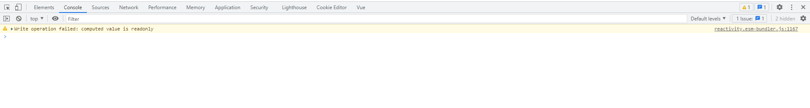

## 基础

### 模板语法

#### 文本插值

```
<span>Message: {{ msg }}</span>
```

### 指令

#### `v-bind`

##### `:class`

`class`与 `:class`是可以同时存在

```
<div class="xxx" :class="xxx">测试样式</div>
```

1）对象写法

```
<template>
  // 基本对象写法 1.active 是 class 名称，2. isShow 布尔值
  // {class 属性名称: 一个布尔值} 
  <div class="xxx" :class="{active: isShow}">测试样式</div>
  
  // 如果 class 属性名称是多个字符，需要使用引号 ''
  <div :class="{'is-active': isShow}">测试样式</div>
  
</template>

<script setup>
import { ref } from 'vue'

let isShow = ref(true)
let isMore = ref(false)

</script>

<style scoped lang="scss">
.active {
  color: red;
}

.is-active{}
</style>

```


#### `v-model`

使用 `v-model`绑定组件

```
// 组件上的 v-model 使用 modelValue 作为 prop 和 update:modelValue 作为事件

// 父组件
<child v-model="isShow"></child>

// 子组件
<el-button 
	@click="$emit('update:modelValue', false)"
>
取消
</el-button>

export default {
	props: {
		modelValue:{
			
		}
	}
}
```

### 响应式

#### 响应式函数

##### `reactive`

创建响应式对象或者数组：

```
<script setup>
  import { reactive } from 'vue'

  const arr = reactive([1,2,3])
  const obj = reactive({})
	// 定义方法
  function changeItem(){
    // 新增的数据是响应式的
    obj.count = 1

    // 数组也可以直接更改
    arr[0] = 10
  }
</script>
<template>
  <div>响应式数组{{ arr }}</div>
  <div>
    <a @click="changeItem">点我响应式{{ obj.count }}</a>
  </div>
</template>
```

##### `ref`

`ref` 可以允许创建任何值类型的响应：

```
// ref 要通过 value 的值才能得到数据
<script setup>
  import { ref } from 'vue'

  let num = ref(0)
  const obj = ref({count: 1})

  console.log('num', num.value) // 0
  console.log('obj', obj) // 这个是响应式对象

  function changeItem(){
    obj.value.count = 2
    num.value = 3
  }
</script>

<template>
  <div>响应式语句{{ num }}</div>
  <div>
    <a @click="changeItem">点我响应式{{obj.count}}</a>
  </div>
</template>
```

##### 语法糖

```
// 目前使用以下代码还会报错
let num = $ref(0)
```

##### 总结

```
// reactive 只对引用值类型有效（对象，数组，Map, Set），对于原始值类型无效
// reactive 一般用于引用数据类型响应式， ref 用于基本数据类型
```

#### `nextTick`

当`dom`更新完成时使用这个函数：

```
import { nextTick } from 'vue'

function changeItem(){
	// 操作更新dom的方式
	...
	nextTick(() => {})
}
```

### 计算属性

#### 区别

计算属性与普通方法的主要区别：计算属性有缓存，只有响应式数据改变的时候，才会执行，而普通方法是都会执行

#### 语法

##### 基本语法

```
<script setup>
import { ref, computed } from 'vue'

let data = ref(0)

const num = computed(()=> {
  // 必须有可以响应的值,属性才能发生变化
  return data.value
})

function changeValue(){
  data.value ++
}
</script>

<template>
  <div>
    <button @click="changeValue">触发修改值</button>
    <div>我的值是{{num}}</div>
  </div>
</template>
```

##### 修改计算属性值

如果需要修改计算性的值，以下方法修改值会出现如下图提示：

```
import { ref, computed } from 'vue'

let data = ref(0)

let num = computed(()=> {
  return data.value
})

function handleClick(){
  data.value++
}

function handleChange(){
	// 直接修改计算属性
  num.value = 100
}

</script>

<template>
  <a @click="handleClick">点击我 ++</a>
  <br>
  <a @click="handleChange">点击我修改 count 值</a>
  <div>我是计算属性的值{{num}}</div>
</template>
```

由于计算属性默认是可读的。修改值时会收到一个运行时警告。

当我们想修改值时，需要用到计算属性的`getter`和`setter`

```
// 将上述的计算属性改为如下
let num = computed({
  get(){
    return data.value
  },
  set(val){
  	// 计算属性修改时，会触发set方法，回调参数是修改后 num 的值
    console.log('value', val)
    // 通过修改 get 方法中关联的值，间接修改 num
    data.value = 99
  }
})
```

##### 计算属性传参

```
<script setup>
import { ref, computed } from 'vue'

let data = ref(0)

const num = computed(()=> {
  // 使用闭包
  return (val) => {
    console.log('val', val)
    return data.value
  }
})
</script>

<template>
	<div>我的值是{{num(2)}}</div>
</template>
```

### `dom`操作

#### `ref()`

在标签上绑定`ref`，然后`scritpt`中声明一个同样名称的变量

```
import { ref , nextTick} from 'vue'

// 变量名需要与 div 绑定的 ref 名称一致
const myRef = ref()

console.log('myRefOuter', myRef.value) // undefined

nextTick(() => {
  // 这里才能获取到 dom 对象
  console.log('myRef', myRef.value) 
  myRef.value.style ='color: red'

})
</script>

<template>
  <div ref="myRef">我是ref测试</div>
</template>
```

#### 路由跳转

组合式api

```
script setup>
  import { useRouter } from 'vue-router'
  const router = useRouter()
  
  const goHome = () => {
    router.push('/welcome')
  }
</script>
```

