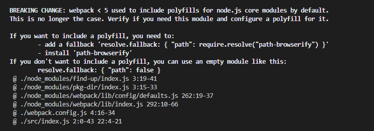

## webpack 5 引入 polyfill

webpack 5 需要手动引入 polyfill， 不然会有如下报错提示：



### 安装依赖包

```
//若不需要一下配置时，可不需要安装以下依赖包，直接配置 webpack.config.js 下的配置为false, 例如: path: false

npm install path-browserify
npm install assert
npm install util
npm install stream-browserify
npm install os-browserify
npm install stream-http
npm install https-browserify
npm install constants-browserify
npm install vm-browserify
npm install buffer
npm install crypto-browserify
npm install tty-browserify
```

### 配置 webpack.config.js

```
module.exports = {
    resolve:{
        fallback: {
            path: require.resolve("path-browserify"),
            assert: require.resolve("assert/"),
            util: require.resolve("util/"),
            stream: require.resolve("stream-browserify"),
            os: require.resolve("os-browserify/browser"),
            http: require.resolve("stream-http"),
            https: require.resolve("https-browserify"),
            constants: require.resolve("constants-browserify"),
            vm: require.resolve("vm-browserify"),
            buffer: require.resolve("buffer/"),
            crypto: require.resolve("crypto-browserify"),
            tty: require.resolve("tty-browserify")
        }
    },
}
```

