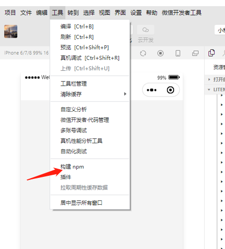

### 功能

#### 获取头像功能

```
https://developers.weixin.qq.com/community/develop/doc/000e881c7046a8fa1f4d464105b001?blockType=1
https://blog.csdn.net/qiushi_1990/article/details/115412465
https://developers.weixin.qq.com/community/develop/doc/000cacfa20ce88df04cb468bc52801?blockType=1
https://blog.csdn.net/lucky_Zeng/article/details/80066479
https://blog.csdn.net/yuan_618859/article/details/123145918
wx.getUserProfile 只能手动触发
```

#### 实现左滑删除

```
./demo/01-左滑删除
```

### 语法

#### 取值

##### 取`value`值

小程序没有双向绑定，需要方法取值

```
<input 
	value="{{addrData.address}}"
	bindchange='addrChange'
/>

//使用 bindchange 触发事件

js

addrChange(e){
	let value = e.detail.value
}
```

##### 取标签中绑定值

1）在标签中自定义属性 `data-x = ''`

```
<button bindtap = 'clickMe' data-id='1' > 点击</button >

// 用e对象中的.currentTarget.dataset.xx 即可取到值
clickMe: function(e) {
  var id = e.currentTarget.dataset.id
  console.log(id);
}
```

2）直接绑定`id`

```
<button bindtap = 'clickMe' id='1' > 点击</button >

// 用e对象中的.currentTarget.id 即可取到值
clickMe: function(e) {
  var id = e.currentTarget.id
  console.log(id);
},
```

#### 赋值

```
addrChange(e){
	let data = `addrData.address` //将对象值赋成字符串
	this.setData({
		[data]: e.detail.value,
		value: e.detail.value
	})
}
```

#### 拦截器

```
<wxs module="fn">
module.exports = {
	formatType: function (str) {
    if (str) {
      switch (str) {
        case 1:
        	return '场地'
        case 2:
        	return '物料'
        default:
        	return ''
       }
    }
  },
}
</wxs>
<view>{{fn.fformatType(str)}}</view>
```

#### 显示/隐藏底部`tabBar`

```
// 隐藏
wx.hideTabBar()

// 显示 
wx.showTabBar()
```

### 页面

#### 关闭页面

1）关闭当前页面

```
wx.navigateBack({})
```

2）关闭当前页面，返回上一页面或多级页面

```
// @delta 1 为关闭当前页面，2关闭上上级，依此类推
wx.navigateBack({
  delta: 1
})
```

3）关闭当前页面，跳转到应用内的某个页面，但不允许跳转到有`tabBar`页面

```
wx.redirectTo({
  url: '../index/index'
})
```

#### 页面传参

1）将参数拼接在`url`后进行传递

```
wx.navigateTo({
  url: '../index/index?id=1&name=aaa',
})

// 另一个页面取值,在生命周期 onLoad 中 options 中即可获取
onLoad: function (options) {
  var id = options.id
}
```

2）全局变量

```
//全局变量app.js
globalData: {
  id: null
}

//赋值
var app = getApp();
app.globalData.id = 2

//取值
var app = getApp();
var id = app.globalData.id
```

### 事件

#### 点击事件

```
// wxml
bindtap = "clickMe"

js
clickMe(e){}
```

#### 阻止事件冒泡

```
// 将 ·bindtap· 改为 catchtap
<view bindtab="toDo">
	<view catchtap="stopPro"></view>
</view>
```

### 指令

#### `wx:for`

```
<view wx:for="{{arr}}">{{item}}</view>
```

### 标签

#### `image`

```
<image src="{{src}}"></image>
```

### 其他

#### 使用`npm`包

##### 初始化`package.json`

```
npm init -f
```

##### 安装第三方依赖

```
npm i xxx
```

##### 勾选 `npm` 模块(但是目前新版好像没有)

在微信开发工具，详情-本地设置-中勾选使用`npm`

##### 构建`npm`

在工具栏中，使用构建工具。



#### 背景图

```
小程序不支持直接使用背景图，可用base64 代替，但是base64 的数据量过大，会影响到整个包的大小，慎用
```

#### 处理富文本图片路径

```
// 当图片在富文本中没有完整URL时，在数据返回时使用 replace 方法 来替换
data = data.replace(new RegExp(/src=\"/g), `style="width: 100%" src="${app.globalData.imgUrl}` );
```

#### 渲染富文本中的` html`

```
// 使用 rich-text 标签，node 的值为富文本标签
<rich-text nodes="{{goodList.goods_content}}"></rich-text>
```

#### 等待 `app.js` 中 `login` 执行完再执行其他方法

```
App({
  onLaunch: function () {
    wx.login({
      success: res => {
        this.globalData.checkLogin = true;
        //由于这里是网络请求，可能会在 Page.onLoad 之后才返回
        // 所以此处加入 callback 以防止这种情况
        if (this.checkLoginReadyCallback){
          this.checkLoginReadyCallback(res);
        }
      }
    })
  },
  globalData: {
    checkLogin: false
  }
  
  ...
})
 

//index.js
//获取应用实例
const app = getApp()
 
Page({
  data: {
    test: false
  },
  onLoad: function () {
    let that = this;
    //判断onLaunch是否执行完毕
    if (app.globalData.checkLogin){
      that.setData({
        test:true
      })
    }else{
      app.checkLoginReadyCallback = res => {
      	  //登陆成功后自己希望执行的，和上面一样
        that.setData({
          test:true
        })
      };
    }
  }
})
```

### 快速开发

#### `vant ui`

1）下载源码

```
github 地址：https://github.com/youzan/vant-weapp
```

2）复制文件夹

```
dist文件夹复制到小程序 **pages**目录下，重命名为vant
```

3）配置组件

```
// 在需要使用组件的页面的json文件中引入配置，例如index.json：

"usingComponents": {
  "van-button": "../../vant/button/index"
}
```

4）使用组件

```
// 在wxml文件中直接使用组件，如index.xwml:

<van-button type="default">默认按钮</van-button>
<van-button type="primary">主要按钮</van-button>
```

#### 编译`scss`为`wxss`

```
// 参考以下目录
/tools/vscode.md
```

