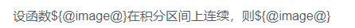
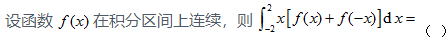

#### 前言

存在一个需求，给定的一串字符串中存在图片的`url`的代替变量`a`,现需要将变量`a`替换成``标签进行渲染，很正常的想到的方法是用 `v-html` 指令渲染。
由于 `v-html` 是更新元素的 `innerHTML`，只会按普通`HTML`插入，`vue` 的语法就不能使用了，之后代替的方法就是用组件了。

#### 解决思路

为了进行模板解析，使用了 `render` 函数

#### 效果

未处理前：



处理后




#### 源码

```vue
<template>
  <div class="subject-analysis">
    <title-wrap 
      :subject="subject(data, list)" 
      @handleChangeImg="toShow(val)"
    ></title-wrap>
  </div>
</template>

<script>
import Vue from 'vue'
export default {
  name: 'SubjectAnalysis',
  props: {
    data: {// 这里传入得是文本
      type: String,
      default: '设函数${@image@}在积分区间上连续'
    },
    list:{// 这个对应图片的list
      type: Array,
      default: () => (['https://www.w3school.com.cn/i/eg_tulip.jpg'])
    }
  },
  components:{// 注册局部组件
    'title-wrap':{
      props:{
        subject: {}
      },
      render(h){
        const com = Vue.extend({
          template: `<div>${this.subject}</div>`,
          methods:{
            toShow(val){
              this.$emit('handleChangeImg', val)
            }
          }
        })
        return h(com, {})
      },
      
    }
  },
  computed:{
    // 这个是为了批量替换父级传入的参数
    subject(){
      return (data, list) => {
        let vHtml = data
        let count = 0
        vHtml = vHtml.replace(/\${@image@}/g, function(){
          const imgDom = ``
          count += 1
          return imgDom
        })
        return vHtml
      }
      
    }
  },
  methods:{
    toShow(val){
      // 这里处理
    },
  }
}
</script>
```


