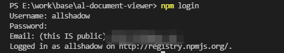

### 起步

#### 安装 vue-cli

```
npm install -g @vue/cli
```

#### 使用旧版的 vue init 功能

```
npm install -g @vue/cli-init
```

#### 初始化项目

```
vue init webpack-simple base-document-viewer
```

#### 下载依赖

```
npm install
```

#### 运行项目

```
npm run dev
```


### npm 注册

1）若没有账号，需要在 npm 上注册一个，官网地址：https://www.npmjs.com/

2）填入信息，邮箱验证即可

3）验证后在本地用命令行进行发布操作

### 发布系列命令

发布需要在本地控制台进行操作，vscode terminal 或 者 git bash

#### 登录命令

键入以下命令时，输入用户信息

```
npm login
```

显示以下信息则为成功，若发现报错，大概率用户信息不正确



#### 确认登录成功

```
npm whoami
```

#### 发布

```
npm publish
```

#### 删除

```
npm unpublish --force //强制删除

npm unpublish guitest@1.0.1 //指定版本号

npm deprecate //某些情况
```

https://zhuanlan.zhihu.com/p/146328240