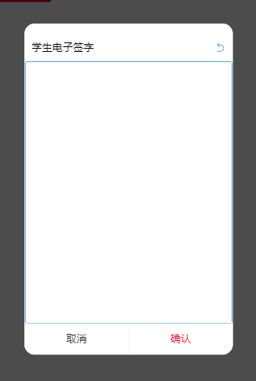

#### 简述

因为项目需要电子签字功能，所以将这个组件代码整理记录。

此组件是基于`van-dialog`与`vue-signature`

#### 效果



#### 安装依赖

##### 全局使用 `vant`

```
yarn add vant

// main.js 引入
import Vant from 'vant';
import 'vant/lib/index.css';
Vue.use(Vant);
```

##### `vue-signature`

```
yarn add vue-signature
```

#### 组件位置

```
https://github.com/Allshadow/mobile-demo

// 运行此项目，点击电子按钮签名看示例
```

#### 组件使用方法

```
<template>
  <!-- 电子签字 -->
  <base-signature
    title="学生电子签字"
    :isShow.sync="signShow"
    @done="done"
  >
  </base-signature>
</template>

<script>
import BaseSignature from '@/components/BaseSignature.vue';

export default {
	data(){
		return {
			signShow: false
		}
	},
	components: {
    BaseSignature
  }
	methods: {
		done(val){
      // 签字返回的内容
    },
    toSign () {
      this.signShow = true
    }
	}
}

</script>
```