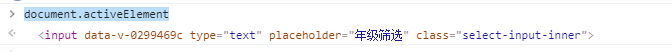

### 事件

#### 绑定事件的方式

##### `dom`元素上绑定

```
// html,方法名中小括号必须写
<div onclick="handleClick()">点击我执行</div>

// js
function handleClick() {
	console.log('我执行了')
}
```

##### `javascript`上绑定

```
// html
<div id="app">点击我执行</div>

// js
var dom = document.getElementById('app')
dom.onclick = function() {
	console.log('我执行了')
}
```

##### `addEventListener`

语法

```
// 事件监听有 3 个阶段，依次是捕获阶段、目标阶段、冒泡阶段
element.addEventListenser(event, funciton, useCapture)
event -- 事件名
function -- 监听函数
useCapture -- 指定事件是否在捕获或冒泡阶段执行， true 为捕获，false 为冒泡。默认 false
```

绑定

```
// html
<div id="app">点击我执行</div>

// js
var dom = document.getElementById('app')
dom.addEventListener('click', function(e) {
	console.log('我执行了')
})
```


#### `this`

##### `dom`元素上绑定

```
// html, 必须传参，不然获取不到
<div onclick="handleClick(event, this)">点击我执行</div>

// js
function handleClick(e, _this) {
	console.log('e', e)
  // 存在子元素时，点击到子元素，e.target == _this应为 false
  console.log('target', e.target == _this)
  // _this <div onclick="handleClick(1)">点击我执行</div>
  console.log('_this', _this)
}
```

##### `javascript`上绑定

```
// html
<div id="app">点击我执行</div>

// js
var dom = document.getElementById('app')
dom.onclick = function(e) {
	console.log('e', e)
	console.log('this', this)
}
```

##### `addEventListener`

```
// html
<div id="app">点击我执行</div>

// js
var dom = document.getElementById('app')
dom.addEventListener('click', function(e) {
	console.log('e', e)
	console.log('this', this)
})
```


### `dom`

#### 打印的 `dom`元素

控制台打印出来的 `dom`元素


`debugger` 看到的`dom`


#### 操作`class`属性

##### `classList`

`classList` 属性返回元素的类名

兼容`ie 10`

使用

```
// 获取类名列表
var dom = document.getElementsById('app')
dom.classList // 返回一个 DOMTokenList（好像是类数组）

// 获取类名长度
dom.classList.length

// 获取元素中索引值对应的类名，索引值从0开始
// 如果索引值在区间范围外则返回 null
dom.classList.item(index)

// 添加一个或多个类名
dom.classList.add('aad') // 若有多个用逗号隔开('aa', 'bb')

// 判断类名是否存在, true 存在 false 不存在
dom.classList.contains('aa')

// 移除元素中一个或多个类名
dom.classList.remove('a') // 多个用 ， 隔开

// 在元素中切换类名
// 第一个参数，如果元素中存在类名，则移除返回 false
// 第一个参数，如果元素中不存在类名，则添加返回 true
// 第二个可选参数，设置元素是否强制添加或移除类，不管该类名是否存在
dom.classList.toggle(class, true | false)
```

参考文档

```
https://www.runoob.com/jsref/prop-element-classlist.html
```


##### 兼容低版本

```
// 添加与移除
var dom = document.getElementsById('app')

if(dom.className.indexOf('arrow') == -1){
	dom.className = dom.className + ' arrow'
}else{
  dom.className = dom.className.replace(/ arrow/, '')
}
```


#### 元素焦点问题

##### 获取获得焦点的元素

使用`document.activeElement` 返回文档中当前获得焦点的元素

当元素获取焦点时，控制台中返回元素 `dom`



语法

```
// 获取获得焦点元素
document.activeElement

// 获取焦点元素的标签名称
document.activeElement.tagName
// 返回 'INPUT'
```

##### 判断元素是否获取焦点

```
let myDom = document.getElementById('input')

showList(isShow){
	//对比两个dom 元素是否相等
	if(myDom === document.activeElement){
		return true
	}else{
		return false
	}
}
```


#### 删除当前 `dom` 元素

```
let dom = document.getElementById('subChart')

if(dom){
	dom.parentNode.removeChild(dom)
}
```
