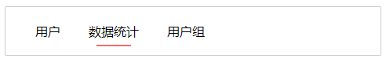
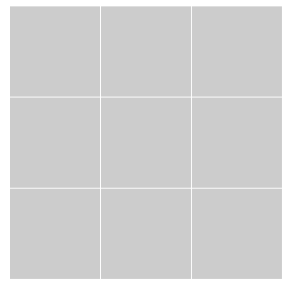
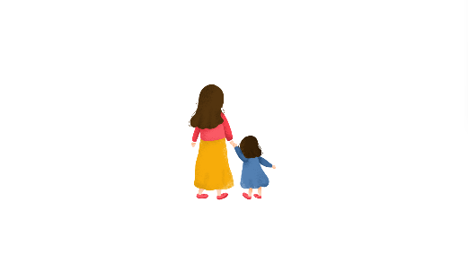
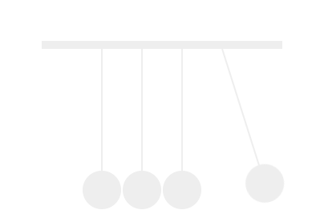

### 功能

#### 01 进度条

##### 需求


##### 源码

```
dom/demo/html/202211/11
```

#### 02 左侧导航菜单

##### 需求


##### 源码

```
dom/demo/html/202211/10
```

#### 03 下拉列表

##### 需求


##### 源码

```
dom/demo/html/202211/12
```

#### 04 页面整体置灰

##### 需求

因为特殊原因，需要将页面置灰


##### 源码

在`css`全局加上以下代码

```
html {
  -webkit-filter: grayscale(100%); /* webkit */
  -moz-filter: grayscale(100%); /*firefox*/
  -ms-filter: grayscale(100%); /*ie9*/
  -o-filter: grayscale(100%); /*opera*/
  filter: grayscale(100%);
  filter: progid:DXImageTransform.Microsoft.BasicImage(grayscale=1);
  filter: gray; /*ie9- */
}
```


### 布局

#### 01

##### 需求

根据分辨率显示背景图的范围

当分辨率为 `1920 * 1080`  时，显示的背景图如下：


当分辨率为 `1366 * 768`时，显示以下背景图：


##### 源码

```
dom/demo/html/202211/01
```

#### 02

##### 需求

根据不同字数展示底部条的长度不同

文字比较小显示如下：


文字比较多显示如下：



##### 源码

```
dom/demo/html/202211/02
```

#### 03

##### 需求

一行三列布局`space-between`问题解决

当每行只有两列时效果如下：


实现效果：


##### 源码

```
dom/demo/html/202211/03
```

#### 04

##### 需求

文本一行时居中显示，多行时居左显示


##### 源码

```
dom/demo/html/202211/04
```

#### 05

##### 需求

九宫格布局



##### 源码

```
dom/demo/html/202211/05
```

#### 06

##### 需求

双列布局


##### 源码

```
dom/demo/html/202211/06
```

#### 07

##### 需求

自定义虚线边框


##### 源码

```
dom/demo/html/202211/07
```

#### 08 表格布局

##### 01 需求

基本表格布局


##### 01 源码

```
dom/demo/html/202211/13/01
```

##### 02 需求

按标签划分区域的表格

##### 02 源码

```
dom/demo/html/202211/13/02
```

#### 09

##### 需求

`3d` 阴影效果


##### 源码

```
dom/demo/html/202211/17
```


### 动画

#### 01 

##### 需求

音频播放


##### 源码

```
dom/demo/html/202211/09
```

#### 02 

##### 需求

抽风动画，左右摆动 `svg`


##### 源码

```
dom/demo/html/202208/01
```

#### 03

##### 需求

平移、旋转、缩放


##### 源码

```
dom/demo/html/202211/08
```

#### 04 

##### 需求

从远到近，再变没有



##### 源码

```
dom/demo/html/202211/14
```

#### 05 

##### 需求

碰撞



##### 源码

```
dom/demo/html/202211/15
```

#### 06

##### 需求

一个轴转圈


##### 源码

```
dom/demo/html/202211/16
```

