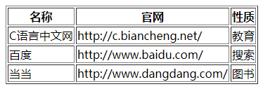
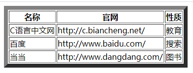
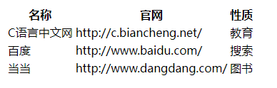
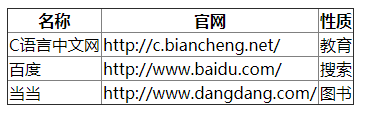

### 功能

#### 进度条

```
./demo/lib/进度条
```


### 文档类型

#### `DTD`

```
DTD(文档类型定义)是一组机器可读的规则，他们定义 XML 或 HTML 的特定版本中允许有什么，不允许有什么
```

#### `DOCTYPE`

```
浏览器通过分析页面的 DOCTYPE 声明来了解要使用哪个 DTD,由此知道要使用 HTML 的哪个版本
```

### 标签

#### 表单

##### `<input>`

```
<input type=”text” placeholder=””>
// placeholder用于提示文字，ie9不支持，可用js桥接value处理兼容
```

#### ``

```

```

#### `<svg>`

实现抽风动画

```
../demo/html/01-抽风动画
```


### `<meta>`

#### 移动端设置不允许缩放

```
<meta 
	name="viewport" 
	content="width=device-width, initial-scale=1.0, minimum-scale=1.0, maximum-scale=1.0, user-scalable=no"
> 

width // viewport的宽度 height - viewport的高度
initial-scale // 初始的缩放比例
minimum-scale // 允许用户缩放到的最小比例
maximum-scale // 允许用户缩放到的最大比例
user-scalable // 用户是否可以手动缩放
```

### `<table>`

```
// 基础表格
./demo/table/01-基本表格布局.html
```

#### 子标签

`<caption>`

```
// 设置表格的标题
// 一个表格中只能有一个 <caption> 标签
```

`<tr>`

```
一个 tr 是一行
```

`<td>`

```
一个 td 算一列
```

`<colgroup>`

```
// 统一设置样式
```

#### 属性

##### `border`

```
// border 属性会为每个单元格添加边框
// border值改变时，只有外部边框会改变
// border = 0 时，显示没有边框的表格
```

`border = 1`



`border = 8`



`border = 0`



##### 合并单元格

```
rowspan  // 表示跨行合并
colspan  // 表示跨列合并 

<!-- n 表示要合并的行数，整数 -->
<td rowspan rowspan="n">单元格内容</td>

<!-- n 表示要合并的列数，整数 -->
<td rowspan colspan="n">单元格内容</td>

// 每次合并 n 个单元格都要少写 n-1 个<td>标签，不然表格会排列错误
```

#### 通过`css`改变其样式

##### 宽度自适应

```
<style>
	table{
		width: 100%; //将表格设为自适应宽度
	}
</style>
```

##### 均分表格

```
<style>
	table{
		table-layout: fixed; 
	}
</style>
```

#### 关于边距问题

##### `cellspacing`

```
// cellspacing 属性设置单元格与单元格边框之间的空白边距

// 将边距设置为 0
<table cellspacing="0"></table>

//等价于
<style>
	table{
		border-spacing:0; // 调整此参数值
	}
</style>
```

##### `cellpadding`

```
cellpadding 设置单元格内容与单元格边框之间的间距

// 将间距设置为 0
<table cellpadding="0"></table>

//等价于
<style>
  th,td {
		padding：0;
	}
</style>
```

##### 合并边框

```
<style>
  table{
  	border-collapse: collapse; 
  }
</style>
```



#### 

### 其他

#### `js`不允许跳转

```
<a href="javascript:void(0);">xxx</a>
```

### `<p>`

#### 特点

块级元素，独占一行

默认有上下边距，分别为16px

### `<hr>`

#### 定义

在页面创建一条水平线

#### 特点

hr 为单标签（空标签），没有结束标签 \<hr>

### `<br>`

#### 定义

插入一个换行符

#### 特点

br  为单标签（空标签），没有结束标签\<br>