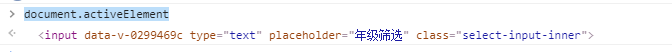

#### 元素焦点问题

##### 获取获得焦点的元素

使用`document.activeElement` 返回文档中当前获得焦点的元素

当元素获取焦点时，控制台中返回元素 `dom`



语法

```
// 获取获得焦点元素
document.activeElement

// 获取焦点元素的标签名称
document.activeElement.tagName
// 返回 'INPUT'
```

##### 判断元素是否获取焦点

```
let myDom = document.getElementById('input')

showList(isShow){
	//对比两个dom 元素是否相等
	if(myDom === document.activeElement){
		return true
	}else{
		return false
	}
}
```


#### 删除当前 `dom` 元素

```
let dom = document.getElementById('subChart')

if(dom){
	dom.parentNode.removeChild(dom)
}
```
