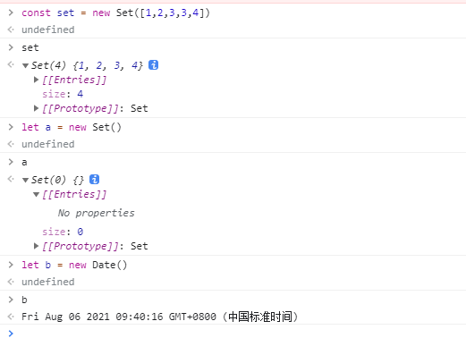

#### 变量声明及申明特性

#####  `let`

```
//特性
1) 不能重复声明
let a = '111';
let a = '222'; //会报错

2) 块级作用域
//只在代码块里面有效， es5之前有全局，函数，eval等作用域
//存在{} 的代码块如果用let声明，都存在块级作用域、
//比如 if else while for..
例子：
{
    let a = '111';
}
console.log(a) //报错a is not define

而如果是var
{
	var a = '111';
}
console.log(a); //打印 111

3) 不存在变量提升
//不允许在声明变量之前使用let定义的变量
例子：
console.log(a); //cannout access 'a' before initialization
let a = '111';

而如果是var
console.log(a); //undefined
var a = '111';

4) 不影响作用域链
//因为当前作用域没有a,则会向上一级来找
{
    let a = '111';
    function fn(){
        console.log(a)
    }
    fn(); // 111
}
```

##### `const`

```
1) 常量一定要赋初始值

2) 一般常量用大写（潜规则）

3) 常量不能修改

4) 块级作用域

5) 对于数组和对象的元素修改，不能算常量的修改，不会报错
const ARR = ['1', '2']
ARR.push('Hello') // 不会报错
ARR[0] = 2 //不会报错
若使用
ARR = '123' //报错

总结： 声明数组或对象时使用 const 比较稳妥
```

#### `...`扩展运算符

##### 数组

1）将一个数组转为用逗号隔开的参数序列

```
let arr = ...[1,2,3,4]
// 报错，生成的是用逗号隔开的序列

console.log(...[1,2,3,4]) 
// 1 2 3 4
```

2）该运算符主要用于函数的调用

#### 变量的解构赋值

##### 定义

允许按照一定模式从数组和对象中提取值，对变量进行赋值

##### 数组解构

1）普通数组解构

```
const F4 = ['小沈阳', '刘能', '李四'];
let [xiao, liu, zhao] = F4;
console.log(xiao)
```

2）复杂解构，开发中不建议使用

```
const products = [
  {
    title: "Nike Air Zoom Pegasus 38",
    price: 120,
  },
  {
    title: "Nike Air Zoom Alphafly NEXT%",
    price: 275,
  },
  {
    title: "Nike Zoom Fly 4",
    price: 89.0,
  }
]

const [tmp = 2 , {title, price}] = products

console.log('我是 map 数组解构')
console.log('title', title)
console.log('price', price)
```

##### 对象的解构

1）普通对象结构

```
const OBJ = {
	name: 'chen',
	hasn: funciton(){
		console.log('我打印出来了')
	} 
}
let {name, hasn} = OBJ;

hasn(); //方法正常调用
//属性解构比较少， 方法解构比较多

```

2）map 对象解构

```
const products = {
  1: {
    title: "Nike Air Zoom Pegasus 38",
    price: 120,
  },
  "name": {
    title: "Nike Air Zoom Alphafly NEXT%",
    price: 275,
  },
  3: {
    title: "Nike Zoom Fly 4",
    price: 89.0,
  },
 };

// const {"name": {title, price}} = products
// 解构只能存在已个或者设置别名
const { 3: {title, price}} = products

console.log('我是 map 对象解构')
console.log('title', title)
console.log('price', price)
```

3）设置解构别名

```
// 普通对象解构设置别名
const data = {id: 1, name: '刘能'}
const {newId: id} = data
console.log('普通对象', newId)

// map 对象
const dataMaP = {
  car: {
    color: '#000',
    height: 200
  }
}

const {car : {newColor: color}} = dataMaP
console.log('map对象', newColor)
```

##### 函数参数解构

```
const funDeconstruction = ({title, remark}) =>{
	console.log('title', title)
	console.log('remark', remark)
}

funDeconstruction({
	title: '我是标题',
	remark: '标记信息'
})
```

4）实用

```
https://my.oschina.net/devpoint/blog/5292444
```

#### 模板字符串

##### 基本用法

```js
1) 声明
let str = `我也是一个字符串`; //反引号``

2）内容中可直接出现换行符
let str = `<ul>
				<li></li>			
			</ul>`

3) 变量的拼接  //`${}`
let first = 1,
    last = 2;
//ES6中使用${NAME}，并将其放在反引号中
let name = 'your name is ${first} ${last}';

//ES6之前拼接字符串
let name = 'your name is ' + first + ' ' + last + '';
```

##### 运算

```
bad：

const name = '小明'
const score = 59

let result = ''

if(score > 60){
	result = `${name}的考试成绩及格`
}else{
	result = `${name}的考试成绩不及格`
}

good:

const name = '小明'
const score = 59
const result = `${name}${score > 60?'的考试成绩及格'：'的考试成绩不及格'}`
```

### 对象的扩展

#### 简化写法

1）允许在大括号里面直接写入变量和函数，作为对象的属性和方法

```js
let name = 'chen'
let change = function(){
	console.log('Hello World')
}

const OBJ = {
	name, //相当于name : name的简化写法
	change,
	inprove(){ //也可以直接这种写发 替代 :function
		
	}
}
console.log(OBJ) // {name: 'chen', change: f, inprove: f}
```

2）打印对象的写法

```
let user = {
	name; 'test'
}

let foo = {
	bar: 'baz'
}

console.log(user, foo)
console.log({user, foo})
```

3）简写的对象方法不能用作构造函数，会报错

#### 属性名表达式

在`es5`中，字面量对象只能用属性标识符作属性名

```
var obj = {
	abc: '123',
}
```

`es6`，支持将变量作为对象的键名

```
let a = 'hello'

const obj = {
	[a]: 'world'
}
```

#### 

#### 箭头函数

```
1) 使用箭头（=>）定义函数
//早期版本
let fn = function(){}

//es6版本
let fn = () =>{}

2) this是静态的
//this始终指向函数声明时所在作用域下的this的值
例子：
function getName(){
    console.log(this.name)
}

let getName2 = () =>{
    console.log(this.name)
}
//设置window 对象的name 属性
window.name = 'chen'
const school = {
    name: 'change'
}
//直接调用
getName();  //chen
getName2(); //chen
//.call方法调用
getName.call(school) //change
getName2.call(school) // chen

2) 不能作为构造实例化对象
let Person = (name, age) =>{
    this.name = name;
    this.age = age;
}
let me = new Person('xiao', 30) //报错
```

#### `promise`

##### 1）定义

```
es6中异步编程的解决方案，promise 是一个构造函数
```

##### 2）实例化 Promise 对象

```
const p = new Promise(function(resolve, reject){
	setTimeout(function(){
		//let data = '数据库中的用户数据';
		//resolve(data); //表示成功
		let err = '数据读取失败'
		reject(err)
	}, 1000)
})

//调用 promise 对象的 then 方法
p.then(function(value){
	//成功时执行
}, function(reason){
	//失败时执行
})
```

##### 3）`promise`

```
promise
.then(result => {...})
.catch(error => {...})
.finally(()=> {...})
```

#### 默认参数

```
//以前javescript原先定义方式
var link = function(height, color, url){
  var height = height || 50;
  var color = color || 'red';
  var url = url || 'http://baidu.com'
}

//ES6中
var link = function(height = 50, color = 'red', url = 'http://baidu.com'){}
```

### `es module`

#### 浏览器直接使用

```
<!-- type=“module” -->
<script src="b.js" type="module"></script>
```

#### `export`

##### 简介

`export`命令用于规定模块的对外接口，`import`命令用于输入其他模块提供的功能。

##### 基本语法

1）输出变量

```
export var firstName = 'Michael';

# or 
var firstName = 'Michael';
export {
	firstName
}
```

2）输出函数或类

```
export function use(){}

# or
function use(){}

export {
	use
}
```

3）变量重命名

```
function use(){}

export {
	use as newName
}
```

4）错误写法

```
// 报错
export 1;

// 报错
var m = 1;
export m;
```

##### `export default`

##### 简介

使用 `export default` 时 `import` 是不用花括号导出

```
// export-default.js
export default function () {
  console.log('foo');
}

import customName from './export-default';
```


#### `import`

##### 简介

使用`import`在其他`js`文件加载`export`命令定义的模块

`import`命令接受一对大括号，里面指定要从其他模块导入的变量名。

大括号里面的变量名，必须与被导入模块（`profile.js`）对外接口的名称相同。

##### 基础语法

```
import { firstName } from './profile.js';

function setName(element) {
  element.textContent = firstName ;
}
```

##### 模块整体加载

```
// util.js
export function area(radius) {
  return Math.PI * radius * radius;
}

export function circumference(radius) {
  return 2 * Math.PI * radius;
}

// main.js
import * as circle from './circle';

console.log('圆面积：' + circle.area(4));
console.log('圆周长：' + circle.circumference(14));

// 下面两行都是不允许的
circle.foo = 'hello';
circle.area = function () {};
```

#### set

1）Set 本身是一个构造函数，用来生成 Set 数据结构

2）Set 结构不会添加重复的值

##### 基本用法

控制台打印出来的结果



初始化

```
const set = new Set()
// 使用 ... 将 set 对象转为数组
let s = [...set]
// []

const set = new Set([1,2,3,4,4,5])
let s = [...set]
// [1,2,3,4,5]
```

##### 与 `map` 方法使用

```
const value = [{name: '陈', age: 22}, { name: '王', age: 18}]
let set = new Set(value.map(ele => ele.name))
let setArr = Array.from(set)

console.log('setArr', setArr)
//setArr (2) ["陈", "王"]
```

#### Map

1) Map 与 Object(对象)的区别

Object 只接受 key 为 字符串，为 字符串-值对应

Map 可以接受各种类型的值作为key, 为值-值对应

2）Map 可以接受数组