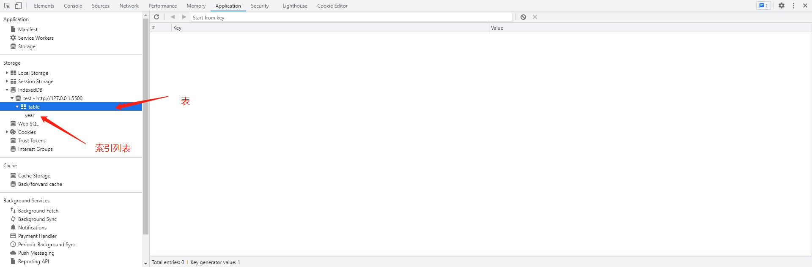

由于后端的数据量太大了，每次请求都会耗费不少时间，所以想着，能否放在本地存储。前端缓存数据量有限，使用`indexedDB`可以满足需求。本文是不考虑兼容性的，也没尝试过到底兼容性如何。先用再说的感觉。

`indexedDB`内部使用键值对存储，用于在客户端存储大量的结构化数据（包括文件/二进制大型对象(`blobs`)）


`demo` 地址:

```
./demo/indexedDB/indexedDB
```

### 基本模式

#### 模式

根据`Mdn`文档上的操作`indexedDB`基本模式为以下几步：

- 打开数据库
- 在数据库中创建一个对象仓库（`object store`）
- 启动一个事务，并发送一个请求来执行一些数据库
- 通过监听正确的类型的`DOM`以等待操作完成
- 在操作结果上进行一些操作

#### 关于`IDBxxx`对象

```
// IDBRequest 为 操作 indexedDB 的返回值
let request = indexedDB.open()

request.onsuccess = (event) => {
	// IDBDatabase 为 IDBRequest 产生的回调 或者 request.result
	db = event.target.result || request.result
}

// IDBTransaction 为 IDBDatabase 操作事务后返回的对象
let transaction = db.transaction(['demo'], 'readwrite');

// IDBObjectStore 操作事务后返回的对象
let objectStore = transaction.objectStore('items');

// IDBIndex 为创建仓库后创建索引值返回的
let myIndex = objectStore.index('lName');

// IDBCursor 为仓库调用 openCursor() 方法返回的
objectStore.openCursor(null, 'next').onsuccess = function(event) {
  let cursor = event.target.result
}
```

| 实体     | 对象             | 获取途径举例                               |
| :------- | :--------------- | :----------------------------------------- |
| 主要对象 | `indexedDB`      | 浏览器原生提供的对象                       |
| 操作请求 | `IDBRequest`     | `request`                                  |
| 数据库   | `IDBDatabase`    | ` db`                                      |
| 事务     | `IDBTransaction` | `transaction`                              |
| 对象仓库 | `IDBObjectStore` | `objectStore`                              |
| 索引     | `IDBIndex`       | `myIndex`                                  |
| 指针     | `IDBCursor`      | `cursor`                                   |
| 主键集合 | `IDBKeyRange`    | 代表数据仓库（object store）里面的一组主键 |

### 实操

#### 创建数据库

新建数据库与打开数据库是用同一个方法。若数据库存在，直接打开数据库，否则就会新建一个数据库（即会触发`upgradeneeded`事件）

我认为主要的一个区别就是`upgradeneeded`事件（此事件只有数据库无版本号到有版本号或者低版本号升级至高版本号的时候才会执行）。

先来看看打开数据库的方法：

```
// open 方法接受两个参数，1. 数据库名称 2. 数据库版本号
// 数据库版本号只能为正整数，只能升才能触发upgradeneeded 事件执行
const indexedDB = window.indexedDB.open('test', 1)

// 由于打开数据库是异步执行，通过三种事件，处理打开数据的操作结果

// error
indexedDB.onerror = function (event) {
  console.log('数据库打开报错');
};

// success
var db;
indexedDB.onsuccess = function (event) {
  db = indexedDB.result;
  console.log('数据库打开成功');
};

// upgradeneeded
var db;

indexedDB.onupgradeneeded = function (event) {
  db = event.target.result;
}
```

谷歌调试工具即可看到有一个数据库，并且带了版本号等信息：


#### 创建`objectStore`

随后，我们该建立数据库仓库了(其实就相当于建表)

```
var db;
indexedDB.onupgradeneeded = function (event) {
  db = event.target.result;
  var objectStore;
  // 判断表是否存在，如果存在就不在创建
  //if (!db.objectStoreNames.contains('table')) {
  //  objectStore = db.createObjectStore('table', { keyPath: 'id' });
  //}
  // createObjectStore 接受两个参数 1. 表名 2. 表配置项
  //{
  //	keyPath: '', // 可以设置成对象中的主键（主键不能重复）
  //  autoIncrement: true // 如果对象中没有合适的主键，则可以自动生成主键
 	//}
  //
  objectStore = db.createObjectStore('table', { keyPath: 'id' });
  
  // 创建索引
  // createIndex 接收三个参数 1.索引名称（一般与键名一致） 2. 键名 3.配置项
  // {
  //  uniqe: 如果设为 true，将不允许重复值
  //  multiEntry 如果设为 true,对于有多个值的主键数组，每个值将在索引里面新建一个条目，否则主键数组对于一个条目。
  // }
  objectStore.createIndex('year', 'year', { unique: false })
}
```



#### 事务

`indexedDB`任何读写操作，都必须在事务里面进行

```
// 一般来说，是在打开数据库后进行事务操作
indexedDB.onsuccess = function (event) {
  const db = indexedDB.result || event.target.result;
  // 创建事务
  // transaction 接收两个参数 1. 要操作的 objectStore 名称 2. mode 操作的模式
  // 1. objectStore 名称接受字符串与数组
  // 2. mode 有 readonly | readwrite 两种模式
  // objectStore 接收一个参数 objectStore 名称
  const transaction = db.transaction('table', 'readwrite').objectStore('table')
};
```

##### 新增数据

新增比较简单，使用事务的`add`方法：

```
indexedDB.onsuccess = function (event) {
  const db = indexedDB.result || event.target.result;
  const transaction = db.transaction('table', 'readwrite').objectStore('table')
  const arr = [
  	{name: '李四', year: 2022, sex: '男'},
  	{name: '张三', year: 2022, sex: '女'},
  	{name: '王五', year: 2021, sex: '男'},
  	{name: '赵六', year: 2020, sex: '男'}
  ]

	arr.forEach(ele => {
  	// 使用事务的add方法
  	transaction.add(ele)
  })
};
```

##### 查询数据

读取数据可分为以下几种：

1）使用主键的值

```
indexedDB.onsuccess = function (event) {
  const db = indexedDB.result || event.target.result;
  const transaction = db.transaction('table', 'readonly').objectStore('table')
	// 获取主键值
	let res = transaction.get(1)

	res.onerror = function(event) {
    console.log('事务失败');
  };

  res.onsuccess = function(event) {
    let result = event.target.result || res.result;
    if (result) {
      console.log('res: ' + JSON.stringify(result));
    } else {
      console.log('未获得数据记录');
    }
  };
}
```

2）使用指针遍历表格

```
indexedDB.onsuccess = function (event) {
  const db = indexedDB.result || event.target.result;
  const transaction = db.transaction('table', 'readonly').objectStore('table')
  
  transaction.openCursor().onsuccess = function (event) {
  	let cursor = event.target.result;
    if (cursor) {
    	console.log('Id: ' + cursor.key);
    	console.log('value', JSON.stringify(cursor.value))
    	cursor.continue();
    } else {
    	console.log('没有更多数据了！');
    }
  }
};
```

3）使用索引

```
// 这种方法筛选出来结果只有一条数据
indexedDB.onsuccess = function (event) {
	const db = indexedDB.result || event.target.result;
  const transaction = db.transaction('table', 'readonly').objectStore('table')
	
	const index = transaction.index('year');
  const request = index.get(2022);

  request.onsuccess = function (e) {
  	var result = e.target.result;
    if (result) {
    	console.log('result', result)
    } else {
    	console.log('没有更多数据了！');
    }
  }
}

// 可以遍历索引值
indexedDB.onsuccess = function (event) {
	const db = indexedDB.result || event.target.result;
  const transaction = db.transaction('table', 'readonly').objectStore('table')
	
	const index = transaction.index('year');

  index.openCursor().onsuccess = function (event) {
    let cursor = event.target.result;
    if (cursor) {
    	console.log('Id: ' + cursor.key);
    	console.log('value', JSON.stringify(cursor.value))
    	cursor.continue();
    } else {
    	console.log('没有更多数据了！');
    }
  }
}
```

##### 更改数据

更改数据需要找到需要更改的那条数据进行替换

```
// 修改的主键不能改变
indexedDB.onsuccess = function (event) {
	const db = indexedDB.result || event.target.result;
  const transaction = db.transaction('table', 'readonly').objectStore('table')
	
	let res = transaction.get(2)

  res.onsuccess = function(event) {
  	let result = event.target.result || res.result;
    if (result) {
    	console.log('res: ' + JSON.stringify(result))
    	result.name = '老頔'
      // 如果主键为递增必须要第二个参数，不然会变为新增
      transaction.put(result, 2)
    } else {
    	console.log('未获得数据记录');
    }
  };
}
```

##### 删除数据

1）清除所有数据

```
indexedDB.onsuccess = function (event) {
	const db = indexedDB.result || event.target.result;
  const transaction = db.transaction('table', 'readonly').objectStore('table')
	
	transaction.clear()
}
```

2）清除当前主键数据

```
indexedDB.onsuccess = function (event) {
	const db = indexedDB.result || event.target.result;
  const transaction = db.transaction('table', 'readonly').objectStore('table')
	
	let request = transaction.delete(1)

  request.onsuccess = function (event) {
    console.log('数据删除成功')
  }
}
```

3）遍历删除

```
indexedDB.onsuccess = function (event) {
	const db = indexedDB.result || event.target.result;
  const transaction = db.transaction('table', 'readonly').objectStore('table')
	
	transaction.openCursor().onsuccess =  (event) => {
    let cursor = event.target.result;
    if (cursor) {
    	if(cursor.value.name == '李四'){
    		cursor.delete()
   		}
    	cursor.continue();
    }else{
    	console.log('没有更多数据了！')
    }
  }
}
```

### 方法总结

#### `IDBObjectStore`

使用此方法需要创建事务，以上的事务中有案例

##### `.add()`

新增数据

```
// add() 接受两个参数: 1.键值 2.主键（可省略，默认为 null）
objectStore.add(value, key)
```

##### `.put()`

用于更新某个主键对应的数据记录，如果对应键值不存在，则插入一条新记录

```
// put() 接受两个参数: 1.新数据 2.主键（可选，且只有在自动递增时才有必要提供，因为那时主键不包含在数据值中）
objectStore.put(item, key)
```

##### `.clear()`

删除仓库的所有记录

```
objectStore.clear()
```

##### `.delete()`

删除指定主键记录

```
// delete() 接受一个参数 1.主键的值
objectStore.delete(Key)
```

