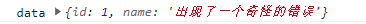
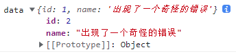
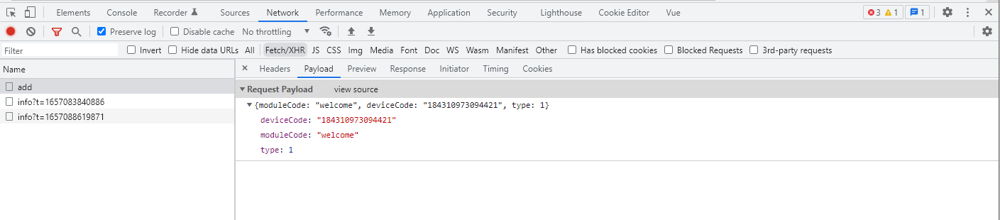
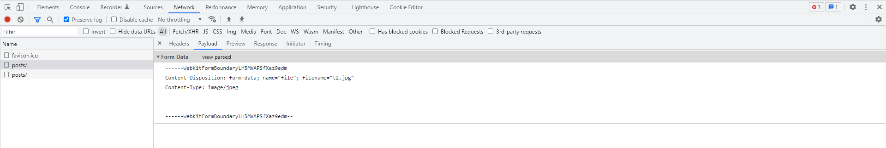

### 基本类型

#### `Number`

##### 千分位处理

```
// 有浮点数也可以处理

let num = 1000000

let newNum = localeStr(num)  //  '1,000,000'

/** 数字变千分位处理 */
function localeStr(num) {
  if (parseFloat(num).toString() === 'NaN') {
    return num;
  }
  let result = '-';
  if (Number(num)) {
    result = Number(num).toLocaleString();
  }
  return result;
}
```

##### 判断是否是数字

1）简单业务

```
// 可以使用
let boolean = +val || 0 
```

2）检验是否是有穷数

`Number.isFinite()`方法只有数值类型的值，并且是有穷的`finite`才返回 `true`

```
Number.isFinite(Infinity);  // false
Number.isFinite(NaN);       // false
Number.isFinite(-Infinity); // false

Number.isFinite(0);         // true
Number.isFinite(2e64);      // true

Number.isFinite('0');       // false, would've been true with
                            // global isFinite('0')
Number.isFinite(null);      // false, would've been true with
                            // global isFinite(null)
```

3）`typeOf`

```
let a = 123
let type = typeof a == 'number' ? true : false
```

4）检测值是否为`NaN`

```
Number.isNaN(NaN);        // true
Number.isNaN("NaN");      // false， 字符串 "NaN" 不会被隐式转换成数字 NaN。
```

5）正则表达式（包含正负整数，0，以及正负浮点数）

```
/**
* 校验只要是数字（包含正负整数，0以及正负浮点数）就返回true
**/
function isNumber(val){
	var regPos = /^[0-9]+.?[0-9]*/; //判断是否是数字。
	return regPos.test(val)
}
```

6）校验正数负数

```
/**
* 校验正负正数就返回true
**/
function isIntNum(val){
	var regPos = / ^\d+$/; // 非负整数 
	var regNeg = /^\-[1-9][0-9]*$/; // 负整数
	return regPos.test(val) && regNeg.test(val)
}
```

##### 解决精度问题

使用`number-precision`库进行运算

1）`github`地址

```
https://github.com/nefe/number-precision
```

2）安装

```
npm install number-precision --save
```

3）方法

```
NP.strip(num)         
// strip a number to nearest right number
NP.plus(num1, num2, num3, ...)   
// addition, num + num2 + num3, two numbers is required at least.
NP.minus(num1, num2, num3, ...)  
// subtraction, num1 - num2 - num3
NP.times(num1, num2, num3, ...)  
// multiplication, num1 * num2 * num3
NP.divide(num1, num2, num3, ...) 
// division, num1 / num2 / num3
NP.round(num, ratio)  
// round a number based on ratio
```

4）使用

```
import NP from 'number-precision'
NP.strip(0.09999999999999998); 
// = 0.1
NP.plus(0.1, 0.2);             
// = 0.3, not 0.30000000000000004
NP.plus(2.3, 2.4);             
// = 4.7, not 4.699999999999999
NP.minus(1.0, 0.9);            
// = 0.1, not 0.09999999999999998
NP.times(3, 0.3);              
// = 0.9, not 0.8999999999999999
NP.times(0.362, 100);          
// = 36.2, not 36.199999999999996
NP.divide(1.21, 1.1);          
// = 1.1, not 1.0999999999999999
NP.round(0.105, 2);            
// = 0.11, not 0.1
```

#### 字符串

##### 去除重复字符串

1）使用`es6` `Map`数据结构

```
[...new Set('ababbc')].join('')
```

##### 判断字符串是否是数字

1）先将字符串转为数字类型，再用`Number`值来判断

#### `Boolean`

##### 虚值

虚值就是在转换为布尔值时变为 `false` 的值

```
undefined / null / 0 （包含 -0 和 +0）/ NaN / ''
```

##### 用法

```
// 字符串 0 转布尔值
Boolean('0') // true

// Number 0 转布尔值
Boolean(0)  // false
```

### 条件语句

#### `switch...case`

##### 基本结构

```
let fruit = 'banana'
// switch 也可以写表达式
// switch 与 case 没有强制类型转化
switch(fruit){
	case "banana":
		// ...
		break;
	case "apple":
	case "orange":
		// ...
		break;
	default: 
		// ...
}
```

#### 三元运算符

##### 判断奇偶数

```
let n = 5
let num = n % 2 === 0 ? '偶数' : '奇数'
```


### 对象

#### 创建对象

##### 键名

对象所有的键名都是字符串。

键名不符合标识名的条件（比如第一个字符为数字，或者含有空格或运算符），且也不是数字，则必须加上引号，否则会报错。

##### 定义对象的属性

定义对象的属性

```
obj.foo = true

obj['a'+ 'abc'] = 'aaa'
```

字面量定义对象的属性

```
var obj = {
	abc: 'foo',
	['a' + 'abc']: true,  // 这种写法 es5 是不支持的
	a b: 'aaa' // 这个是错误写法，要加上引号
}
```


### 数组综合

#### 累加

```
let code = list.reduce((pre, cur) => pre + cur.credit, 0)
```

当不是每项都需要累加时，需要用以下方式

```
let count = list.reduce((pre, cur) => {
	if(cur.status == 1){
		pre = pre + cur.money
	}
	return pre
}, 0)
```

#### 删除元素

删除数组对象中，与另一个数组相同的元素

```
let arr = [
	{id: 1, value: '1'},
	{id: 2, value: '2'},
	{id: 3,value: '3'},
	{id: 4,value: '4'},
	{id: 5,value: '5'},
	{id: 6,value: '6'}
]

let delArr = [3, 4]

const end = arr.filter((ele)=>{
	return delArr.indexOf(ele.id) == -1
})
```

#### 菜单结构

将一维数组转化为一个多层的数据结构

```
// 规则
	// 拥有一个唯一的 id
	// 拥有一个 parentId ，这个 id 指向它父级的 id
const list = [
  { id: 1, pid: 0 },
  { id: 2, pid: 1 },
  { id: 3, pid: 2 },
  { id: 4, pid: 2 },
  { id: 5, pid: 4 },
  { id: 6, pid: 0 }
];

const treeData =  (arr, pid) => {
  return res = arr.filter((item)=> {
    if(item.pid === pid){
      item.children = treeData(arr, item.id)
      	return true
      }
  })
}
console.log('arr', treeData(list, 0))
```

### 数组

#### 过滤虚值

```
const arr = [1, 0, undefined, null]
const trueNum = arr.filter(Boolean)
// trueNum  [1]
```

#### 去空值

```
_arr = _arr.filter(ele => ele && ele.trim())
```

#### 将对象转化为数组

##### `传统写法`

将类数组转化为数组

```
var arrLike = {
	'0': 'a',
	'1': 'b',
	'2': 'c',
	length: 3
}

var arr = [].slice.call(arrLike)
```

##### `Array.from (es6)`

将两类对象转为数组：

1.类数组的对象

2.可遍历`(iterable)`的对象（包括`Set`和'Map'数据解构）

```
let arr = Array.from(arrLike)
```

##### `...(es6)`

转化有`iterable`的对象，普通类数组不能转换

```
let arr = [...arrLike]
```


#### 位置

##### 数组元素交换位置

```
/**
* 数组元素交换位置
* index1 添加项目位置
* index2 删除项目位置
*/
export swapArray = (arr, index1, index2) => {
	arr[index1] = arr.splice(index2, 1, arr[index1])[0]
  return arr
}

/**
* 元素上移/下移的方法
*	@params arr 数组列表
*	@params index 需要移动的索引值
* @params type 上移还是下移， 上移传 'up'
*/
export moveArray = (arr, index, length, type="up") => {
	let length = arr.length
  if(type === 'up'){
    if(index != 0){
      swapArray(arr, index, index - 1)
    }else{
    	console.log('已经处于置顶')
    }
	}else{
    if(index + 1 != length){
      swapArray(arr, index, index + 1)
    }else{
    	console.log('已经处于置底')
    }
  }
}
```

#### 去重

使用 `es6` `Set` 数据结构

```
const array = [1, 2, 4, 6, 4, 4]
let arr = [...new Set(array)]
// arr [1.2.3.4]

or 

let arr = Array.from(new Set(array))
```

#### 取最大/小值

##### 最大值

```
let arr = [1, 3, 5, 7]

Math.max.apply(null, numArray)

or

Math.max(...arr)

or

arr.reduce((a,b)=> a > b ? a : b)
```

##### 最小值

```
let arr = [1, 3, 5, 7]

Math.min(...arr)

or

arr.reduce((a,b)=> a < b ? a : b)
```

#### 排序

##### 打乱数组顺序

```
const arr = [10, 15, true, false]
const randomArr = arr.sort(()=> 0.5 - Math.random())
```

##### 字符串数组

```
arr.sort()
```

##### 数字数组

```
const array  = [40, 100, 1, 5, 25, 10]

// 从小到大排序
array.sort((a,b) => a-b)

// 从大到小排序
array.sort((a,b) => b-a);
```

#### 数组的拷贝

##### 浅拷贝

1）定义

若数据是基本类型，拷贝的是基本类型的值，若数据是引用类型，拷贝的则是内存地址

2）示例

```js
let obj = {
    id:1,
    info:{
        name:"hello",
        age:24
    }
}
let obj2 = obj; // 赋值就是一个浅拷贝
obj2.id = 3;
console.log(obj.id);   // 3
```

##### 深拷贝

1）定义

将一个对象从内存中完整拷贝一份出来，从堆内存中开辟一个新的区域存放新对象，且不会影响原对象

2）序列化与反序列化

```
JSON.parse(JSON.stringify)

//缺点
有些格式JSON不支持，如下
1.对象中不能有函数，属性直接被忽略
2.对象中不能有undefined，属性直接被忽略
3.对象中不能有正则，属性直接被忽略
4.Date类型数据会被转化为字符串类型
5.对象不能是环状结构，否则会报错
//所谓环状结构的对象，就是对象的属性又指向了自身，window就是最常见的一个环状对象
```

3）参考文章（数组深拷贝）

https://juejin.im/post/6889327058158092302#heading-13

##### 封装深拷贝方法

```
./lib/common.js  deepClone()
```

### 数组对象

#### 去重

1）使用`es6` `Map`数据结构

```
const arr = [
	{id: 1, name: '张三'},
	{id: 2, name: '李四'},
	{id: 1, name: '王五'}
]
const dealRepeat = (arr) =>{
	const res = new Map()
	return arr.filter((ele) => !res.has(ele.id) && res.set(ele.id, 1))
}

dealRepeat(arr) // 打印结果 [{...},{...}]
```

2）使用 `reduce()`

```
// data 为需要去重得数组
let hash = {}; 
data = data.reduce((pre, cur) => {
	hash[cur.id] ? '' : hash[cur.id] = true && pre.push(cur); 
	return pre 
}, [])
```

#### 排序

##### 字符串数组对象

```
const objectArr = [ 
	{ first_name: 'Lazslo', last_name: 'Jamf'     },
	{ first_name: 'Pig',    last_name: 'Bodine'   },
	{ first_name: 'Pirate', last_name: 'Prentice' }
];
objectArr.sort((a, b) => a.last_name.localeCompare(b.last_name))
```

##### 数组数组对象

```
const arr = [
	{ id: 2, name: 'john' },
	{ id: 1, name: 'zhang' },
	{ id: 6, name: 'li' }
]

arr.sort((a, b) => a.id - b.id)

console.log('aaa', arr) 
```

### 类数组

#### 定义

如果一个对象的所有键名都是整数或零，并且有 `length`属性。就称为 “类似数组的对象”


### 模块化

#### 简介

##### 未模块化的影响

```
// 造成全局污染

// 依赖管理
	// 下层 js 能调用上层 js 的方法，上层 js 无法调用下层 js 的方法 
```

##### 参考链接

```
https://juejin.cn/post/6994224541312483336#heading-19
```

#### `commonjs`

##### `webpack`

```
webpack 打包工具对 commonJS 的支持和转换，前端应用在编译之前，可以使用 commonJS 开发
```

##### 使用与原理

```
// 每一个 js 文件都是一个单独的模块，可以称之为 module
// 模块中包含 commonjs 规范的核心变量， exports, module.exports, require
// exports module.exports 负责模块的导出
// require 函数可以帮助我们导入其他模块（自定义模块、系统模块、第三方库模块）
```

#### `es module`

##### 简述

`export`命令用于规定模块的对外接口，`import`命令用于输入其他模块提供的功能。

##### `export`

```
// 导出模块

// 1

const name = '我是xxx'

export {
	name
}

// 2
export const say = function (){}

// 导入模块
import { name, say } from './index.js'

export {} // 与变量名绑定，命名导出
import {} from 'xxx' ，此时 import {} 中的变量名称要与 export {} 一致
```

##### `export default`

```
const name = 'xxx'
const say = function(){
	console.log('aaaa')
}

export default {
	name,
	say
}

// 导入模块
import mes from './index.js'

export default anything 导入 module 的默认导出。 anything 可以是函数，属性方法，或者是对象
import anyName from 'module' anyName 可以是自定义名称
```

##### 混合导入/导出

```
// 导出

export const name = 'xxx'

export const author = 'xxx'

export default function say(){}

// 导入
import theSay, { name, author as newAuthor } from './index.js'

import theSay, * as mes from './index'
```

##### 无需导入模块，只需运行模块

```
import 'module'
```

##### 动态导入

```
const promise = import('module')
```

### 表单

#### `input`

##### 只能输入正整数

实现代码

```
<el-input 
	v-model="formData.studyTime" 
	@input="handleTime"
>
</el-input>

# 省略...

handleTime(val){
	this.formData.studyTime = val.replace(/[^\d]/g,'')
},
```

参考链接

```
https://blog.csdn.net/zxl1990_ok/article/details/105437735
```


1）当 type = number 时，浏览器右侧出现箭头

使用以下样式，去掉箭头

```
input::-webkit-outer-spin-button,
input::-webkit-inner-spin-button {
    -webkit-appearance: none;
}
 
input[type="number"] {
    -moz-appearance: textfield;
}
```

2）当 type = number 时，禁止输入 e 和 ...

```
<input 
    type="number" 
    autocomplete="off" 
    onkeypress="return (/[\d]/.test(String.fromCharCode(event.keyCode)))" 
    style="ime-mode:Disabled"
>
```


### 校验

#### 密码

```
// 6-12 位密码，需要包含大小写字母和数字以及特殊字符

```


#### 邮箱校验

```
// ,/lib/common.js
// checkEmail()
```

#### 手机号

```
// ./lib/common.js
// checkPhone() 方法
```

#### 身份证

##### 校验性别

```
sex = parseInt(this.basicForm.idNumber.substr(16, 1)) % 2 == 1 ? '男' : ‘女’
```

##### 校验身份证号

```
function isCardNo(card) { 
  // 身份证号码为15位或者18位，15位时全为数字，18位前17位为数字，最后一位是校验位，可能为数字或字符X 
  var reg = /(^\d{15}$)|(^\d{18}$)|(^\d{17}(\d|X|x)$)/; 
  if(reg.test(card) === false) { 
    alert("身份证输入不合法"); 
    return false; 
  } 
}
```


### 其他

#### 封装获取`url`中参数的方法

##### 代码

```
/**
 * 封装获取 url 参数的方法
 * @param {*} str 字符串
 * @param {*} name 获取参数名称
 */
export function getQueryParams(str, name){
  const obj = {}
  const searchArr = str.substr(1).split('&')
  searchArr.forEach(v => {
  	const index = v.indexOf('=')
  	if (index !== -1) {
  		const name = v.substring(0, index)
  		const val = v.substring(index + 1, v.length)
 			obj[name] = val
  	}
  })
  return obj[name] ? unescape(obj[name]) : null
}
```

##### `demo`

```
/dom/demo/202301/01
```

#### video 获取视频时长

```
let video = document.createElement('video')
let duration = 0
video.src = res.result.filePath
video.play()
video.addEventListener("loadedmetadata", function (_event) {
	duration = video.duration;
})
```

#### 跳转外部链接

```js
let url = http://www.baidu.com
window.location.href = url;
```

#### 经典编码

```
let htmlStr = ''

person.forEach(p =>{
	htmlStr += `<li>${p.id}</li>`
})

let list = document.getElementById('list')

list.innerHTml = htmlStr
```

### 浏览器事件

#### 获取定位

```
Navigator.geolocation.getCurrentPosition
```

#### 监听滚动条滚动

```
<script>
    window.onscroll = funciton(){
    	let scor = document.documentElement.scrollTop
	}

	or
    
    window.addEventListener('scroll', function(){})
</script>
```

#### 监听滚动条滚动到最底部

```
// 变量 vDom 可以是 window 或者 是其他的 dom 对象
let vDom = this.$refs.course; //这里指vue 中的 dom 元素
vDom.addEventListener('scroll', () =>{
	let courseHeight = vDom.clientHeight, //元素可视区的高度，元素的实际高度
		scrollTop = vDom.scrollTop, //滚动条距离顶部的距离
		scrollHeight = vDom.scrollHeight; //滚动条的总高度，其实感觉就是内容的高度
    if(scrollTop + courseHeight == scrollHeight){
    	console.log('滚动到最底部了')
    }
})
```

#### 监听页面（刷新或关闭）

```
// 当离开页面以后执行的操作
// 监听
window.addEventListener('beforeunload', e => {})

// 移除监听
window.removeEventListener('beforeunload', e => {})
```

#### 判断刷新或关闭

1. 判断鼠标是否点击关闭

2. 是否按了 ALT + F4

```
window.onbeforeunload = function () {
  if (event.clientX > document.body.clientWidth && event.clientY < 0 || event.altKey) {
    alert ("你关闭了浏览器");
  } else {
    alert ("你正在刷新页面");
  }
}
```

3）兼容处理

```
let isEndSendOK = false;
function report() {
  if (isEndSendOK) {
    return;
  }
  isEndSendOK = true;
  fetch('xxxxxx');
}

// 监听多个事件，做同一个事情，用一个标志位确定是否做过
// 移动端普遍只支持 pagehide
window.addEventListener('beforeunload', report);
window.addEventListener('pagehide', report);
window.addEventListener('unload', report);

// IOS14 之前不会冒泡，只能监听document
document.addEventListener('visibilitychange', () => {
  if (document.visibilityState !== 'visible') {
    report();
  } else {
    // 如果界面又显示了，说明没有关闭，重置标志位
    isEndSendOK = false;
  }
});
```


### 文件处理

#### 文件上传

```
<input type="file" accept="image/*" multiple>

-- accept // 限制文件类型
-- image/* 只能选择图片类型
-- multiple // 选择多张
```

#### `base64`

##### 在 `` 中展示

需要在开头加上以下代码：

```
“data:image/jpg;base64,...."
```

##### 转为二进制文件

```
// 转为 binary 或者 url
/demo/关于文件处理/01-base64转二进制文件.html
```

#### 文件下载

`<a>` 标签

直接下载

```
<a href="https://www.juejin.com/测试.xls" download="测试.xls">EXCEL</a>
```

动态下载

```
/*
* url 需要下载的 url
* name 文件名称
* 文件类型 例如 ‘.xls’
*/
const downLoad = (url, name, type) =>{
	let a = document.createElement("a");
    a.href = url
    a.download = `${name}${type}`
    //以下这段为了兼容火狐
    a.dispatchEvent(new MouseEvent('click', {bubbles: true, cancelable: true, view: window}))
    a = null;
}
```

#### 视频

1）此为简单视频下载功能，`ur`l为下载视频路径

```
downLoad(url){
	let a = document.createElement('a');
	a.href = url;
	a.click();
	a = null;
}
```

2）下载视频变为打开

```
在下载视频的url后拼接 
?response-content-disposition=attachment
```

### 方法

#### `typeof`

1）定义

`typeof` 判断数据类型（数组跟对象都返回Object）

#### `instanceof`

### 异常处理

#### `try...catch`

##### 概述

一旦发生错误，程序就终止执行，try...catch结构允许对错误进行处理，选择是否往下执行

##### 基本结构

```
try{
	throw new Error('出错了');
} catch(e){
	console.log(e.name + ": " + e.message);
	console.log(e.stack);
}
```


### `console`对象

#### `console.log()`

1）打印引用值出现问题

修改了引用值的数据之前，使用`console.log()`打印这个值，点开小箭头，我们发现，使用`console.log()`打印引用值时，打印的内容跟上次定义的值不同。

```
<body>
  <div onclick="showDiff()">点击我</div>
  <script>
    function showDiff(){
      let data = {id: 1, name: '出现了一个奇怪的错误'}
      console.log('data', data)
      data.id = 2
      // console.log('data', data)
    }
  </script>
</body>

```

在没打开控制台的小箭头之前的结果



打开小箭头发现



原因如下：

```
console.log()`函数在浏览器中输出的是变量引用地址的内存快照，只简单输出变量的类型。

当点击左侧这个小箭头时，浏览器会根据当前引用类型变量的内存地址去读取变量的值。

这与 javascript 的事件队列是有关系的，console.log 函数只有当本次宏任务执行完成，才会去读取参数的值
```

### `xhr`

#### `enctype`

`enctype` 为 `form` 表单的属性。切勿与  `content-type ` 混为一谈

1）当表单使用`GET`方法发送数据时，`enctype`无效

```
<form action="" method="get">
```

2）当表单使用`POST`方法发送数据时，有三种类型发送

```
1. application/x-www-form-urlencoded
// 如果未设置，默认为 application/x-www-form-urlencoded
http Reques tHeaders 的 content-type: application/x-www-form-urlencoded

// 2. text/plain

// 3. multipart/form-data
```

谷歌调试工具中的




```
content-type 为 application/x-www-form-urlencoded

传参方式为 formData: key1=val1&key2=val2
```



```
XMLHttpRequest.setRequestHeader('Content-Type', 'application/json') 
```

