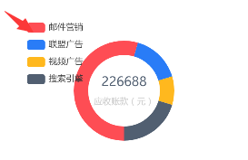

### 整体

#### `tooltip`

##### `tooltip.trigger`

```
'item'  // 数据项图形触发，主要在散点图，饼图等无类目轴的图表中使用
'axis' // 坐标轴触发，主要在柱状图，折线图等会使用类目轴的图表中使用
'none' // 什么都不触发
```

#### 根据窗口改变自适应

```
setTimeout(function (){
  window.onresize = function () {
    subjectChart.resize();
  }
},200)
```

#### x轴

##### 标题倾斜显示

```
xAxis: {
  axisLabel: {
    interval: 0,
    rotate: 45
  }
},
```

##### 未从起始点开始

配置 `xAxis` 的` boundayGap` 值

```js
xAxis: {
	boundaryGap: false,
},
```

#### 隐藏提示图例



```
option ={
  legend: {
  	show: false
  }    
}
```

#### 设置背景颜色

```
optios = {
	backgroundColor: '',
}
```

### 散点图

#### `x`轴

##### 设置`x`轴标题在底部

```
xAxis: {
	name: this.xName,
	nameLocation: 'center'
},
```

##### 标题与轴线的距离

```
 xAxis: {
 	nameGap: 30 
 }
```

#### `y`轴

##### 设置`y`轴标题在左侧

```
yAxis: {
	name: this.yName,
	nameLocation: 'center'
}
```

##### 标题与轴线的距离

```
 yAxis: {
 	nameGap: 30 
 }
```

#### `x,y`轴通用

##### 设置网格线样式

```
xAxis/yAxis: {
  splitLine: { // 网格线配置
    show: true, // 显示或隐藏网格线
    lineStyle:{ // 网格线样式
      color: ['#315070'],
      width: 1,
      type: 'solid'
    }
  }
}
```

#### 散点样式

##### 散点的说明文字

```
series: {
	type: 'scatter',
  label: { // 散点图旁的说明文字
    show: true,
    position: 'top',
    formatter(params){// 格式化说明文字
    	return params.data[2]
  	}
},
```

##### 散点的样式

```
options = {
	series: {
		itemStyle:{
    }
	}
}
```

#### 标记位置

有时候想标记一个坐标的位置，使用`markLine`

##### 取消鼠标移入弹框

```
options = {
	series: {
		markLine: {
			tooltip: { 
      	trigger: 'none'  // 设置 trigger 为 null
      },
		}
	}
}
```

##### 取消线条高亮

```
options = {
	series: {
		markLine: {
			emphasis: {
      	disabled: true
      }
		}
	}
}
```

##### 修改标记线样式

```
options = {
	series: {
		markLine: {
      symbol: ['none', 'none'],//去掉箭头
      lineStyle: { // markline 样式
        normal: {
          color: "#fff",
          type: "solid",
        },
      },
      label: { // 展示坐标值
        show: false
      },
      data: [ // 位置，参考文档
        {
         // name: "Y 轴值为 100 的水平线",
          yAxis: 3,
        },
        {
          // name: "Y 轴值为 100 的水平线",
          xAxis: 1,
        },
      ],
		},
	}
}
```

#### `dataset`（独立数据集）

##### 语法

```
options = {
	dataset: []
}
```

##### `dataset.source`

1）数据结构

```
// 二维数组
options = {
	dataset: {
		source : [ // 分别为 x, y, 后面是其他的数据
        [3.275154, 2.957587,'测试1'],
        [-3.344465, 2.603513, '测试2'],
        [0.355083, -3.376585, '测试3'],
        [1.852435, 3.547351, '测试4'],
        [-2.078973, 2.552013, '测试5'],
        [-0.993756, -0.884433,'测试6',],
		]
	}	
}
```

### 饼图

#### 修改环形颜色

```
option = {
    color: ['#FE4D54', '#297CF7', '#FFB81E'],
}
//个人感觉对应 legend:{}中的data
```

#### 添加中间文字

```
option ={
	graphic: [{　//环形图中间添加文字
    type: 'text',　//通过不同top值可以设置上下显示
    left: 'center',　　　　　　　　　　
    top: '30%', //距圆顶部距离
    style: {　　　　　　　　　　　　　　　　
      text: "80%", //圆环中显示的内容
      textAlign: 'center',
      fill: '#000',//文字的颜色
      width: 30,
      height: 30,
      fontSize: 18,
      color: "#4d4f5c",
      fontFamily: "Microsoft YaHei"
    }
	}, 
	{
    type: 'text',
    left: 'center',
    top: '45%',
    style: {
      text: '达标率',
      textAlign: 'center',
      fill: '#000',
      width: 30,
      height: 30,
      fontSize: 18,
    }
  }],
}
```

