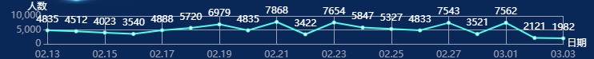

### 基本折线图

#### 实现图例



#### 实现代码

html 实现

```vue
<div ref="main" style="width: 100%;height:100px "></div>
```

js 实现

```js
initEcharts() {
	var chartDom = this.$refs.main; //获取 dom 元素
	var myChart = echarts.init(chartDom); // 初始化 echarts 
	var option;
	option = {
        grid: {top: '55%', bottom: '80%', left: '95%', right: '93.5%'}, //调整组件到容器的边距
		xAxis: {//x 轴的内容
			type: 'category',
			data: ['02.13', '02.14', '02.15', '02.16', '02.17', '02.18', '02.19', '02.20', '02.21', '02.22', '02.23', '02.24', '02.25', '02.26', '02.27', '02.28', '03.01', '03.02', '03.03'],
			name: '日期', // x 轴名称
			nameTextStyle: { // x 名称样式
				color: '#fff',
				align: 'left',
				padding: [0, 0, 0, -10],
			},
			boundaryGap: false, //
			axisLine: {
				show: true,
				lineStyle: {
					color: '#9DA0B2',
				},
				onZero: true,
			},
			splitLine: {
				show: true,
				lineStyle: {
					color: '#9DA0B2',
				},
			},
			axisTick: {
				show: false,
				alignWithLabel: false,
				// inside: true
			},
          axisLabel: {
            fontSize: 12,
          }
		},
        yAxis: {
        	type: 'value',
        	splitNumber: 1.5,
        	name: '人数',
        	nameTextStyle: {
        		color: '#fff',
        		align: 'left',
        		padding: [0, 0, -10, -25],
        	},
        	axisLine: {
        		show: true,
        		lineStyle: {
        			color: '#9DA0B2',
        		},
        		onZero: true,
        	},
        	splitLine: {
        		show: true,
        		lineStyle: {
        			color: '#9DA0B2',
        		},
        	},
        	axisTick: {
       		show: true,
        	},
        },
        series: [{
        	data: [4835, 4512, 4023, 3540, 4888, 5720, 6979, 4835, 7868, 3422, 7654, 5847, 5327, 4833, 7543, 3521, 7562, 2121, 1982],
        	type: 'line',
        	lineStyle: {
        		color: '#3FFFEA',
        	},
        	itemStyle: {
        		color: '#3FFFEA',
        	},
        	label: {
        		show: true,
        		position: 'top',
        		color: '#FFFFFF',
        	},
        }],
      };

	option && myChart.setOption(option);
},
```

