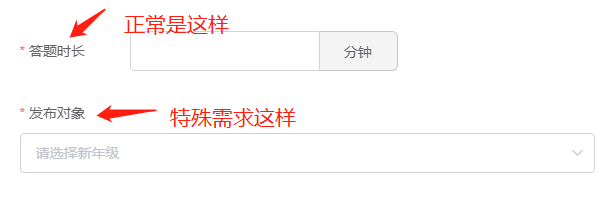

#### `el-form`

##### label 文字对齐方式

1）默认规则设置

```
label-position="left/right/top"
// 文字内容左对齐, 或者在内容上方
// 如果设置 left/right 要设置 label-width="110px"
```

2）label 单独换行设置



```html
<style>
.label-top{
	/deep/ .el-form-item__content{ 
      margin-left: 0!important;
    }
}
</style>
```

#### `el-checkbox`

##### 实现值与展示不同

```
<el-checkbox-group 
	v-model="ruleForm.check"
>
	<!-- label 为 传入的值, 客观题为展示的值 -->
	<el-checkbox :label="1">客观题</el-checkbox>
	<el-checkbox :label="2">主观题</el-checkbox>
</el-checkbox-group>

export default{
	data(){
		return {
			check: []
		}
	}
}
```

#### `el-input`

##### 从服务端搜索数据

```
<template>
    <el-autocomplete
        v-model="ruleForm.name"
        :fetch-suggestions="querySearchAsync" // 筛选的步骤
        placeholder="请输入xxx"
        @select="handleSelect" // 选择后触发
        style="width: 100%"
    >
    </el-autocomplete>
</template>

<script>
// ...
methods:{
	// 选择后触发
	handleSelect(item){
		// item 的值为 {value:'xxx', key: xxx}
    },
    
	// 搜索函数
	querySearchAsync(queryString, cb){
        // 由于我请求使用的是 await/async 所以返回的为promise
        this.getCourseName(queryString).then(res =>{
            // res 是数组对象，且这个参数必须有 value例如
            // res = [{value: 'xxx', key: 1}]
            cb(res);
        })
	},
	
	// 获取接口参数
	async getCourseName(name){
      const data = {
        name
      }

      let res = await this.$api(this.$cfg.API.all.queryLikeByName, data)
      const resList = res.result? res.result : []
      const arr = []
      resList.forEach((ele, index) => {
        arr.push({
          value: ele, // 
          key: index
        })
      })
      return arr
    }
}

</script>

```

#### `el-input-number`

##### 输入整数包含小数

```
<el-form>
	<el-form-item label="xxx" prop="xxx">
        <el-input-number 
        	v-model="ruleForm.xxx" 
        	:controls="false"
        	:min="0"
        	class="num"
        	placeholder="请输入专业选修课学分"
        >
        </el-input-number>
	</el-form-item>
</el-form>

// el-input-number 默认会出现一个默认值，去掉默认值，将默认参数定义成 undefined 即可

<script>
data() {
	return {
        ruleForm: {
            xxx: undefined, //设置为 undefined
        },
	};
},
</script>

<style>
.el-input-number.num{
  width: 100%;
  .el-input{
    input{
      text-align: left; // 将居中的文本置为左边
    }
  }
}
</style>
```

#### 移除表单校验结果

同一个输入框的有时候需要校验，有时候不需要校验。

然而校验后会出现表单未填提示，需要清除

```
this.$refs[formName].clearValidate(['name']);

// formName 是 <el-form> 上的 ref 属性
// clearValidate 可以是字符串，可以是数组
```

#### 校验单个项目

有时候只需要校验一单个项目是否已经填写

```
this.$refs[formName].validateField(prop, getError => { //验证手机号码是否正确
  if (!getError) {//如果正确得话，执行里面得代码
    
  } else {
    return false;
  }
});

// formName <el-form>上得 ref值
// prop <el-form-item>上得prop校验值, prop 为 string, 也可以为数组（但数组没测试过）
```

#### 存在两个需要校验时间的解决方法

```
//第一个校验
<el-form-item label="招标文件的时间期限" prop="getBidFileStartTime"> 
  <el-row>
    <el-col :span="11">
      <div style="padding: 0">
        <el-date-picker
          :disabled="noticeGetFileForm.getBidFileStartTimeDisabled"
          v-model="noticeGetFileForm.getBidFileStartTime"
          type="datetime"
          placeholder="选择起始时间"
          value-format="yyyy-MM-dd HH:mm:ss"
        >
        </el-date-picker>
      </div>
    </el-col>
    <el-col :span="2">
      <div style="padding: 0 4px">至</div>
    </el-col>
    <el-col :span="11">
      <div style="padding: 0">
        <el-form-item prop="getBidFileEndTime">  //插入一个el-form-item
          <el-date-picker
            :disabled="noticeGetFileForm.getBidFileEndTimeDisabled"
            v-model="noticeGetFileForm.getBidFileEndTime"
            type="datetime"
            placeholder="选择结束时间"
            value-format="yyyy-MM-dd HH:mm:ss"
          >
          </el-date-picker>
        </el-form-item>
      </div>
    </el-col>
  </el-row>
</el-form-item>
```

#### 判断开始时间不大于结束时间

```
<el-form-item prop="starttime">
    <el-date-picker
      v-model="temp.starttime"
      type="date"
      :picker-options="starttime"
      value-format="yyyy-MM-dd"
      placeholder="开始时间"
    />
</el-form-item>
  <el-form-item prop="endTime">
    <el-date-picker
      v-model="temp.endTime"
      type="date"
      :picker-options="endTime"
      value-format="yyyy-MM-dd"
      placeholder="结束时间"
    />
</el-form-item>

return{
// 开始时间
      starttime: {
        disabledDate: time => {
          if (this.temp.endtime) {
            return (
              time.getTime() > new Date(this.temp.endtime).getTime()
            )
          } else {
            // 不能大于当前日期
            return time.getTime() > Date.now()
          }
        }
      },
      // 结束时间
      endTime: {
        disabledDate: time => {
          if (this.temp.starttime) {
            return (
              time.getTime() > Date.now() ||
              time.getTime() < new Date(this.temp.starttime).getTime() - 8.64e7 // 加- 8.64e7则表示包当天
            )
          } else {
            return time.getTime() < Date.now()
          }
        }
      },
}
```

#### 常见问题

##### `resetForm` 报错

```
问题：Error: please transfer a valid prop path to form item!
```

```
可能原因：数据原色已经删除，但是可能表单验证中的验证项目还未删除

解决：

使用 $nextTick 
this.$nextTick(() => {
	this.resetForm()
})
```


