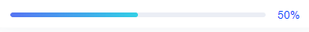

#### 进度条样式

图例展示



实现代码

```
<el-progress :percentage="50"></el-progress>

/deep/ .el-progress{
	width:100%;
	white-space: nowrap; // 实现文字与进度条不换行
	.el-progress-bar__inner{ // 修改进度条渐变色
		background-color: unset;
		background-image: linear-gradient(to right, #5573F6 , #23CEE7);
	}
	.el-progress__text{ // 修改右侧文本样式
		padding-left: 10px;
		color: #0045FF;
	}
}
```

