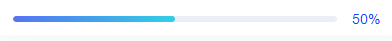

### `element-Ui`

#### `el-input`

##### 标准`input`

```
<el-input
  placeholder="请输入内容"
  v-model="input"
>
</el-input>

<script>
export default {
  data() {
    return {
      input: ''
    }
  }
}
</script>
```

##### 可清除的输入框

```
// clearable 属性
<el-input clearable ></input>
```

##### 设置宽度

```
<el-input style="width: 200px"></input>
```

##### 从服务端搜索数据

```
<template>
	<el-autocomplete
    v-model="ruleForm.name"
    :fetch-suggestions="querySearchAsync" // 筛选的步骤
    placeholder="请输入xxx"
    @select="handleSelect" // 选择后触发
    style="width: 100%"
  >
	</el-autocomplete>
</template>

<script>
// ...
methods:{
	// 选择后触发
	handleSelect(item){
		// item 的值为 {value:'xxx', key: xxx}
    },
    
	// 搜索函数
	querySearchAsync(queryString, cb){
        // 由于我请求使用的是 await/async 所以返回的为promise
        this.getCourseName(queryString).then(res =>{
            // res 是数组对象，且这个参数必须有 value例如
            // res = [{value: 'xxx', key: 1}]
            cb(res);
        })
	},
	
	// 获取接口参数
	async getCourseName(name){
      const data = {
        name
      }

      let res = await this.$api(this.$cfg.API.all.queryLikeByName, data)
      const resList = res.result? res.result : []
      const arr = []
      resList.forEach((ele, index) => {
        arr.push({
          value: ele, // 
          key: index
        })
      })
      return arr
    }
}

</script>
```

#### `el-input-number`

##### 输入整数包含小数

```
<el-form>
	<el-form-item label="xxx" prop="xxx">
    <el-input-number 
      v-model="ruleForm.xxx" 
      :controls="false"
      :min="0"
      class="num"
      placeholder="请输入专业选修课学分"
    >
    </el-input-number>
	</el-form-item>
</el-form>

// el-input-number 默认会出现一个默认值，去掉默认值，将默认参数定义成 undefined 即可

<script>
data() {
	return {
    ruleForm: {
    	xxx: undefined, //设置为 undefined
    },
	};
},
</script>

<style>
.el-input-number.num{
  width: 100%;
  .el-input{
    input{
      text-align: left; // 将居中的文本置为左边
    }
  }
}
</style>
```

#### `el-select`

##### 标准`select`

```
<el-select v-model="value" placeholder="请选择">
	<el-option
		v-for="item in options"
		:key="item.value"
		:label="item.label"
		:value="item.value"
	>
	</el-option>
</el-select>

<script>
  export default {
    data() {
      return {
        options: [{
          value: '选项1',
          label: '黄金糕'
        }, {
          value: '选项2',
          label: '双皮奶'
        }],
        value: ''
      }
    }
  }
</script>
```

##### 默认值设置

`v-model` 值为当前选中的 `el-option`的`value`属性值

```
<el-select v-model="value" placeholder="请选择"></select>

// 设置 value 的值即可设置默认值
```

##### 可清除的下拉框

```
<el-select clearable ></el-select>
```

##### 可多选的下拉框

展示全部

```
<el-select multiple></el-select>
```

展示 + 1

```
<el-select multiple collapse-tags></el-select>
```

##### 绑定事件

```
<!-- val 为当前选中值  -->
<el-select @change="(val)"></el-select>
```

##### `@change`传参方式

```
// 这种方法据说会改变 this 指向
<el-input-number 
	@change="(value) => numberChange(value, scope.row)" 
/>

// 使用$event
<el-input-number
	@change="numberChange($event,scope.row,scope.$index)" 
/>
```

##### 修改右侧图标

```
::v-deep i.el-select__caret {
  /*很关键：将默认的select选择框样式清除*/
  appearance:none;
  -moz-appearance:none;
  -webkit-appearance:none;
  /*自定义图片*/  
  background: url('~@/assets/audit/img/xiala.png') no-repeat scroll center center transparent;
  /*自定义图片的大小*/  
  background-size: 7px 6px;
  /*图片的角度*/  
  transform: rotateZ(0deg)!important;
}
/*将小箭头的样式去去掉*/ 
::v-deep .el-icon-arrow-up:before {
    content: '';
}
```

##### 进阶

###### 处理 el-select 值

需求分析：

使用 `el-select` 时，我们通常会将其 `value` 传递给后端，后端返回的值通常也是 `value` ，但是我们想要展示的一般来说是 `label`的值

简单举例：

```
<template>
  <el-select
    v-model="searchParams.redo"
    placeholder="是否重做"
  >
  <el-option
    v-for="item in isRedoOpt"
    :key="item.value"
    :label="item.label"
    :value="item.value"
  />
  </el-select>
</template>

<script>
	import { isRedoOpt } from '@/components/options'
	export default{
		data(){
			return {
				isRedoOpt, //通常我们会将这个放在 options.js 文件中进行管理，或者是公共接口返回
			}
		}
	}
</script>

// options.js 代码如下
// 是否重做
export const isRedoOpt = [
	{
    value: true,
		label: '是'
  },
  {
		value: false,
		label: '否'
	}
];
```

处理 `value` 的值：

如果用过滤器来过滤需要再重写一遍 `options` 方法，用计算属性直接复用 `options.js`

```
<template>
	<!-- item.value 为后端返回的 value 值 -->
	<div>comOption(item.value)</div>
</template>

<script>
import { isRedoOpt } from '@/components/options'

export default{
	data(){
  	return {
  		isRedoOpt, //通常我们会将这个放在 options.js 文件中进行管理，或者是公共接口返回
  	}
  },
  computed: {
  	comOption(){
  		// val 是匹配值, 
  		// list 是 option 的列表， 
  		// listOpt 是匹配 el-select 的 key,value
      return (val, list, listOpt = {label: 'label', value: 'value'}) =>{
        if(val || val == 0){
          const arr = list.filter((ele) => ele[listOpt.value] == val);
					return arr[0][listOpt.label];
        }else{
          return ''
        }
      }
    }
  }
}
</script>
```

###### 通过遍历的 el-select

```
<div v-for="(item, index) in dataList">
  <el-select 
    v-model="selectData[index]" 
    placeholder="请选择包计价方式"
  >
    <el-option 
      v-for="list in options"
      :label="list.dictName"
      :key="list.dictValue"
      :value="list.dictValue"
    >
    </el-option>
  </el-select>
</div>

<script>
  export default {
  data() {
  	return {
      selectData: {},
      options:[]
    }
  }
  methods:{
    getData(){
      ...请求回来的数据
      this.dataList.forEach((ele, index)=>{
        this.$set(this.selectData, index, ele.dictName); //设置默认值
      }
    }
  }
}
</script>
```

#### `el-form`

##### 引用外部校验

```
// 1.引入文件
import { xxx } from validator(详细的路径名称)

// data
rules: {
    pass: [
    	{ validator: xxx, trigger: 'blur' }
    ]
}

// 参照 gpx-web 目录下 lib 文件夹下 validator.js
```

##### 校验单个项目

有时候只需要校验一单个项目是否已经填写

```
this.$refs[formName].validateField(prop, getError => { //验证手机号码是否正确
  if (!getError) {//如果正确得话，执行里面得代码
    
  } else {
    return false;
  }
});

// formName <el-form>上得 ref值
// prop <el-form-item>上得prop校验值, prop 为 string, 也可以为数组（但数组没测试过）
```

##### 动态表单校验

有时候需要多个 `<el-form-item>`遍历时，可外面加 `div`遍历

```
<el-form
	:model="ruleForm"
	ref="ruleForm"
	label-width="80px"
	label-position="left"
>
	<div 
	  v-for="(item, index) in ruleForm.dataList" 
  	:key="index"
  >
  <el-form-item 
  	label="免考原因" 
  	:prop="'dataList.' + index + '.reason'"
  	:rules="{required: true, message: '请选择免考原因', trigger: 'change'}"
  >
  <el-select 
  	v-model="ruleForm.dataList[index].reason" 
  >
  	<!-- ... -->
  </el-select>
  </el-form-item>
  <el-form-item 
  	label="免考科目"
  	:prop="'dataList.' + index + '.reason'"
  	:rules="{required: true, message: '请选择免考原因', trigger: 'change'}"
  >
  	<!-- ... -->
  </el-form-item>
  </div>
</el-form>

<script>
export default{
	data(){
		return {
			ruleForm: {
        dataList: [
          {
            reason: '',
            subjectList: [],
            subjectValue: []
          }
        ]
			},
		}
	}
}
</script>
```

##### `label`文字对齐方式

1）默认规则设置

```
label-position="left/right/top"
// 文字内容左对齐, 或者在内容上方
// 如果设置 left/right 要设置 label-width="110px"
```

2）label 单独换行设置


```
<style>
.label-top{
	/deep/ .el-form-item__content{ 
      margin-left: 0!important;
    }
}
</style>
```

##### 移除表单校验结果

同一个输入框的有时候需要校验，有时候不需要校验。

然而校验后会出现表单未填提示，需要清除

```
this.$refs[formName].clearValidate(['name']);

有时候需要加上 this.$nextTick(()=>{})
// formName 是 <el-form> 上的 ref 属性
// clearValidate 可以是字符串，可以是数组
```

##### 存在两个需要校验时间的解决方法

```
//第一个校验
<el-form-item label="招标文件的时间期限" prop="getBidFileStartTime"> 
  <el-row>
    <el-col :span="11">
      <div style="padding: 0">
        <el-date-picker
          :disabled="noticeGetFileForm.getBidFileStartTimeDisabled"
          v-model="noticeGetFileForm.getBidFileStartTime"
          type="datetime"
          placeholder="选择起始时间"
          value-format="yyyy-MM-dd HH:mm:ss"
        >
        </el-date-picker>
      </div>
    </el-col>
    <el-col :span="2">
      <div style="padding: 0 4px">至</div>
    </el-col>
    <el-col :span="11">
      <div style="padding: 0">
        <el-form-item prop="getBidFileEndTime">  //插入一个el-form-item
          <el-date-picker
            :disabled="noticeGetFileForm.getBidFileEndTimeDisabled"
            v-model="noticeGetFileForm.getBidFileEndTime"
            type="datetime"
            placeholder="选择结束时间"
            value-format="yyyy-MM-dd HH:mm:ss"
          >
          </el-date-picker>
        </el-form-item>
      </div>
    </el-col>
  </el-row>
</el-form-item>
```

##### 判断开始时间不大于结束时间

```
<el-form-item prop="starttime">
    <el-date-picker
      v-model="temp.starttime"
      type="date"
      :picker-options="starttime"
      value-format="yyyy-MM-dd"
      placeholder="开始时间"
    />
</el-form-item>
  <el-form-item prop="endTime">
    <el-date-picker
      v-model="temp.endTime"
      type="date"
      :picker-options="endTime"
      value-format="yyyy-MM-dd"
      placeholder="结束时间"
    />
</el-form-item>

return{
// 开始时间
      starttime: {
        disabledDate: time => {
          if (this.temp.endtime) {
            return (
              time.getTime() > new Date(this.temp.endtime).getTime()
            )
          } else {
            // 不能大于当前日期
            return time.getTime() > Date.now()
          }
        }
      },
      // 结束时间
      endTime: {
        disabledDate: time => {
          if (this.temp.starttime) {
            return (
              time.getTime() > Date.now() ||
              time.getTime() < new Date(this.temp.starttime).getTime() - 8.64e7 // 加- 8.64e7则表示包当天
            )
          } else {
            return time.getTime() < Date.now()
          }
        }
      },
}
```

##### 常见问题

`resetForm` 报错

```
问题：Error: please transfer a valid prop path to form item!
```

```
可能原因：数据原色已经删除，但是可能表单验证中的验证项目还未删除

解决：

使用 $nextTick 
this.$nextTick(() => {
	this.resetForm()
})
```

#### `el-switch`

##### 标准`el-switch`

```
//默认以左边为关闭，右侧为打开
<el-switch
  v-model="value"
  active-color="#13ce66"
  inactive-color="#ff4949">
</el-switch>

<script>
  export default {
    data() {
      return {
        value: true
      }
    }
  };
</script>
```

##### 赋值

```vue
v-model="value" //为el-switch绑定值，当切换时，值也会相应变化
```

##### 修改开关背景颜色

```vue
active-color="#13ce66" //打开时的背景色
inactive-color="#ff4949" //关闭时的背景色
```

##### 设置开关左右的文本描述

```vue
active-text="否"  //打开时的文字描述
inactive-text="是" //关闭时的文字描述

#关于文本样式默认为蓝色，暂时还未遇到要修改颜色需求，以后添加
```

##### 禁用开关

```vue
disabled  //true为禁用
```

##### 绑定事件

`@change`

```
<el-switch
  v-model="value"
  @change="handelChange"
>
</el-switch>

<script>
  export default {
    data() {
      return {
        value: true
      }
    },
    methods:{
      handelChange(val){
          console.log(val) //val 为改变后的状态值
      }  
    }
  };
</script>
```

#### `el-table`

##### 显示索引号

```
<el-table-column
	type="index" // type 为 index 即可
	width="50"
	label="序号" // 如果表头需要展示文字
>
```

##### 超出隐藏并 hover 提示

```
// 在 item 中使用
<el-table-column
	:show-overflow-tooltip="true || false"   // true 是生效 false 不生效
>
</el-table-column>
```

##### 默认选中节点

单选框默认选中

```
row // 需要渲染中数组的对象，自己拼的不能用
this.$refs['singleTable'].setCurrentRow(row, true)
```

多选框默认选中

```
// 需要渲染中数组的对象，自己拼的不能用
this.$refs['multipleTable'].toggleRowSelection(row, true)
```

##### 清除选中

```
this.$refs['singleTable'].clearSelection();
```

##### 翻页选中

`<el-table>`默认切换到下一页时不保留选中的数据，使用 `row-key` 和 `reserve-selection`可以保留

```
<el-table row-key="id">
  <el-table-column 
  	type="selection" 
  	reserve-selection
  >
  </el-table-column>
</el-table>
```

注意事项：

`row-key` 中可以使用 `String`  或者 `Function` 传参

错误用法 一

```
// 使用 string 时 使用 :row-key="id"  // 这个不生效的
```

错误用法 二

```
// row-key   需要绑定数据的唯一值，不然不生效
```

错误用法 三

```
使用 function 语法时， reserve-selection 要绑定在 type="selection" 的列中
```

##### 自定义表头

```
<el-table>
	<el-table-cloumn>
		<template slot="header" slot-scope="scope">
        <span>我是表头</span>
      </template>
	</el-table-cloumn>
</el-table>
```

##### 常见问题

###### 渲染列时排序问题

当`el-table`用遍历来渲染表个列的时候可能会出现顺序错误

```
<el-table
	:data="tableData"
>
	<!-- 将 div 标签替换为 template 标签 -->
	<div v-for="(item,index) in tabConfig" :key="index"> 
		<el-table-column :label="item.name" :prop="item.prop"></el-table-column>
	</div>

</el-table>
```

###### 删除时底部数据被清空

遍历 `<el-table>`情况下，删除中间某个数组值，底部选中的数据会被清空

```
demo/关于elementui/el-table/02-处理遍历表格的删除
```

###### 多列排序

```
demo/关于elementui/el-table/03-多列排序
```

###### 设置某行不能选择

```
// 使用 Table-column 的 selectable 属性

// tempalete
<el-table>
	<el-table-column 
		type="selection"
    :selectable="checkSelect"
  >
  </el-table-column>
</el-table>

// methods
checkSelect(row, index) {
	return row.id ? true : false;  // true 可选 false 不可选
},

Demo:
demo/关于elementui/el-table/01-设置某行不能选择.html
```

###### 单选表格

示例：


```
demo/关于elementui/el-table/04-单选表格
```

###### 解决布局错乱

原因： 使用动态布局或使用 fixed 定位造成以下问题


解决： 重新计算布局

```js
this.$nextTick(() =>{
	this.$refs.dataTable.doLayout() // el-table 标签上的 ref 属性
})
```

案例代码

```vue
// 因为我是在 el-select 改变时改变布局，则
<el-select 
	v-model="custom" 
	@change="handleTableColumn"
>
	...
</el-select>

methods: {
	handleTableColumn(){
		this.$nextTick(() =>{
			this.$refs.dataTable.doLayout()
		})
	},
}
```

###### 校验表格中必填项

```
demo/关于elementui/el-table/05-校验表格中必填项
```

#### `el-tree`

##### 标准可选择树形节点

```
<el-tree
  :data="dataList"
  show-checkbox
  node-key="deptId"
  :check-strictly="true"
  ref="tree"
  highlight-current
  :props="defaultProps"
  >
</el-tree>

<script>
export deafult {
	data (){
	 return {
	 
	 }
	}
}
</script>
```

##### 手动清空/设置已选节点

```
// 清空时候 checkedObj = []
this.$refs.treeRef.setCheckedKeys(checkedObj);
```

#### `el-dialog`

##### 插入弹窗到 `body`中

当存在定位是，遮罩层会悬浮在弹窗之上

```
//使用el-dialog以下属性
	//遮罩层默认插入至Dialog的父元素上，设置modal-append-to-body，将插入到body中
<el-dialog
    :modal-append-to-body="false"
>
</el-dialog>
```

#### `el-upload`

##### 自定义上传

```
<el-upload
  action=""
  :http-request="toUpload" // 自定义上传参数
>
	<span>上传图片</span>
</el-upload>

// 因为现在环境不支持，可能需要 onerror 这些属性来监听错误等
```

##### 成功时返回的数据

```
{
    bytes: null
    content: null
    fileName: "测试文件 12.doc"
    moduleName: null
    path: "2020/1/10/ff8080816f8a5708016f8d29c253001b.doc"
    size: "8"
    suffix: ".doc"
    zoneCode: null
}
```

#### 时间日期选择器

##### `DatePicker`

```
format // 指定输入框的格式，这个为选择后值展示的格式

value-format  // 指定值得格式，获取值的格式时候用这个参数
```

##### 当天之前日期不能选

！！！此方法有个bug未完全解决: 当选择时间时，会出现可以选超过的时间

解决：在@change里面进行校验

```
<el-date-picker             
   v-model="time"
   type="datetime" //选择器类型
   placeholder="选择结束时间" //选择器提示
   value-format="yyyy-MM-dd HH:mm:ss" //日期格式
   :picker-options="pickerOptions()"
></el-date-picker>
```

```
data() {
  return {
    pickerOptions: {
      disabledDate(time) {//此处会执行展示得日期，筛选之后得日期值， time为日期值
        return time.getTime() < new Date().getTime() - 86400000; //86400000为24小时的秒数
      },
    },
  }
},

methods:{
  pickerOptions(){
    const _this = this
    return {
      disabledDate(time){
        if (_this.info.startTime) {
          return new Date(_this.info.startTime).getTime() < time.getTime()
        }
      }
    }
  }, 
}

```

#### `el-progress`

##### 修改进度条样式

图例展示



实现代码

```
<el-progress :percentage="50"></el-progress>

/deep/ .el-progress{
	width:100%;
	white-space: nowrap; // 实现文字与进度条不换行
	.el-progress-bar__inner{ // 修改进度条渐变色
		background-color: unset;
		background-image: linear-gradient(to right, #5573F6 , #23CEE7);
	}
	.el-progress__text{ // 修改右侧文本样式
		padding-left: 10px;
		color: #0045FF;
	}
}
```

#### `el-checkbox`

##### 实现值与展示不同

```
<el-checkbox-group 
	v-model="ruleForm.check"
>
	<!-- label 为 传入的值, 客观题为展示的值 -->
	<el-checkbox :label="1">客观题</el-checkbox>
	<el-checkbox :label="2">主观题</el-checkbox>
</el-checkbox-group>

export default{
	data(){
		return {
			check: []
		}
	}
}
```

#### `el-transfer`

##### 树形穿梭框组件

```
// fjun-roll 项目搜索 BaseTransfer
```

#### `el-steps`

##### 自定义步骤条

```
//v-if可以判断是否需要此图标
<el-steps>
  <el-step title="xxx">
        <i :class="icon" slot="icon" v-if="active == 0"></i>
  </el-step>
</el-steps>
```

##### 竖直步骤条不居中解决

```
<!--在el-step 加上 text-align: center-->
<el-steps direction="vertical" :active="active">
  <el-step title="等待开标" style="text-align: center"></el-step>
  <el-step title="公布投标人" style="text-align: center"></el-step>
</el-steps>
```

##### 文字跟图标不对称

```
//因为有默认的margin-top: 20
.el-step__title{
  margin-top: 0;
}
```

#### `el-popover`

##### 修改样式

因为`el-popover`无法直接修改组件样式，需要全局修改

```
<el-popover 
  // 设置一个独立样式
	popper-class="proper-wrap"
>
</el-popover>

<style lang="scss">
.el-popover.proper-wrap{
	background-color: #171F2D!important;
}
</style>
```


### 问题集合

#### `refs`

使用`this.$refs.xxx`调用弹窗时，有时候`dom`未被识别，可使用

```
this.$set(this.ruleForm, 'major', arr)
```

#### 直接引用`element-ui`

##### 通过 `cdn` 引入

在页面上引入 以下两个文件夹即可使用

```
<!-- 引入样式 -->
<link rel="stylesheet" href="https://unpkg.com/element-ui/lib/theme-chalk/index.css">

<!-- 引入组件库 -->
<script src="https://unpkg.com/element-ui/lib/index.js"></script>
```

`CDN`引入时图标找不到问题：

解决：需要下载字体包，请查看以下方式

`./package` 文件夹下的是 `element-ui@2.14.1` 版本， 若需要升级，则看如下教程


