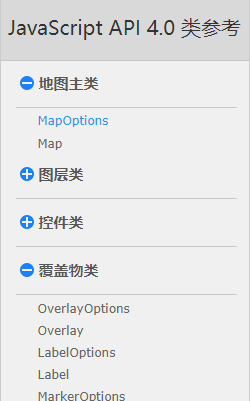

### `Api`

#### 基本

官方`api` 文档地址如下:

```
http://lbs.tianditu.gov.cn/api/js4.0/class.html
```

在官方文档中，一般都暴露有一个类，与其对应的配置属性。



#### `API`分类

根据`api`的使用规则不同，我把天地图分为两类，一个是主类，另一个是副类，虽然不太准确。

##### 主类

目前包含了 【地图主类】 模块

**构造函数用法：**

```
// 以 map 类为例
this.map = new T.Map("tiandi");
```

**方法的使用：**

```
// 例如: 返回地图当前缩放级别
let zoom = this.map.getZoom()
```

**事件的使用：**

```
// 例如： 地图更改缩放级别结束时触发触发此事件。
this.map.addEventListener("zoomend", () => {})
```

##### 副类

目前除了地图的类目

**构造函数用法：**

由于覆盖物一般都是以多个坐标点组成的。所以需要【实体类】中的 `LngLat` 来指定坐标点

```
// 假设我目前有一些经纬度坐标点：
const LngArr = [
  [95.6274036431516,40.3868709263334],
  [95.6284014249018,40.3871297061474],
  [95.6284622215346,40.3860509959725],
  [95.6275753045277,40.3858821055271],
  [95.6274036431516,40.3868709263334]
]

// 通过遍历，添加坐标点
let lngPoint =[]
LngArr.forEach(ele => {
	// 将 LngLat 类的返回值，整理成数组
	lngPoint.push(new T.LngLat(point[0], point[1]))
})

// this.lngPoint 即为多边形覆盖物类的第一个参数
this.lngPoint = lngPoint
```

创建覆盖物

```
// 创建多边形覆盖物类
// 注意这个 this.polygon 在下面的方法中很有用处
this.polygon = new T.Map(this.lngPoint, {});

// 然后将覆盖物添加到地图上
this.map.addOverLay(polygon);
```

**方法的使用：**

```
// 例如: 给地块设置颜色
let zoom =this.polygon.setFillColor('green')
```

**事件的使用：**

```
// 例如： 点击地块事件
this.polygon.addEventListener("click", () => {

})
```

#### 类的参数

在类中的参数中我们可以自己添加部分参数，供自己使用

```
// 在添加多边形覆盖的时候，后面的传参可以传递额外参数

this.polygon = new T.Polygon(this.lngPoint, 
{
	color: "#fff",
	weight: 2, 
	farmerId: item.farmerId // 这个是自定义的
});

// 获取到自定义的参数
let farmerId = this.options.farmerId
```

### 应用

#### 工具类

##### `LngLat`

此类以经度和纬度表示的地理位置坐标点

**构造函数：**

```
// 这个类比较简单，就是将经纬度转化为地图的坐标点
// 想在地图上画内容，需要用到此类

// lng 经度(Number)， lat 维度(Number)
const lngLat = new T.LntLat(lng, lat)
```

**方法：**

```
// 目前还没用到
lngLat.getLng()
```


#### 控件类

##### `Control.MapType`

此类是负责切换地图类型的控件，此类继承`TControl`。

1）初始化控件

```
const mapTypeControl = new T.Control.MapType()
// 放置位置
mapTypeControl.setPosition(T_ANCHOR_TOP_RIGHT)
// 添加到地图上
this.map.addControl(mapTypeControl)
```


2）监听控件切换的方法：

```
this.map.addEventListener('maptypechange', (e)=>{
	// 获取类型信息
	const name = e.mapType.name
})
```


#### 覆盖物类

##### `Marker`

表示地图上的一个标注

**构造函数使用：**

```
// 画标注，需要将经纬度转化为地理坐标，需要用到【工具类-LngLat】
const lngLat = new T.LntLat(lng, lat)
// lngLat 地理坐标,  options 配置参数
const marker = new T.Marker(lngLat, options)

this.map.addOverLay(marker)
// 注意：目前是一个地理坐标对应一个标住，如果多个标注撒点，需要用到【组件类-MarkerClusterer】
```


##### `InfoWindow`

此类表示地图上包含信息的窗口。（弹窗）

**自定义弹窗传递参数:**

为点击事件传递参数

```
// 由于 urlList 是数组，如果直接 ${urlList} 会报错
// 需要在 ${urlList} 加上 '',此时数组会转换为字符串
// 接收的时候需要 urlList.split(',')

imgDom += ``
```


##### `Polygon`

此类表示一个多边形覆盖物。(画地块)

**构造函数使用：**

多边形覆盖物表示的是一些点的集合

```
const orignData = [
	[104.99121484, 34.94009642],
  [104.98443813, 34.94261405],
  [104.97795181, 34.93938073],
  [104.97328301, 34.93893759],
  [104.96671327, 34.94002548],
  [104.96850996, 34.94321211],
  [104.95976862, 34.94534958],
]
// 将生成的坐标点存入此数组，作为 Polygon() 的第一个参数
const points = []

orignData.forEach(ele => {
	points.push(new T.LngLat(ele[0], ele[1]))
})

// 生成多边形地块， 这时候还没画出来
const temp = new T.Polygon(points)

// 因为多边形覆盖物的数量可能不止一个，且有统一展示跟隐藏的需求
// 所以用个数组存着，再使用时再调用
this.markPolygonList.push(temp)

// 画地块
this.markPolygonList.forEach((item) =>{
	this.map.addOverLay(item))
}

// 显示地块
this.markPolygonList.forEach((item) => {
	item.show()
})

// 隐藏地块
this.markPolygonList.forEach((item) => {
	item.hide()
})

// 这个 show()/hide() 方法估计是继承于 Overlay(叠加层类)
```


##### 自定义覆盖物

自定义覆盖物也继承于 `Overlay`。

由于，目前大多数需求都是修改`html`布局及样式，在`vue`中我把它定义到了`data`上然后就传入原生的`html`

```
// 以下代码还需要完善
data(){
	return {
		// 其他需求看文档
		defaultOverLayer:  T.Overlay.extend({ 
			// 传进来的参数会在此函数接收
    	initialize: function (lnglat, htmlPlugin) {
    		this.lnglat = lnglat;
    		this.htmlPlugin = htmlPlugin
    	},
			// 调用map.addOverLay时，会调用此方法
			onAdd: function (map) {
        this.map = map;
        var div = this._div = document.createElement("div");
        // 给 div 设置样式
        for (let i in this.htmlPlugin.divStyle){
        	div.style[i] = this.htmlPlugin.divStyle[i]
				}

				div.innerHTML = this.htmlPlugin.html ? this.htmlPlugin.html : ''

map.getPanes().overlayPane.appendChild(this._div);
this.update(this.lnglat);
}

// 使用
const htmlPlugin = {
  divStyle: {
    position: 'absolute',
    left: '50%',
    top: '50%',
    color: '#000',
    backgroundColor: '#fff',
    whiteSpace: 'nowrap',
    fontSize: '14px',
    zIndex: 1000,
    textAlign: 'center',
    transform: 'translate(-50%, -50%)'
  },
  html: `<p> ${ele.areaName}</p>`
}

// centerPoint， 也是处理过的坐标点
this.provinceLayer.push(
	new this.mapDefaultLayer(centerPoint, htmlPlugin)
)
```


#### 组件类

##### `MarkerClusterer`

解决加载大量标注点到地图上产生覆盖现象的问题，并提高性能


**构造函数：**

```
// 由于这个是批量撒点，所以造了一个多点的数组
const markerArr = [
	[36.050084289,103.831063401],
	[36.050084289,103.831063401],
	[34.754355345,104.882922678],
	[39.900816212,116.400078342],
	[37.936475648,102.625141229]
]

// 批量点组成的数组
let markers
markerArr.forEach(ele => {
	markers.push( new T.Marker(
		new T.LntLat(lng, lat), {})
	)
})

// this.map 地图对象， 参数， markers 数据点

const markerClusterer = new T.MarkerClusterer(this.map, { markers: markers })


// 注意： 这个已经画到地图上了，不用再调 addOverLay() 方法

// 这个些点也只能用方法清除
// 注意调用的人，以及参数
markerClusterer.clearMarkers(markers);
```


**方法：**

```
markerClusterer.getClustersCount()
```


**数据监听：**

此方法没有数据监听，查看 【覆盖物类-Marker】


**`MarkerClustererOptions`：**


使用 `styles`属性来修改聚合点的默认样式：

```
const markersOpt = {
	markers: markers,
	styles: [ // 顺序由最小的缩放级别到最大的缩放级别
    {
      // 图片地址，支持require(), 绝对路径, http 请求
      url: require('../assets/markers/toubao-l.png'),
      //图片大小
      size:[40, 40], 
      //显示图片的偏移量
      offset:new T.Point(0, 0),
      //显示数字的颜色
      textColor:'#4da1f8', 
      //显示文字的大小
      textSize:8,
      // 多少个聚合点展示这个图标
      range:[0, 50],
    }, 
    {
      url: require('../assets/markers/toubao.png'),
      size:[60, 60],
      offset:new T.Point(0, 0),
      textColor:'#4ea76c',
      textSize:10,
      range:[50, 200],
    }, 
    {
      url:require('../assets/markers/toubao-h.png'),
      size:[80, 80],
      offset:new T.Point(0, 0),
      textColor:'#ae452d',
      textSize:12,
      range:[200, 500],
    }
   ]
}

const markerClusterer = new T.MarkerClusterer(this.map, markersOpt)
```

注意到上图的文字不是居中而是在底下

```
// 不要妄图使用 offset 来设置图片的偏移量，设置偏移量后文本是一直居中的。
// 所以决定直接修改样式,注意这会修改整体的聚合点样式

<style>
// 强制改变天地图的文字位置
.tdt-cluster0{
    & > div{
        position: absolute;
        left: 50%;
        bottom: -65%;
        transform: translateX(-50%);
    }
}
</style>
```


### 其他

#### 缩放等级

```
1 - 18 级
```