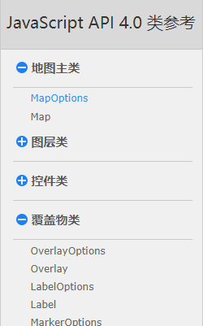
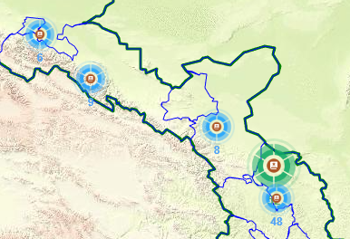

### `Api`

#### 基本

官方`api` 文档地址如下:

```
http://lbs.tianditu.gov.cn/api/js4.0/class.html
```

在官方文档中，一般都暴露有一个类，与其对应的配置属性。



#### `API`分类

根据`api`的使用规则不同，我把天地图分为两类，一个是主类，另一个是副类，虽然不太准确。

##### 主类

目前包含了 【地图主类】 模块

**构造函数用法：**

```
// 以 map 类为例
this.map = new T.Map("tiandi");
```

**方法的使用：**

```
// 例如: 返回地图当前缩放级别
let zoom = this.map.getZoom()
```

**事件的使用：**

```
// 例如： 地图更改缩放级别结束时触发触发此事件。
this.map.addEventListener("zoomend", () => {

})
```

##### 副类

目前除了地图的类目

**构造函数用法：**

由于覆盖物一般都是以多个坐标点组成的。所以需要【实体类】中的 `LngLat` 来指定坐标点

```
// 假设我目前有一些经纬度坐标点：
const LngArr = [
  [95.6274036431516,40.3868709263334],
  [95.6284014249018,40.3871297061474],
  [95.6284622215346,40.3860509959725],
  [95.6275753045277,40.3858821055271],
  [95.6274036431516,40.3868709263334]
]

// 通过遍历，添加坐标点
let lngPoint =[]
LngArr.forEach(ele => {
	// 将 LngLat 类的返回值，整理成数组
	lngPoint.push(new T.LngLat(point[0], point[1]))
})

// this.lngPoint 即为多边形覆盖物类的第一个参数
this.lngPoint = lngPoint
```

创建覆盖物

```
// 创建多边形覆盖物类
// 注意这个 this.polygon 在下面的方法中很有用处
this.polygon = new T.Map(this.lngPoint, {});

// 然后将覆盖物添加到地图上
this.map.addOverLay(polygon);
```

**方法的使用：**

```
// 例如: 给地块设置颜色
let zoom =this.polygon.setFillColor('green')
```

**事件的使用：**

```
// 例如： 点击地块事件
this.polygon.addEventListener("click", () => {

})
```

#### 类的参数

在类中的参数中我们可以自己添加部分参数，供自己使用

```
// 在添加多边形覆盖的时候，后面的传参可以传递额外参数

this.polygon = new T.Polygon(this.lngPoint, 
{
	color: "#fff",
	weight: 2, 
	farmerId: item.farmerId // 这个是自定义的
});

// 获取到自定义的参数
let farmerId = this.options.farmerId
```

### 应用

#### 工具类

##### `LngLat`

此类以经度和纬度表示的地理位置坐标点

**构造函数：**

```
// 这个类比较简单，就是将经纬度转化为地图的坐标点
// 想在地图上画内容，需要用到此类

// lng 经度(Number)， lat 维度(Number)
const lngLat = new T.LntLat(lng, lat)
```

**方法：**

```
// 目前还没用到
lngLat.getLng()
```


#### 控件类

##### `Control.MapType`

此类是负责切换地图类型的控件，此类继承`TControl`。

**监听控件切换的方法：**

```
this.map.addEventListener('maptypechange', (e)=>{
	   
})
```


#### 覆盖物类

##### `Marker`

表示地图上的一个标注

**构造函数使用：**

```
// 画标注，需要将经纬度转化为地理坐标，需要用到【工具类-LngLat】
const lngLat = new T.LntLat(lng, lat)
// lngLat 地理坐标,  options 配置参数
const marker = new T.Marker(lngLat, options)

this.map.addOverLay(marker)
// 注意：目前是一个地理坐标对应一个标住，如果多个标注撒点，需要用到【组件类-MarkerClusterer】
```


##### `InfoWindow`

此类表示地图上包含信息的窗口。（弹窗）

**自定义弹窗传递参数:**

为点击事件传递参数

```
// 由于 urlList 是数组，如果直接 ${urlList} 会报错
// 需要在 ${urlList} 加上 '',此时数组会转换为字符串
// 接收的时候需要 urlList.split(',')

imgDom += ``
```


#### 组件类

##### `MarkerClusterer`

解决加载大量标注点到地图上产生覆盖现象的问题，并提高性能


**构造函数：**

```
// 由于这个是批量撒点，所以造了一个多点的数组
const markerArr = [
	[36.050084289,103.831063401],
	[36.050084289,103.831063401],
	[34.754355345,104.882922678],
	[39.900816212,116.400078342],
	[37.936475648,102.625141229]
]

// 批量点组成的数组
let markers
markerArr.forEach(ele => {
	markers.push( new T.Marker(
		new T.LntLat(lng, lat), {})
	)
})

// this.map 地图对象， 参数， markers 数据点

const markerClusterer = new T.MarkerClusterer(this.map, { markers: markers })


// 注意： 这个已经画到地图上了，不用再调 addOverLay() 方法

// 这个些点也只能用方法清除
// 注意调用的人，以及参数
markerClusterer.clearMarkers(markers);
```


**方法：**

```
markerClusterer.getClustersCount()
```


**数据监听：**

此方法没有数据监听，查看 【覆盖物类-Marker】


**`MarkerClustererOptions`：**



使用 `styles`属性来修改聚合点的默认样式：

```
const markersOpt = {
	markers: markers,
	styles: [ // 顺序由最小的缩放级别到最大的缩放级别
    {
      // 图片地址，支持require(), 绝对路径, http 请求
      url: require('../assets/markers/toubao-l.png'),
      //图片大小
      size:[40, 40], 
      //显示图片的偏移量
      offset:new T.Point(0, 0),
      //显示数字的颜色
      textColor:'#4da1f8', 
      //显示文字的大小
      textSize:8,
      // 多少个聚合点展示这个图标
      range:[0, 50],
    }, 
    {
      url: require('../assets/markers/toubao.png'),
      size:[60, 60],
      offset:new T.Point(0, 0),
      textColor:'#4ea76c',
      textSize:10,
      range:[50, 200],
    }, 
    {
      url:require('../assets/markers/toubao-h.png'),
      size:[80, 80],
      offset:new T.Point(0, 0),
      textColor:'#ae452d',
      textSize:12,
      range:[200, 500],
    }
   ]
}

const markerClusterer = new T.MarkerClusterer(this.map, markersOpt)
```

注意到上图的文字不是居中而是在底下

```
// 不要妄图使用 offset 来设置图片的偏移量，设置偏移量后文本是一直居中的。
// 所以决定直接修改样式,注意这会修改整体的聚合点样式

<style>
// 强制改变天地图的文字位置
.tdt-cluster0{
    & > div{
        position: absolute;
        left: 50%;
        bottom: -65%;
        transform: translateX(-50%);
    }
}
</style>
```


### 其他

#### 缩放等级

天地图最大缩放等级 18