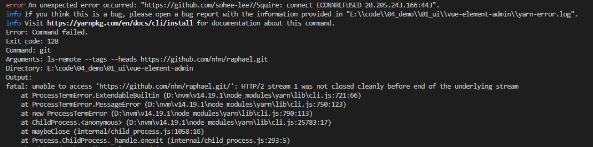
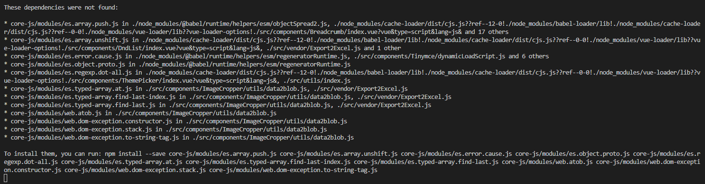

### 开源项目

#### `vue-element-admin`

##### 报错

1）下载`tui-editor:1.3.3`时候报错



原因：

`tui-editor`已经改名为`toast-ui/editor`

解决方案：

删掉`package.json`中依赖的`tui-editor:1.3.3`：

```
"dependencies": {
	...
	"tui-editor": "1.3.3", //删除此项
	...
}
```

更改组件内容:

```
// /src/components/MarkdownEditor/index.vue
// 1. 用下面 import 替换此路径下的所有 import
import 'codemirror/lib/codemirror.css'
import '@toast-ui/editor/dist/toastui-editor.css'
import Editor from '@toast-ui/editor'
import defaultOptions from './default-options'

// 2. 将所有 getValue、setValue 分别替换为 getMarkdown、setMarkdown
```

下载`@toast-ui/editor`

```
yarn add @toast-ui/editor
```

2）`core-js` 报错



解决方案：

下载`core-js`，需要重启项目

```
yarn add core-js
```

