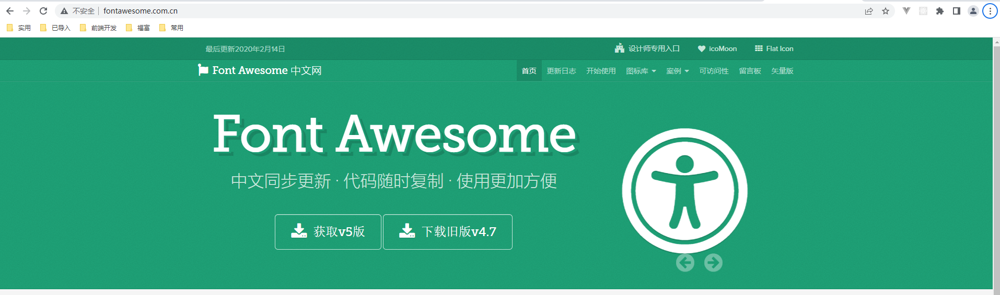

目前使用`vue3 + vue-cli`，在用版本为  `vxe-table v4`

### 起步

#### 简介

`pc`  端的表格组件

#### 安装

```
yarn xe-utils vxe-table@next
```

#### 引入方式

由于`vxe-table`在项目中使用不是很广泛，尽量使用按需引入

##### 全局引入

```
// 在 mian.js 中引入
import 'xe-utils'
import VXETable from 'vxe-table'
import 'vxe-table/lib/style.css'

app.use(VXETable)

// 组件中使用
<vxe-table>
	<vxe-column field="size" title="Size"></vxe-column>
	<vxe-column field="type" title="Type"></vxe-column>
	<vxe-column field="date" title="Date"></vxe-column>
</vxe-table>
```

##### 按需引入

下载按需加载模块

```
// 下载 babel-plugin-import
yarn add babel-plugin-import -D
```

修改 `.babelrc` 或 `babel.config.js`

```
// 可能配置文件有以下内容了
module.exports = {
  presets: [
    '@vue/cli-plugin-babel/preset'
  ]
}

// 加上

module.exports = {
  presets: [
    '@vue/cli-plugin-babel/preset'
  ],
  "plugins": [
    [
      "import",
      {
        "libraryName": "vxe-table",
        "style": true // 样式是否也按需加载
      }
    ]
  ]
}

```

新建 `vxeTabel.js`

```
// vxeTabel.js 源码
./demo/vxe-table/vxeTabel.js

// main.js 引入
import {useTable} from './assets/vxeTable'

const app = createApp(App)
app.use(useTable)
```


#### 关于图标

引入有图标的组件时，发现默认图标加载不出来。需要下载，字体图标库

##### 下载地址

```
// 下载个旧版即可
http://www.fontawesome.com.cn/
```



##### 引用

此下载是压缩包，估计`scss、less、css`版本的都可以用，我用到的是`css`目录下的文件，记得要拷贝上`fonts`目录，不然字体图标找不到

```
// 目录结构
vxeFont
	|-- css
			|-- font-awesome.min.css
	|-- fonts
			|-- 目录下的字体

// main.js 引入，在引入 vxe-table 后引入即可
import './assets/vxeFont/css/font-awesome.min.css'
```


#### 参考文档

```
// github 地址(使用方法往下拉)
https://github.com/x-extends/vxe-table

// 文档地址
https://vxetable.cn/#/table/tree/treeIcon
```

