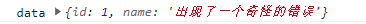
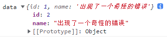

### 数组相关

#### 综合

##### 累加

```
let code = list.reduce((pre, cur) => pre + cur.credit, 0)
```

当不是每项都需要累加时，需要用以下方式

```
let count = list.reduce((pre, cur) => {
	if(cur.status == 1){
		pre = pre + cur.money
	}
	return pre
}, 0)
```

##### 删除元素

删除数组对象中，与另一个数组相同的元素

```
let arr = [
	{id: 1, value: '1'},
	{id: 2, value: '2'},
	{id: 3,value: '3'},
	{id: 4,value: '4'},
	{id: 5,value: '5'},
	{id: 6,value: '6'}
]

let delArr = [3, 4]

const end = arr.filter((ele)=>{
	return delArr.indexOf(ele.id) == -1
})
```

#### 数组

##### 去空值

```
_arr = _arr.filter(ele => ele && ele.trim())
```

##### 去重

使用 `es6` `Set` 数据结构

```
const array = [1, 2, 4, 6, 4, 4]
let arr = [...new Set(array)]
// arr [1.2.3.4]

or 

let arr = Array.from(new Set(array))
```

##### 数组的拷贝

###### 浅拷贝

1）定义

若数据是基本类型，拷贝的是基本类型的值，若数据是引用类型，拷贝的则是内存地址

2）示例

```js
let obj = {
    id:1,
    info:{
        name:"hello",
        age:24
    }
}
let obj2 = obj; // 赋值就是一个浅拷贝
obj2.id = 3;
console.log(obj.id);   // 3
```

###### 深拷贝

1）定义

将一个对象从内存中完整拷贝一份出来，从堆内存中开辟一个新的区域存放新对象，且不会影响原对象

2）序列化与反序列化

```
JSON.parse(JSON.stringify)

//缺点
有些格式JSON不支持，如下
1.对象中不能有函数，属性直接被忽略
2.对象中不能有undefined，属性直接被忽略
3.对象中不能有正则，属性直接被忽略
4.Date类型数据会被转化为字符串类型
5.对象不能是环状结构，否则会报错
//所谓环状结构的对象，就是对象的属性又指向了自身，window就是最常见的一个环状对象
```

3）参考文章（数组深拷贝）

https://juejin.im/post/6889327058158092302#heading-13

#### 数组对象

##### 去重

1）使用`es6` `Map`数据结构

```
const arr = [
	{id: 1, name: '张三'},
	{id: 2, name: '李四'},
	{id: 1, name: '王五'}
]
const dealRepeat = (arr) =>{
	const res = new Map()
	return arr.filter((ele) => !res.has(ele.id) && res.set(ele.id, 1))
}

dealRepeat(arr) // 打印结果 [{...},{...}]
```

2）使用 `reduce()`

```
// data 为需要去重得数组
let hash = {}; 
data = data.reduce((pre, cur) => {
	hash[cur.id] ? '' : hash[cur.id] = true && pre.push(cur); 
	return pre 
}, [])
```

### 字符串

#### 去除重复字符串

1）使用`es6` `Map`数据结构

```
[...new Set('ababbc')].join('')
```

### 监听浏览器事件

#### 监听滚动条滚动

```
<script>
    window.onscroll = funciton(){
    	let scor = document.documentElement.scrollTop
	}

	or
    
    window.addEventListener('scroll', function(){})
</script>
```

#### 监听滚动条滚动到最底部

```
// 变量 vDom 可以是 window 或者 是其他的 dom 对象
let vDom = this.$refs.course; //这里指vue 中的 dom 元素
vDom.addEventListener('scroll', () =>{
	let courseHeight = vDom.clientHeight, //元素可视区的高度，元素的实际高度
		scrollTop = vDom.scrollTop, //滚动条距离顶部的距离
		scrollHeight = vDom.scrollHeight; //滚动条的总高度，其实感觉就是内容的高度
    if(scrollTop + courseHeight == scrollHeight){
    	console.log('滚动到最底部了')
    }
})
```

#### 监听页面（刷新或关闭）

```
// 当离开页面以后执行的操作
// 监听
window.addEventListener('beforeunload', e => {})

// 移除监听
window.removeEventListener('beforeunload', e => {})
```

#### 判断刷新或关闭

1. 判断鼠标是否点击关闭

2. 是否按了 ALT + F4

```
window.onbeforeunload = function () {
  if (event.clientX > document.body.clientWidth && event.clientY < 0 || event.altKey) {
    alert ("你关闭了浏览器");
  } else {
    alert ("你正在刷新页面");
  }
}
```

### 文件处理

#### 文件转化

##### `base64`转为二进制文件

```
// 转为 binary 或者 url
/demo/关于文件处理/01-base64转二进制文件.html
```

#### 文件下载

\<a> 标签

直接下载

```
<a href="https://www.juejin.com/测试.xls" download="测试.xls">EXCEL</a>
```

动态下载

```
/*
* url 需要下载的 url
* name 文件名称
* 文件类型 例如 ‘.xls’
*/
const downLoad = (url, name, type) =>{
	let a = document.createElement("a");
    a.href = url
    a.download = `${name}${type}`
    //以下这段为了兼容火狐
    a.dispatchEvent(new MouseEvent('click', {bubbles: true, cancelable: true, view: window}))
    a = null;
}
```

#### 视频

1）此为简单视频下载功能，url为下载视频路径

```

downLoad(url){
	let a = document.createElement('a');
	a.href = url;
	a.click();
	a = null;
}
```

2）下载视频变为打开

```
在下载视频的url后拼接 
?response-content-disposition=attachment
```

#### 身份证号校验性别

```
sex = parseInt(this.basicForm.idNumber.substr(16, 1)) % 2 == 1 ? '男' : ‘女’
```

#### 移动端不允许缩放

```
<meta 
	name="viewport" 
	content="width=device-width, initial-scale=1.0, minimum-scale=1.0, maximum-scale=1.0, user-scalable=no"
> 

width // viewport的宽度 height - viewport的高度
initial-scale // 初始的缩放比例
minimum-scale // 允许用户缩放到的最小比例
maximum-scale // 允许用户缩放到的最大比例
user-scalable // 用户是否可以手动缩放
```

#### 标签 js 不允许跳转

```
<a href="javascript:void(0);">xxx</a>
```

#### video 获取视频时长

```
let video = document.createElement('video')
let duration = 0
video.src = res.result.filePath
video.play()
video.addEventListener("loadedmetadata", function (_event) {
	duration = video.duration;
})
```


#### `typeof`

1）定义

typeof 判断数据类型（数组跟对象都返回Object）

#### `instanceof`

#### 解决js精度问题

##### 使用number-precision库

#github地址

https://github.com/nefe/number-precision

#下载

```
npm install number-precision --save
```

#方法

```
NP.strip(num)         
// strip a number to nearest right number
NP.plus(num1, num2, num3, ...)   
// addition, num + num2 + num3, two numbers is required at least.
NP.minus(num1, num2, num3, ...)  
// subtraction, num1 - num2 - num3
NP.times(num1, num2, num3, ...)  
// multiplication, num1 * num2 * num3
NP.divide(num1, num2, num3, ...) 
// division, num1 / num2 / num3
NP.round(num, ratio)  
// round a number based on ratio
```

#使用

```
import NP from 'number-precision'
NP.strip(0.09999999999999998); 
// = 0.1
NP.plus(0.1, 0.2);             
// = 0.3, not 0.30000000000000004
NP.plus(2.3, 2.4);             
// = 4.7, not 4.699999999999999
NP.minus(1.0, 0.9);            
// = 0.1, not 0.09999999999999998
NP.times(3, 0.3);              
// = 0.9, not 0.8999999999999999
NP.times(0.362, 100);          
// = 36.2, not 36.199999999999996
NP.divide(1.21, 1.1);          
// = 1.1, not 1.0999999999999999
NP.round(0.105, 2);            
// = 0.11, not 0.1
```

#### base64

##### 在 `` 中展示

需要在开头加上以下代码：

```
“data:image/jpg;base64,...."
```

#### `console`对象

##### `console.log()`

1）打印引用值出现问题

修改了引用值的数据之前，使用`console.log()`打印这个值，点开小箭头，我们发现，使用`console.log()`打印引用值时，打印的内容跟上次定义的值不同。

```
<body>
  <div onclick="showDiff()">点击我</div>
  <script>
    function showDiff(){
      let data = {id: 1, name: '出现了一个奇怪的错误'}
      console.log('data', data)
      data.id = 2
      // console.log('data', data)
    }
  </script>
</body>

```

在没打开控制台的小箭头之前的结果



打开小箭头发现



原因如下：

```
console.log()`函数在浏览器中输出的是变量引用地址的内存快照，只简单输出变量的类型。

当点击左侧这个小箭头时，浏览器会根据当前引用类型变量的内存地址去读取变量的值。

这与 javascript 的事件队列是有关系的，console.log 函数只有当本次宏任务执行完成，才会去读取参数的值
```


