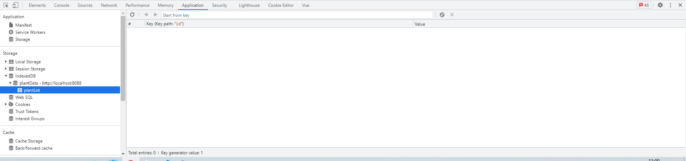

##### 在`vue`中使用

下载

```
yarn add indexdbwrapper

// 引入
import IndexDBWrapper from "indexdbwrapper";

export default {
	data(){
		indexedDB: null
	}，
	
	mounted(){
		// 初始化数据
		this.indexedDB = new IndexDBWrapper('plantData', 1, {
    	onupgradeneeded: (e) =>{
    		const db = e.target.result;
    		const objStore = db.createObjectStore("plantList",{
    			autoIncrement: true,
    			keyPath: "id"
    		});
    	}
    })
		// 打开数据库，这样浏览器就可以看到了
		this.indexedDB.open()
	}
}

```


