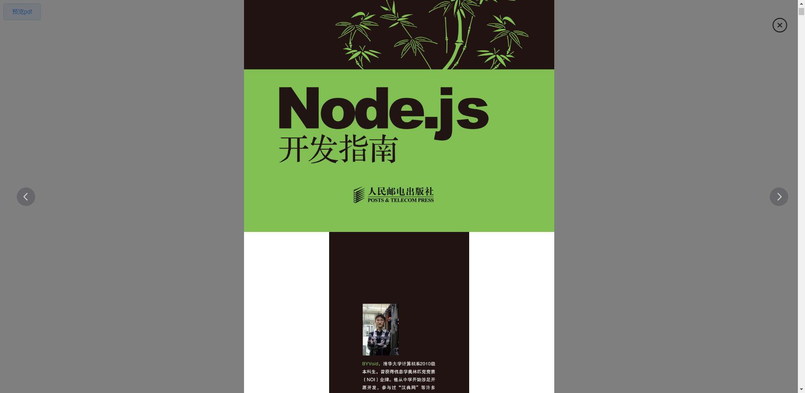

### 分享

vue 使用 vue-pdf 来实现预览 pdf 的功能感觉是最简单的解决方案了。

### 快速上手

#### 安装

```
npm install --save vue-pdf
or
yarn add vue-pdf
```

#### 引入

```
import pdf from 'vue-pdf'
```

#### 注册组件

```
components: {
	pdf
},
```

### 使用

基本引入

```
<pdf ref="pdf" :src="pdfUrl"></pdf>
```

若直接按以上引入，会存在一个问题，就展示一个页面，于是网上找了许多方法进行改进

目前的需求是直接展示滚动条滚动页面，如果需要分页滚动，以后还会继续添加

```
<pdf
    v-for="item in numPages"
    :key="item"
    :src="src"
    :page="item"
    class="pdf-wrap"
/>

几个属性的说明
// src   pdf 的链接，可以是相对或者绝对地址，也可是一个 pdf 的加载任务
// page  需要展示 pdf 的第几页
```

执行以下方法， url 为 pdf 地址

```
data() {
    return {
        numPages: '',
        src: '', // pdf文件地址
    };
},

methods：{
	dealPdf(url) {
        this.src = pdf.createLoadingTask(
            url
        );
        this.numPages = '' //这个是以下的实战时切换来使用
        this.src.promise.then((pdf) => {//经常看到没加 .promise 的文章，但是会报 then 没有定义
            this.numPages = pdf.numPages;
        });
    },
}

几个方法的说明
// createLoadingTask(src) 这个方法创建一个当前 pdf 的加载任务，可以作为 :src 使用或者公开的获取当前 pdf 的页面总数

mounted(){
	this.dealPdf('http://image.cache.timepack.cn/nodejs.pdf')
}
```

### 实际效果

本人依据 vue-pdf,  以及借鉴  \<el-image-viewer> 实现了一个可以切换不同 .pdf 的 url 的组件

#### 实际效果图



#### demo

demo 放在 github 上， 点击 [demo-03](https://github.com/Allshadow/vue-no-webpack/tree/master/demo-03) 查看

