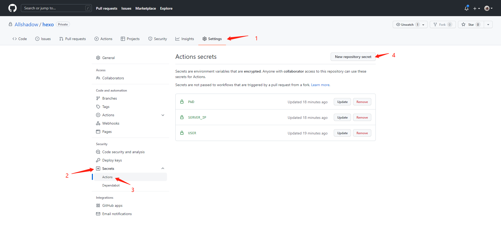
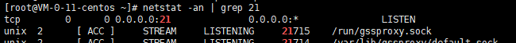

### `Hexo`

#### 起步

`Hexo`需要依赖`nodejs`，如未安装，请自行百度如何安装。

##### 安装

```
npm install -g hexo-cli

// 检查是否安装完成
hexo version
```

##### 初始化项目

```
// 新建目录，并进入目录
hexo init
```

##### 运行项目

```
// 安装依赖
yarn

// 运行项目
hexo server
```

##### 新建博客

```
hexo new 'xxx' // xxx 为文章名称
```

#### 关于主题

官网`https://hexo.io/themes/`有很多主题，我们可以挑选心仪的主题，来作为自己的博客网站

##### 主题应用

我们点进主题中，就可以看到一些主题的用法。以下我是用`maupassant`主题模板来举例

1）主题教程地址

```
// 功能配置可以参考以下文档
https://www.haomwei.com/technology/maupassant-hexo.html
```

2）主题下载

在`themes`目录下执行以下命令：

```
git clone https://github.com/tufu9441/maupassant-hexo.git themes/maupassant  
// 需要的依赖
npm install hexo-renderer-pug --save  
npm install hexo-renderer-sass --save  

// 依赖hexo-renderer-sass安装时容易报错，很可能是国内网络问题，请尝试使用代理或者切换至NPM的国内镜像源安装
```

下载完，会有一个`themes`目录，把目录下的`maupassant`文件夹拷到当前`themes`目录下。我们刚才下载的`themes`目录就可以删除了

3）编辑`_config.yml`

编辑`Hexo`目录下的 `_config.yml`，将`theme`的值改为`maupassant`。

### 自动部署

#### 简介

##### 需求

我的想法比较简单，只要将本地的文章推送到 `github`远程仓库时，能自动构建并发到服务器。 `Github Actions`这个服务正好符合我的要求。目前感觉构建是慢了一点。

##### 关于`Github Actions`

网站上的教程一般都是发布到`Github Pages`，因此，我也踩了不少坑。但是对于`Github Actions`，也有一点点熟悉了。

`Github Actions`应用市场上有两种将打包好的文件传递到个人服务器的方法：一种是通过 `SFTP`传递，这个是通过默认端口22来传递，相对方便点。但是我的服务器`ssh-key`一直配置不对。第二种是通过`FTP`来传输，所以我采用这种方式

`ps`: 插件市场地址

```
https://github.com/marketplace/actions
```

#### 项目本地配置

##### 新建工作流

在`.github`目录下新建`workflows`目录，`workflows`目录下再建`deploy.yml`文件

##### `deploy.yml`

```
name: CI

on:
  push:
    branches:
      - master

jobs:
  build:
    name: Build on node ${{ matrix.node_version }} and ${{ matrix.os }}
    
    runs-on: ubuntu-latest
    
    strategy:
      matrix:
        os: [ubuntu-latest]
        node_version: [12.x]
		# name 是步骤提示，在github actions 里面可以看到
		# uses github 提供的一些插件
		# with 插件的配置
		# run 我们需要执行的命令
    steps:  # 运行步骤
      # check out the repository
      - name: Checkout
        uses: actions/checkout@v2    #这里使用了github官方提供的action,checkout项目到虚拟机上

      - name: Use Node.js ${{ matrix.node_version }}
        uses: actions/setup-node@v1
        with:
          node-version: ${{ matrix.node_version }}

      - name: changeYum
        run: npm config set registry http://registry.npm.taobao.org/

      - name: install package
        run: yarn add hexo-renderer-pug hexo-renderer-sass

      - name: Install Dependencies
        run: yarn

      - name: Build
        run: npm run deploy

      # 利用action把build好的文件上传到服务器/resource/blog路径下,需要确认此目录已在服务端创建
      - name: Upload from public_html via FTP
        uses: airvzxf/ftp-deployment-action@latest
        with:
          server: ${{ secrets.server_ip }} #这个东西下面有解释怎么用
          user: ${{ secrets.user }}
          password: ${{ secrets.pwd }}
          local_dir: "public/"
          remote_dir: "/resource/blog"
          delete: true
```

##### `$`{{ `secrets.XXX` }}

有部分隐私内容不方便直接放在代码上展示，所以放在`github`上设置，点击`New repository secret`按钮，name 为 `$`{{ `secrets.XXX` }} 中的 `xxx`， `value`为该设置的值



#### 服务端配置

由于用`FTP`传输，遇到了一个问题，就是写好了运行脚本，但是访问`21`端口都是被拒绝。

后来才知道，端口需要有一个监听程序

##### 安装`vsftpd`

```
yum install vsftpd
```

##### 修改`vsftpd`配置文件

```
anonymous_enable=YES
listen=YES
listen_ipv6=NO
userlist_enable=NO
```

##### 启动

```
service vsftpd restart
```

##### 检查`21`号端口是否监听

```
netstat -an | grep 21
```

以下表示有在监听



##### 错误解决

1）当使用`root`登录时，报以下问题

```
530 Please login with USER and PASS
```

解决：

```
vim /etc/vsftpd/ftpusers

# root  // 注释掉 root

// 重启
service vsftpd restart
```

### 参考链接

- [`Hexo`+云服务器搭建个人博客网站](https://blog.csdn.net/wobushiguirenren/article/details/103612363)
- [利用 `Github Actions` 自动部署 `Hexo` 博客](https://sanonz.github.io/2020/deploy-a-hexo-blog-from-github-actions/#%E4%BB%8B%E7%BB%8D)