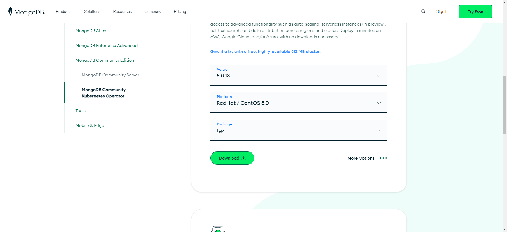

### 起步

#### `CenterOS` 安装 `mongodb`

##### 使用 `tar` 包安装

1）安装依赖

```
yum install libcurl openssl xz-libs -y
```

2）下载`tar`包：

下载地址:

```
https://www.mongodb.com/try/download/community
```

往下滑选择社区版本， 并选择版本下载，如下图所示



3）解压

```
// 目录要记得将 * 号替换
tar -zxvf mongodb-linux-*-5.0.13.tgz
```

4）移动文件位置

```
mv mongodb-linux--*-5.0.13/* /usr/local/mongodb/
```

5) 配置环境变量

```
// 打开
vim /etc/profile

// 在 export PATH 上添加下面一行，注意要改目录位置
export PATH=/user/local/mongodb/bin:$PATH

// 更新下环境变量
source /etc/profile
```

6）创建数据目录

```
cd /usr/local/mongodb
$ touch mongodb.conf
$ mkdir db
$ mkdir log
$ cd log
$ touch mongodb.log

// 设置文件夹权限
chmod 777 db
chmod 777 log
```

7）修改`mongodb.conf`

```
vim /usr/local/mongodb/mongodb.conf

// 写入以下代码
port=27017 #端口
dbpath= /usr/local/mongodb/db #数据库存文件存放目录
logpath= /usr/local/mongodb/log/mongodb.log #日志文件存放路径
logappend=true #使用追加的方式写日志
fork=true #以守护进程的方式运行，创建服务器进程
maxConns=100 #最大同时连接数
#noauth = true #不启用验证
journal=true #每次写入会记录一条操作日志（通过journal可以重新构造出写入的数据）。
#即使宕机，启动时wiredtiger会先将数据恢复到最近一次的checkpoint点，然后重放后续的journal日志来恢复。
storageEngine=wiredTiger  #存储引擎有mmapv1、wiretiger、mongorocks
bind_ip = 0.0.0.0  #这样就可外部访问了，例如从win10中去连虚拟机中的MongoDB
auth = true #用户认证
```

8）启动

```
mongod --config /usr/local/mongodb/mongodb.conf
```

9）配置

在添加用户名之前应该先执行`./mongo`命令先打开`mongodb`数据库

```
// 进入bin目录
cd /usr/local/mongodb/bin/

//使用admin数据库
use admin

//给admin数据库添加管理员用户名和密码，用户名和密码请自行设置
db.createUser({user:"admin",pwd:"123456",roles:["root"]})

//验证是否成功，返回1则代表成功
db.auth("admin", "123456")

//切换到要设置的数据库,以test为例
use test

//为test创建用户,用户名和密码请自行设置。
db.createUser({user: "test", pwd: "123456", roles: [{ role: "dbOwner", db: "test" }]})
```

10）参考链接

```
// 官网地址
https://www.mongodb.com/docs/manual/tutorial/install-mongodb-on-red-hat-tarball/#using-a-custom-mongodb-port

// 教程地址
https://blog.csdn.net/weixin_45827976/article/details/121085078
```