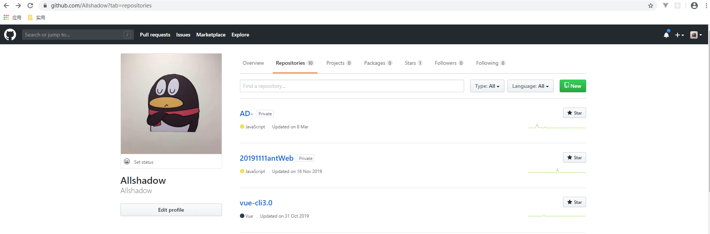
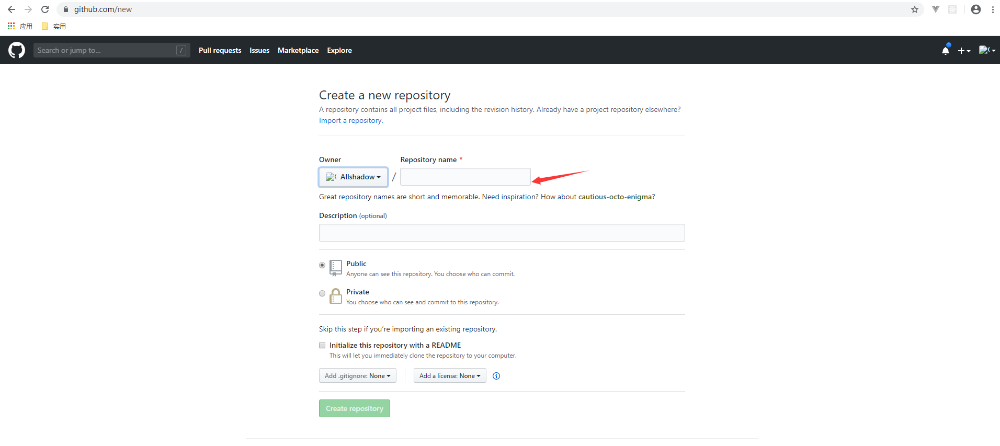
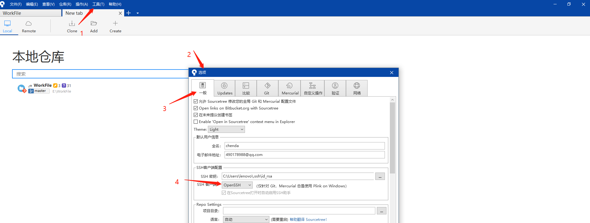
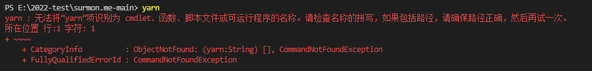

### `git`

#### 安装

##### 升级 `git`

```
git update-git-for-windows
```

#### 使用场景

##### 批量添加文件到暂存区

```
$ git add -A
```

##### 更新线上分支

```
git remote update origin --prune
```

##### 放弃当前`rebase`状态

```
git rebase --abort
```

##### 重置为当前最初状态

```
git reset --hard origin/branch/hotfix/V5.0.10.16_GPX_200313 
//后面为当前版本
```

##### 取消上一次提交状态

```
git reset --soft HEAD^
```

##### 分支的强制覆盖

有时候，想将develop分支上的内容强制覆盖到master分支

1）切换到develop分支下，并保证本地已经同步了远程仓库的代码

```
git checkout develop
git pull
```

2）把本地的develop分支强制（-f）推送到远程仓库master

```
git push origin develop:master -f (develop:master 为当前分支名称：需要覆盖的分支名称)
```

3）切换到旧分支

```
git checkout master
```

4）下载远程仓库的最新内容，不作合并

```
git fetch --all
```

5）把HEAD指向master最新版本

```
git reset --hard origin/master
```

#### 关于远程仓库

##### 设置本地`ssh`

1）判断本地是否存在`.ssh`目录

打开 `Git Bash`，输入命令检查目录是否存在

```
//输入以下代码（一般在 C:\Users\lenovo\.ssh 目录下）
$ ls -al ~/.ssh 
# ls: cannot access '/c/Users/lenovo/.ssh': No such file or directory //返回此说明没有这个目录
```

2）如果存在，会有以下两个文件

```
id_rsa  //私钥，不能泄露出去
id_rsa.pub //公钥，可以放心告诉别人
```

3）创建`sshkey`（若文件存在跳过此步）

```
//以下邮件地址需要换成自己的邮件地址
//然后一路回车，使用默认值即可
$ ssh-keygen -t rsa -C "youremail@example.com"
```

4）登陆`gitHub`

```
1.点击右侧头像---settings---SSH and GPG keys
2.点击New SSH key 按钮
3. 填上title(可以随意的title),Key为文本框里粘贴id_rsa.pub文件的内容（C:\Users\lenovo\.ssh windows路径）
4.保存即可
```

##### 添加远程仓库

1）点击右侧头像---your Repositories-- new



2）公开的只要填name即可



##### 关联远程仓库

1）在本地仓库运行命令

```
$ git remote add origin git@github.com:Allshadow/WorkFile.git //ssh传输

$ git remote add origin https://github.com/Allshadow/WorkFile.git //此为https协议的链接，会不断重复输入密码...

//此时，取消本地关联仓库，执行ssh传输
1.git remote rm origin
```

##### 推送远程仓库

1）初始化本地仓库

```
$ git init
```

2）提交文件到暂存区

```
$ git add -A
```

3）提交文件到版本库

```
$ git commit -m ''
```

4）在本地仓库运行命令

```
$ git push -u origin master
```

#### `git`用户设置

##### 设置用户名

```
git config --global user.name "Your Name" 
```

##### 设置邮箱

```
git config --global user.email "email@example.com"
```

##### 备注

```
//--global 如果用了这个参数，这台电脑上的所有Git仓库都会使用这个配置
```

### `Sourcetree`

#### 报错

##### `git status` 失败

报错：`git status`失败 错误代码`128：error :bad signature 0x0000000`

```
//打开 git bash

//1.删除 index
rm -f .git/index

//2.重新创建（可以使用如下命令，不用质疑）
git reset
```

##### `ssh` 密钥认证失败

使用 `sourceTree`时候，弹出窗口，通过密钥认证失败...请设置密钥等等

```
// 修改客户端配置，因为sourceTree默认SSH客户端配置的SSH客户端 是PuTTY/Plink
[工具]-[选项]-[一般]，如下图，选择为 openSSH
```



### `yarn`

#### 安装

```bash
npm i yarn -g
```

#### 常用指令

##### 查看版本

```bash
yarn -v
```

##### 创建 `package.json`

```
yarn init

or

yarn init -y 
```

##### 添加依赖

```
yarn add //添加依赖会更新 package.json 以及 yarn.lock 文件

* 生产环境依赖
yarn add webpack || yarn add webpack@2.3.3
相当于 yarn add --save

*开发环境依赖
yarn add --dev webpack

*全局依赖
yarn global add webpack
```

##### 更新依赖

```
yarn upgrade //升级所有依赖
yarn upgrade webpack //升级指定包
yarn upgrade --last //忽略版本规则，升级最新版本，并且更新 package.json
```

##### 移除依赖

```
yarn remove webpack
```

##### 安装 `package.json` 中所有文件

```
yarn || yarn install
yarn install --force //安装时，如果 node_modules 中有相应的包,可以以强制重新下载安装
```

##### 运行脚本

```
yarn run //用来执行在 package.json 中属性下定义的脚本
yarn run dev || yarn dev
```

参考链接

```
https://www.cnblogs.com/lililia/p/10482169.html
http://www.imooc.com/wiki/yarnlesson //慕课网教程
```

### `nvm`

`nvm` 是 `node.js` 的版本管理工具

#### 安装

##### 百度网盘

```
百度网盘上 work > nvm-setup > nvm-setup.exe
```

##### `github`

```
https://github.com/coreybutler/nvm-windows/releases
```

#### 常用指令

##### 查看 `npm` 版本号

```
npm -v
```

##### 查看 `node` 版本号

```
node -v
```

##### 查看本地版本

```
nvm list
```

##### 查看帮助

```
nvm --help
```

##### 查看 node 可用版本

```
nvm list available
```

##### 使用哪个 node 版本

```
nvm use 版本号
```

##### 下载 node 版本

```
nvm install 版本号
```

##### 卸载

```
nvm uninstall 版本号
```

#### 切换国内镜像

`*\nvm\setting.txt`添加如下内容

```
node_mirror: https://npm.taobao.org/mirrors/node/
npm_mirror: https://npm.taobao.org/mirrors/npm/
```

### `npm`

#### 常用指令

##### 生成`package.json`

```
npm init
```

##### 安裝模块依赖

```
npm install
```

##### 查看当前使用`npm` 源

```
npm config get registry
```

##### 删除 `node_modules`

```
// 删除 node_modules, 再安装
rm -rf node_modules
rm package-lock.json
npm cache clear --force
npm install
```

#### `.npmignore`

##### 设置白名单

```
!dist/file.js
```

#### 设置源

1）设置淘宝源

```
npm config set registry http://registry.npm.taobao.org/

npm config get registry // 检查是否设置成功
```


### `nrm`

`nrm` 用来管理 `npm` 源

#### 下载

```
npm install -g nrm
```

#### 常用指令

##### 添加 npm 源

```
nrm add npm http://registry.npmjs.org
nrm add taobao https://registry.npm.taobao.org
```

##### 切换源地址

```
nrm use npm
nrm use taobao
```

##### 查看当前源地址

```
nrm ls
```

### 项目中常见问题

#### `node-sass`

1）`node-sass` 安装报错

```
# 解决存放在Github上的sass无法下载的问题
npm config set sass_binary_site=https://npm.taobao.org/mirrors/node-sass
npm install
```

#### `phantomJs`

1）下载延时问题

```
//百度网盘
2022开发工具/node相关/phantomJs

//无需安装，解压即可，并配置环境变量
//在path中添加：
D:\Program Files\phantomjs-2.1.1-windows\bin
```

#### `gyp`

1）gyp ERR! build error 

因为 windows 平台缺少编译环境，以下安装即可

```
npm install -g node-gyp
```

### 报错

#### `yarn`

##### 使用`yarn`命令报错



```
npm install -g yarn
```

##### 报网络错误

```
// yarn 报错
There appears to be trouble with your network connection. Retrying...

// 解决
yarn upgrade
```

#### `nvm`

##### `node`不是外部命令

问题： `node -v` 不是内部命令或外部命令

```
// 先检查环境变量是否配置

解决： 将 nodejs 目录下有 etc 文件， 将其删除即可
```

##### 安装完 `node` 找不到

```
刚安装完node版本，需要重启计算机，否则有可能出现node找不到的问题
```

##### node 安装失败

由于 `npm` `git`官方地址变更，使用默认配置会导致 node 下载失败，修改` “nvm/settings.txt”`

```
root: D:\nvm
path: D:\nodejs
// 添加以下代码
node_mirror: http://npm.taobao.org/mirrors/node/
npm_mirror: https://npm.taobao.org/mirrors/npm/
```

#### `npm`

##### 下载`yarn`报错

切换`node1.6.14.2`版本后，下载`yarn`报错


暂时无解！！！

#### 运行项目时报错

```
Error [ERR_PACKAGE_PATH_NOT_EXPORTED]: No "exports" main resolved in 'xxx'
```

原因：由于`node.js` 的版本过高，降低版本可以解决

```
nvm use 10.22.0
```