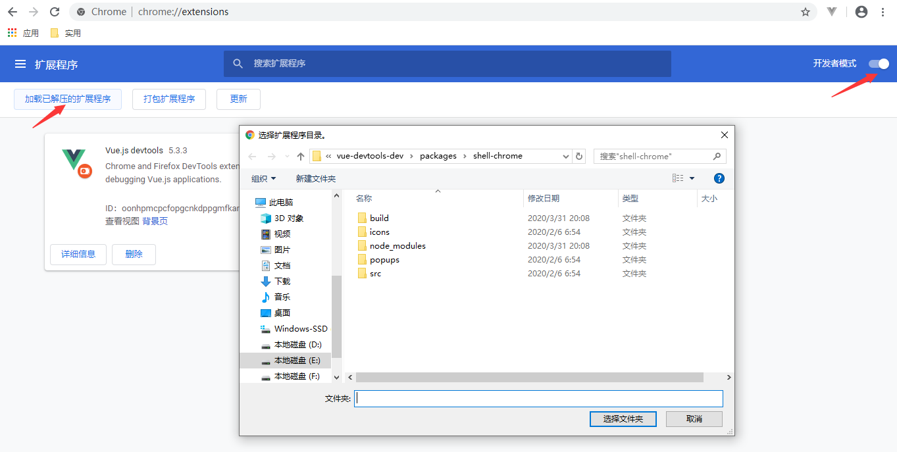

### `google chrome`

#### 插件

##### `vue-devtools`

1）下载

```
// 百度网盘
tools/谷歌插件/vueDevtools
```

2）使用方法

使用谷歌浏览器访问：· [chrome://extensions/](chrome://extensions/)

打开右侧的开发者模式，并且点击 '加载已解压的扩展程序'，选取文件



3）弹出的选择文件弹窗，选择文件加压后的 `E:\project\vue-devtools-dev\packages\shell-chrome`，点选择文件夹即可

##### 谷歌标签与码云同步

1）插件下载

```
// 百度网盘： 
tools/谷歌插件/标签同步码云
```

2）码云 `token`

```
15a6b5b6080d5a934b99e7fa7a57c537

// 获取码云token 以及其他信息查看 码云仓库的 readme.md
```

##### `cookie-editor`

```
// 百度网盘： tools/谷歌插件/cookieEditor
// 直接点击 '加载已解压的扩展程序' 直接引入目录
```

##### `axure`

```
// 百度网盘
tools/Axure
```

#### 操作

##### 强制刷新

```
// 方式一
shift + 鼠标左键

// 方式二
ctrl + F5
```

### 