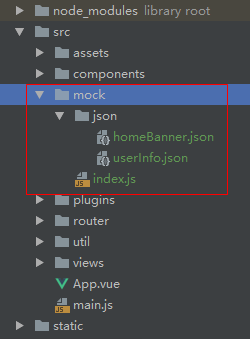

### `json-server`

#### 简介

一个简单的本地服务，可以通过接口，处理获取`json`中的数据

#### 安装

```
npm install -g json-server
```

#### 使用

##### 创建 `db.json`

新建个文件夹，创建 `db.json`文件

```
{
  "posts": [
    { "id": 1, "title": "json-server", "author": "typicode" }
  ],
  "comments": [
    { "id": 1, "body": "some comment", "postId": 1 }
  ],
  "profile": { "name": "typicode" }
}
```

##### 监听数据

在命令行中执行，即可监听到数据变化

```
json-server --watch db.json
```

#### `demo`

```
/tools/mock/json-server
```


### `mock.js`

#### 安装

```
yarn add --dev mockjs

or

npm install mockjs --save-dev
```

#### 步骤

##### 新建目录

`src`目录下新建下图的文件结构



上图项目中的代码

`index.js`

```
const Mock = require('mockjs');
//格式： Mock.mock( url, post/get , 返回的数据);
Mock.mock('/user/userInfo', 'get', require('./json/userInfo'));
Mock.mock('/home/banner', 'get', require('./json/homeBanner'));
```

`json`文件中的内容

```
// homeBanner.json

{
  "result": "success",
  "data": {
    "mtime": "@datetime", //具体应用看官方文档
    "score|1-800": 800,
    "rank|1-100":  100,
    "stars|1-5": 5,
    "nickname": "@cname"
  },
  "msg": ""
}
```

##### 使用

```
// main.js 引入
import axios from 'axios' //需要使用到 axios
Vue.prototype.axios = axios;  //挂载 axios
require('./mock'); //引入mock数据，关闭则注释该行

// axios 请求
this.axios.get('/user/userInfo')
  .then(function(res){
    console.log(res);
  })
  .catch(function(err){
    console.log(err);
  });
```
