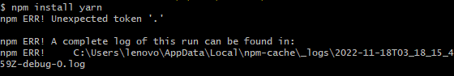

#### 介绍

`nvm` 是 `node.js` 的版本管理工具

#### 安装

安装尽量不选`c`盘其他的按默认就好

```
// 百度网盘 v1.1.10
tools > nvm > nvm-setup.exe

// github 获取最新版本
https://github.com/coreybutler/nvm-windows/releases
```

#### 常用命令

```
// 查看当前 npm 版本
npm -v

// 查看当前 node.js 版本
node -v

// 查看已经安装的版本
nvm list

// 使用 node 版本
nvm use 16.18.1

// 下载 node 版本
nvm install 16.18.1

// 查看 node 可用版本
nvm list available

// 卸载版本
nvm uninstall 16.18.1

// 查看帮助
nvm --help
```

#### 切换国内镜像

`*\nvm\setting.txt`添加如下内容

```
node_mirror: https://npm.taobao.org/mirrors/node/
npm_mirror: https://npm.taobao.org/mirrors/npm/
```

#### 问题解决

1）低版本`nvm1.1.7`安装 `node16`报错问题：



解决方案：

```
// 1.删除已经安装并且报错的node
// 2.升级nvm至最新版本（windows 是下载上面的安装包,再安装一次）
// 3.重新安装node
```

2） `node -v` 不是内部命令或外部命令

刚安装完node版本，需要重启计算机，否则有可能出现node找不到的问题

```
// 先检查环境变量是否配置

解决： 将 nodejs 目录下有 etc 文件， 将其删除即可
```

3）`node` 安装失败

由于 `npm` `git`官方地址变更，使用默认配置会导致 `node` 下载失败，修改` “nvm/settings.txt”`

```
root: D:\nvm
path: D:\nodejs
// 添加以下代码
node_mirror: http://npm.taobao.org/mirrors/node/
npm_mirror: https://npm.taobao.org/mirrors/npm/
```
