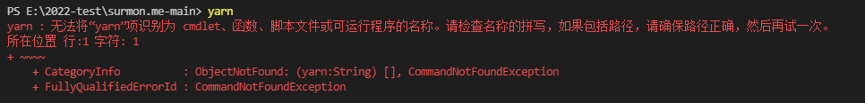

### `yarn`

#### 安装

```
npm i yarn -g
```

#### 常用指令

```
// 查看 yarn 版本
yarn -v

// 初始化 package.json
yarn init -y  ||  yarn init

// 下载所有依赖
yarn || yarn install

// 安装时，如果 node_modules 中有相应的包,可以以强制重新下载安装
yarn install --force 

// 添加依赖（会更新 package.json 以及 yarn.lock 文件）

// 1. 添加生产依赖（yarn add --save）
yarn add webpack || yarn add webpack@2.3.3

// 2. 开发环境依赖
yarn add --dev webpack

// 3. 全局依赖
yarn global add webpack

// 升级依赖
yarn upgrade //升级所有依赖
yarn upgrade webpack //升级指定包
yarn upgrade --last //忽略版本规则，升级最新版本，并且更新 package.json

// 移除依赖包
yarn remove webpack

// 运行
yarn run //用来执行在 package.json 中属性下定义的脚本
yarn run dev || yarn dev

// 清除缓存
yarn cache clean

// 查看缓存目录
yarn cache dir
```

#### 问题解决

1）使用 `yarn` 命令报错



因为`yarn`未安装，使用以下命令安装：

```
npm install -g yarn
```

2）`core-js`  未找到

报错：

```
This dependency was not found:

​		`* core-js/modules/es.error.cause.js...
```

下载 `core-js` 并重启项目

```
yarn add core-js
```

3）项目运行报错

```
Error [ERR_PACKAGE_PATH_NOT_EXPORTED]: No "exports" main resolved in 'xxx'
```

由于`node.js` 的版本过高，降低版本可以解决：

```
nvm use 10.22.0
```

#### 参考链接

```
https://www.cnblogs.com/lililia/p/10482169.html
http://www.imooc.com/wiki/yarnlesson //慕课网教程
```

### `npm`

#### 常用指令

```
// 初始化 package.json
npm init -y || npm init

// 安装所有依赖
npm i || npm install

// 安装生产依赖
npm install xxx || npm install xxx --save || npm install xxx -S

// 安装开发依赖
npm install xxx -D || npm install --save-dev xxx

// 查看当前使用 npm 源
npm config get registry

// 设置源地址 1. xxx 为地址
npm config set registry xxx
```

#### 操作

##### 删除 `node_modules`

```
// 删除 node_modules, 再安装
rm -rf node_modules
rm package-lock.json
npm cache clear --force
npm install
```

##### 设置淘宝源

```
npm config set registry http://registry.npm.taobao.org/

npm get registry // 检查是否设置成功
```

#### `.npmignore`

##### 设置白名单

```
!dist/file.js
```

#### 问题解决

1）`node-sass` 安装报错

```
// 解决存放在Github上的sass无法下载的问题
npm config set sass_binary_site=https://npm.taobao.org/mirrors/node-sass
npm install
```

2）`phantomJs`下载延时问题

```
//百度网盘
tools/node/phantomJs

// 无需安装，解压即可，并配置环境变量
// 在path中添加：
D:\Program Files\phantomjs-2.1.1-windows\bin
```

3）`gyp ERR! build error `

因为 windows 平台缺少编译环境，以下安装即可:

```
npm install -g node-gyp
```