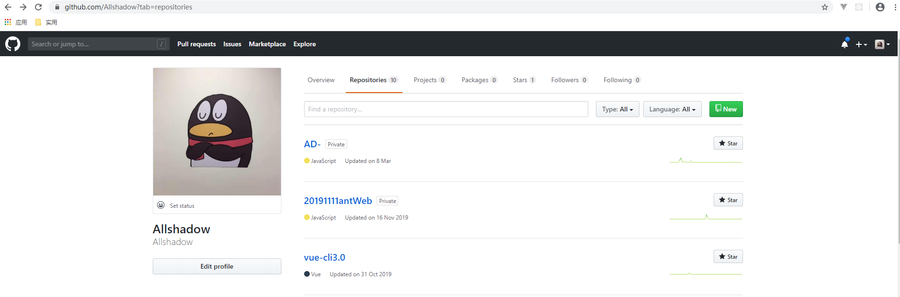
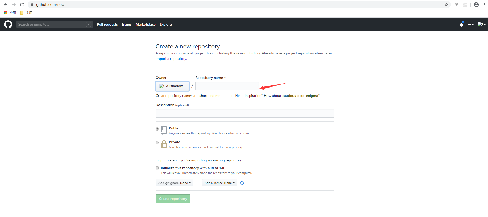

### `git`

#### 安装

##### 升级 `git`

```
git update-git-for-windows
```

#### 使用场景

##### 批量添加文件到暂存区

```
$ git add -A
```

##### 更新线上分支

```
git remote update origin --prune
```

##### 放弃当前`rebase`状态

```
git rebase --abort
```

##### 重置为当前最初状态

```
git reset --hard origin/branch/hotfix/V5.0.10.16_GPX_200313 
//后面为当前版本
```

##### 取消上一次提交状态

```
git reset --soft HEAD^
```

##### 分支的强制覆盖

有时候，想将develop分支上的内容强制覆盖到master分支

1）切换到develop分支下，并保证本地已经同步了远程仓库的代码

```
git checkout develop
git pull
```

2）把本地的develop分支强制（-f）推送到远程仓库master

```
git push origin develop:master -f (develop:master 为当前分支名称：需要覆盖的分支名称)
```

3）切换到旧分支

```
git checkout master
```

4）下载远程仓库的最新内容，不作合并

```
git fetch --all
```

5）把HEAD指向master最新版本

```
git reset --hard origin/master
```

#### 关于远程仓库

##### 查看远程仓库

```
git remote -v
```


##### 设置本地`ssh`

1）判断本地是否存在`.ssh`目录

打开 `Git Bash`，输入命令检查目录是否存在

```
//输入以下代码（一般在 C:\Users\lenovo\.ssh 目录下）
$ ls -al ~/.ssh 
# ls: cannot access '/c/Users/lenovo/.ssh': No such file or directory //返回此说明没有这个目录
```

2）如果存在，会有以下两个文件

```
id_rsa  //私钥，不能泄露出去
id_rsa.pub //公钥，可以放心告诉别人
```

3）创建`sshkey`（若文件存在跳过此步）

```
//以下邮件地址需要换成自己的邮件地址
//然后一路回车，使用默认值即可
$ ssh-keygen -t rsa -C "youremail@example.com"
```

4）登陆`gitHub`

```
1.点击右侧头像---settings---SSH and GPG keys
2.点击New SSH key 按钮
3. 填上title(可以随意的title),Key为文本框里粘贴id_rsa.pub文件的内容（C:\Users\lenovo\.ssh windows路径）
4.保存即可
```

##### 添加远程仓库

1）点击右侧头像---your Repositories-- new



2）公开的只要填name即可



##### 关联远程仓库

1）在本地仓库运行命令

```
$ git remote add origin git@github.com:Allshadow/WorkFile.git //ssh传输

$ git remote add origin https://github.com/Allshadow/WorkFile.git //此为https协议的链接，会不断重复输入密码...

//此时，取消本地关联仓库，执行ssh传输
1.git remote rm origin
```

##### 推送远程仓库

1）初始化本地仓库

```
$ git init
```

2）提交文件到暂存区

```
$ git add -A
```

3）提交文件到版本库

```
$ git commit -m ''
```

4）在本地仓库运行命令

```
$ git push -u origin master
```

#### `git`用户设置

##### 设置用户名

```
git config --global user.name "Your Name" 
```

##### 设置邮箱

```
git config --global user.email "email@example.com"
```

##### 备注

```
//--global 如果用了这个参数，这台电脑上的所有Git仓库都会使用这个配置
```

### `Sourcetree`

#### 报错

##### `git status` 失败

报错：`git status`失败 错误代码`128：error :bad signature 0x0000000`

```
//打开 git bash

//1.删除 index
rm -f .git/index

//2.重新创建（可以使用如下命令，不用质疑）
git reset
```

##### `ssh` 密钥认证失败

使用 `sourceTree`时候，弹出窗口，通过密钥认证失败...请设置密钥等等

```
// 修改客户端配置，因为sourceTree默认SSH客户端配置的SSH客户端 是PuTTY/Plink
[工具]-[选项]-[一般]，如下图，选择为 openSSH
```


#### `svn`

##### 下载地址

```
//百度网盘
tools/svn
```

#### 