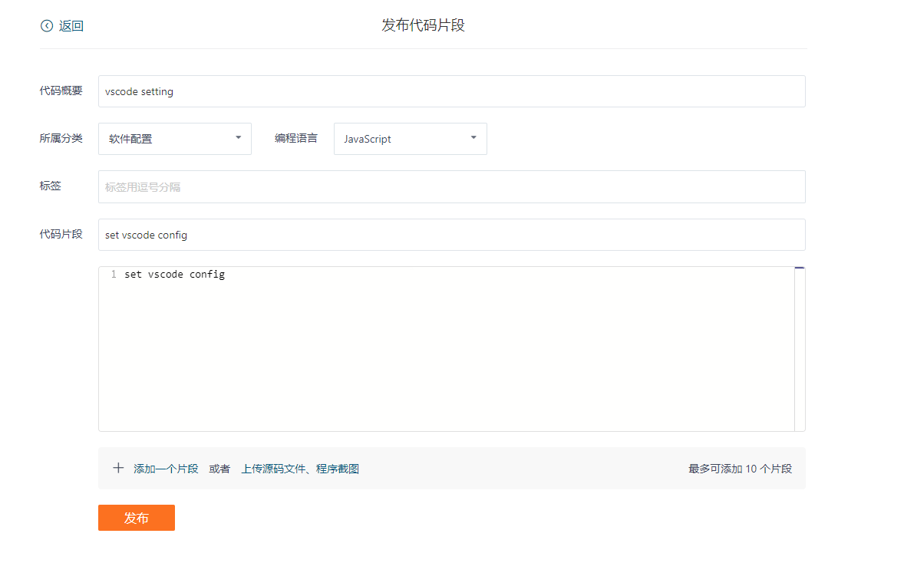
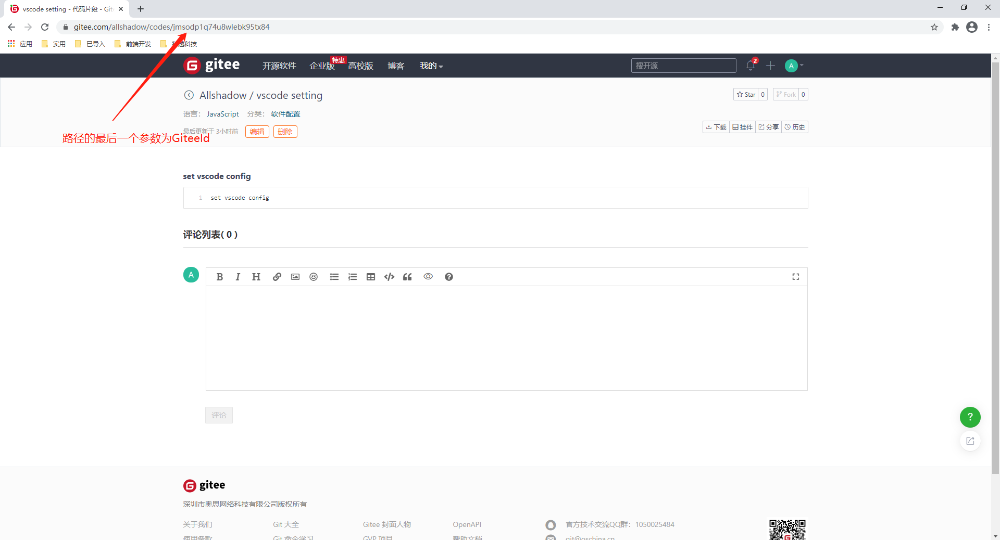
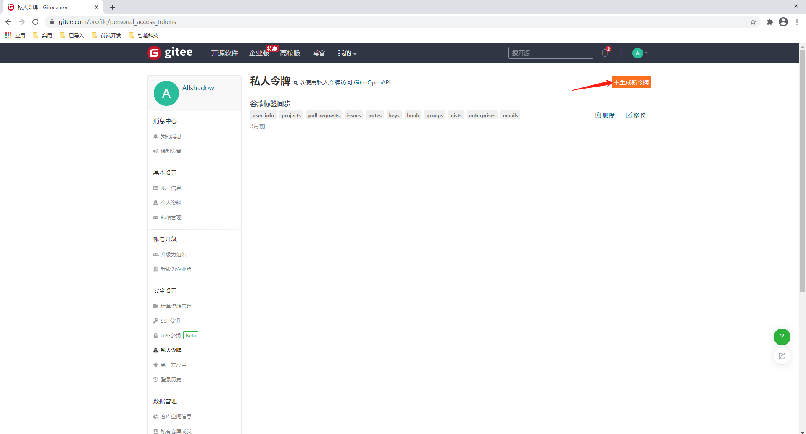
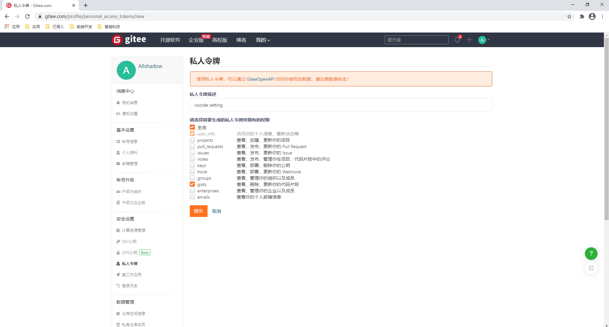
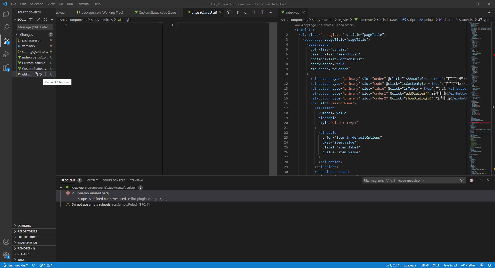

### 插件

#### 外观

1）Better Comments

用来高亮备注的

```
使用 ! / ? 等来高亮备注
// ! 
```

2） Bracket Pair Colorizer 2

高亮括号，选中会匹配到另一半

3）Highlight Matching Tag

会高亮标签，选中标签会出现下划线

#### 效率

1）Error Gutters

查看报错

2）Image preview

预览代码中图片的引用，鼠标移上去就会有小窗展示图片

3）Trailing Spaces

展示尾随空格

4）Code Spell Checker

检查代码拼写

5）koroFileHeader

添加头部注释

6） Auto Rename Tag

自动重命名标签

7）GitLens — Git supercharged

查看 git 记录

```
Live Sass Compiler //将sass or scss 实时编译为 css
minapp //支持小程序标签
wechat-snippet //小程序功能辅助
wxml //wxml高亮显示
Live Server //监听页面实时刷新
code settings sync //同步码云插件
```

#### Live Scss Compiler

```
{
  "liveSassCompile.settings.formats": [
    {
      "format": "expanded",
      "extensionName": ".css",  // 解析文件类型
      "savePath": "/css" // 保存路径，默认 null
    }
  ],
  "liveSassCompile.settings.generateMap": false //不添加map文件
}
```

### 快捷键

```
1、ctrl + enter //换行
```

### 配置文件

```
//settings.json
//进入命令 ctrl + shift + p -- preferences: Open Sttings(JSON)

{
	"editor.tabSize": 2 //tab 大小为两个空格
}
```

### 配置同步码云

国内github gist 仓库经常连接不上，于是选择码云来存放

#### 设置码云

1）点击 '发布代码片段' 填写如下信息



2）获取GiteeId

点击上图发布后，跳转的页面获取

GiteeId:  jmsodp1q74u8wlebk95tx84



3）点击 “设置”， 在设置中创建私人令牌



令牌只展示一次，要保存，如果丢失了要重新创建



私人令牌：d891c1f9f2c29039585adc63bd31ae71

#### 设置vscode

1）安装 code settings sync

2）进入setting.json 配置文件

```
快捷键打开命令面板： ctrl + shift + p
输入： settings
选择： Preferences: Open Settings (JSON) 进入
```

3）json中添加，GiteeId，私人令牌

```
{
	"gitee.gist": "jmsodp1q74u8wlebk95tx84" //这是本人id
	"gitee.access_token": "48bd77cc246dbd4723860d283cb77ce2"//本人令牌
}
```

4）上传配置

```
命令面板： ctrl + shift + p
输入： upload setting
如控制台有输出：
    finished zip
    settings.json
    syncGitee.lock
    extensions.json
    snippets.zip
即为成功
```

5）同步配置

```
命令面板： ctrl + shift + p
输入： download setting //下载命令
```

### 报错

#### Terminal禁止运行命令

报错信息：

http-server : 无法加载文件 C:\Program Files\nodejs\http-server.ps1，因为在此系统上禁止运行脚本。有关详细信息，请参阅 https:/go.microsoft.com/fwlink/?LinkID=135170 中的 about_Execution_Policies。

解决：

按下 win + x ，使用管理员身份运行 power shell

输入命令 set-executionpolicy remotesigned

输入 ‘Y’ , 回车

### 内置 git 用法

#### 移除文件

在想要移除的文件下的返回符号有个 discard changes ,点击即可，或者右键文件单击 discard changes 



### 其他

#### `Teleport Ultra`

用`Teleport Ultra`爬取网页时会出现一些多余标签，用正则表达式批量替换

```
清除tppabs标签：

html文件中：

查找： \btppabs="h[^"]*"  （可以加个空格，把tppabs空格去掉）
替换：（空）

css文件中的图片链接（以gif图片为例）：

查找：tpa=http://[^\s]*.gif

替换：（空）

css文件中的注释：

查找：/\*tpa.*?\*/

替换：（空）
```

