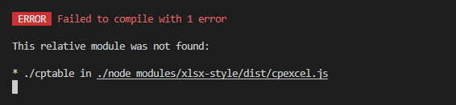

### `vue2.x`


#### 导出表格

##### 说明

```
// 本文借鉴 vue-element-admin, 并基于此基础上进行改造，以便可以修改所需样式
// Excel 的导入导出都是依赖于js-xlsx来实现的。
// 在 js-xlsx 的基础上又封装了Export2Excel.js来方便导出数据。
```

##### 安装依赖

```
// 必须安装
yarn add xlsx@0.14.1 xlsx-style file-saver
// 这个 vue-cli 好像不一定要安装,等报错再装
yarn add --dev script-loader
```

当安装 `xlsx-style`报错时:



```
// 配置 vue.config.js
module.exports = {
  configureWebpack: {
    externals: {
      "./cptable": "var cptable",
    },
  },
};
```

##### `Export2Excel.js`

```
https://blog.csdn.net/qq_45200669/article/details/124191345

https://blog.csdn.net/xingchen678/article/details/102686621
```

#### 时间处理

```
monentjs dayjs
```

#### `swiper`

##### 适用版本

现官网`demo`支持`vue3`，适用`vue2`使用以下版本

```
yarn add swiper@5.1.0 vue-awesome-swiper@4.1.1
```

##### 参考文档

```
// 1. vue-awesome-swiper的 github 地址
https://github.com/surmon-china/vue-awesome-swiper

// 2. vue-awesome-swiper demo
https://v1.github.surmon.me/vue-awesome-swiper

// 3. swiper 配置项
https://www.swiper.com.cn/api
```

##### 手动操作后不继续轮播

```
 var swiper = new Swiper('.swiper-container', {
   autoplayDisableOnInteraction: false,//这个加了没啥用
   on: {
     slideChangeTransitionEnd: function() {
     		this.autoplay.start();//就加这个玩意儿
     },
   }
 });
```

#### `vue-signature`

##### 简介

实现在线签名功能

##### 用法

```
https://www.npmjs.com/package/vue-signature
```

### 其他

#### `nanoid`

随机`ID`生成器，生成`ID`不重复

##### 安装

```
yarn add nanoid
```

##### 使用

```
import { nanoid } from 'nanoid'
// 直接使用 nanoid() 就能生成一个独一无二的id
model.id = nanoid() //=> "V1StGXR8_Z5jdHi6B-myT"
```


#### `vconsole`

移动端的开发调试，使用此插件比较实用

##### 安装

```
yarn add --dev vconsole || npm install vconsole
```

##### 引入

```
//在 main.js 引入

// 开发环境下面使用vConsole进行调试
if (process.env.NODE_ENV === 'development') {
  const VConsole = require('vconsole')
  new VConsole()
}
```


### 服务端

#### `json-server`

##### 简介

一个简单的本地服务，可以通过接口，处理获取`json`中的数据

##### 安装

```
npm install -g json-server
```

##### 创建 `db.json`

新建个文件夹，创建 `db.json`文件

```
{
  "posts": [
    { "id": 1, "title": "json-server", "author": "typicode" }
  ],
  "comments": [
    { "id": 1, "body": "some comment", "postId": 1 }
  ],
  "profile": { "name": "typicode" }
}
```

##### 监听数据

在命令行中执行，即可监听到数据变化

```
json-server --watch db.json
```

