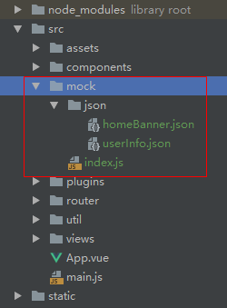

### `vue-cli`依赖

#### 必要依赖

##### `autoprefixer`

1）`vue-cli`默认开启了`autoprefixer`

2）修改 `package.json`  或者 `.browserslistrc`

```
"browserslist": [
    "> 1%",
    "last 3 versions",
    "not ie <= 8",
    "chrome >= 14",
    "safari >= 3",
    "ios >= 8",
    "android >= 4.0"
 ]
```

3）在根目录新建 `postcss.config.js` 文件，输入以下配置，重启项目

```
module.exports = {
	plugins: {
		autoprefixer: {}
	}
}
```

##### `axios`

安装

```
yarn add axios
```

引用

```
// main.js
import axios from 'axios'

Vue.prototype.$axios = axios
```

组件使用

```
this.$axios.post('url', data).then(res =>{})
```


#### 可选依赖

##### `element-ui`

管理系统的`ui`框架

```
// 文档地址
https://element.eleme.cn/#/zh-CN
```

##### `vue-meta`

主要用于管理`HTML`头部标签

安装：

```
yarn add vue-meta
```

引入：

```
// main.js 引入
import VueMeta from 'vue-meta'
Vue.use(VueMeta)

// App.vue 中使用
export default {
	name: 'App',
	metaInfo: {
    title: 'My Example App',
    titleTemplate: '%s - Yay!',
    htmlAttrs: {
      lang: 'en',
      amp: true
    }
  }
}
```

##### `normalize.css`

```
// 安装
yarn add normalize.css

// 使用
import 'normalize.css/normalize.css'
```


### `vue2.x`

#### `js-cookie`

##### 安装

```
npm install js-cookie --save
```

##### 使用

```
// main.js 引入
import Cookies from 'js-cookie'

Vue.prototype.$cookies = Cookies

// 其他引用
this.$cookies.set()
```

##### 语法

1）标准语法

```
//保存到cookie

// Create a cookie, valid across the entire site:
Cookies.set('name', 'value');

// Create a cookie that expires 7 days from now, valid across the entire site:
Cookies.set('name', 'value', { expires: 7 });

// Create an expiring cookie, valid to the path of the current page:
Cookies.set('name', 'value', { expires: 7, path: '' });

//从cookie中取出
// Read cookie:
Cookies.get('name'); // => 'value'
Cookies.get('nothing'); // => undefined

// Read all visible cookies:
Cookies.get(); // => { name: 'value' }

//删除cookie
// Delete cookie:
Cookies.remove('name');

// Delete a cookie valid to the path of the current page:
Cookies.set('name', 'value', { path: '' });
Cookies.remove('name'); // fail!
Cookies.remove('name', { path: '' }); // removed!
```

2）取值应注意事项

```
//跟一般使用不同的是，从Cookie中取出的时候，要从字符串转换成json格式：
const user = {
  name: 'lia',
  age: 18
}
Cookies.set('user', user)
const liaUser = JSON.parse(Cookies.get('user'))
```

3）设置过期时间

参考文档

```
https://github.com/js-cookie/js-cookie/wiki/Frequently-Asked-Questions#expire-cookies-in-less-than-a-day
```

从现在开始15分钟后过期

```
var inFifteenMinutes = new Date(new Date().getTime() + 15 * 60 * 1000);
Cookies.set('foo', 'bar', {
    expires: inFifteenMinutes
});
```

4）删除所有 `cookie`

```
Object.keys(Cookies.get()).forEach(
    function(cookieName) {
  		var neededAttributes = {
    		// Here you pass the same attributes that were used when the cookie was created
    		// and are required when removing the cookie
  };
  Cookies.remove(cookieName, neededAttributes);
});
```


#### `mock.js`

##### 基础使用

1）安装

```
yarn add --dev mockjs

or

npm install mockjs --save-dev
```

2）新建目录

`src`目录下新建下图的文件结构



上图项目中的代码

`index.js`

```
const Mock = require('mockjs');
//格式： Mock.mock( url, post/get , 返回的数据);
Mock.mock('/user/userInfo', 'get', require('./json/userInfo'));
Mock.mock('/home/banner', 'get', require('./json/homeBanner'));
```

`json`文件中的内容

```
// homeBanner.json

{
  "result": "success",
  "data": {
    "mtime": "@datetime", //具体应用看官方文档
    "score|1-800": 800,
    "rank|1-100":  100,
    "stars|1-5": 5,
    "nickname": "@cname"
  },
  "msg": ""
}
```

3）使用

```
// main.js 引入
import axios from 'axios' //需要使用到 axios
Vue.prototype.axios = axios;  //挂载 axios
require('./mock'); //引入mock数据，关闭则注释该行

// axios 请求
this.axios.get('/user/userInfo')
  .then(function(res){
    console.log(res);
  })
  .catch(function(err){
    console.log(err);
  });
```


#### 导出表格

##### 说明

```
// 本文借鉴 vue-element-admin, 并基于此基础上进行改造，以便可以修改所需样式
// Excel 的导入导出都是依赖于js-xlsx来实现的。
// 在 js-xlsx 的基础上又封装了Export2Excel.js来方便导出数据。
```

##### 安装依赖

```
// 必须安装
yarn add xlsx@0.14.1 xlsx-style file-saver
// 这个 vue-cli 好像不一定要安装,等报错再装
yarn add --dev script-loader
```

当安装 `xlsx-style`报错时:


```
// 配置 vue.config.js
module.exports = {
  configureWebpack: {
    externals: {
      "./cptable": "var cptable",
    },
  },
};
```

##### `Export2Excel.js`

```
https://blog.csdn.net/qq_45200669/article/details/124191345

https://blog.csdn.net/xingchen678/article/details/102686621
```

#### 时间处理

```
monentjs dayjs
```

#### `swiper`

##### 适用版本

现官网`demo`支持`vue3`，适用`vue2`使用以下版本

```
yarn add swiper@5.1.0 vue-awesome-swiper@4.1.1
```

##### 参考文档

```
// 1. vue-awesome-swiper的 github 地址
https://github.com/surmon-china/vue-awesome-swiper

// 2. vue-awesome-swiper demo
https://v1.github.surmon.me/vue-awesome-swiper

// 3. swiper 配置项
https://www.swiper.com.cn/api
```

##### 手动操作后不继续轮播

```
 var swiper = new Swiper('.swiper-container', {
   autoplayDisableOnInteraction: false,//这个加了没啥用
   on: {
     slideChangeTransitionEnd: function() {
     		this.autoplay.start();//就加这个玩意儿
     },
   }
 });
```

#### `vue-signature`

##### 简介

实现在线签名功能

##### 用法

```
https://www.npmjs.com/package/vue-signature
```

### 其他

#### `monent.js`

时间转化

##### 起步

```
// 安装
yarn add moment

// 引用
import moment from 'moment'

// 挂载
Vue.prototype.$moment = moment;

// 使用
this.$moment.
```

##### 语法

```
// 获取当前时间

```


#### `nanoid`

随机`ID`生成器，生成`ID`不重复

##### 安装

```
yarn add nanoid
```

##### 使用

```
import { nanoid } from 'nanoid'
// 直接使用 nanoid() 就能生成一个独一无二的id
model.id = nanoid() //=> "V1StGXR8_Z5jdHi6B-myT"
```


#### `vconsole`

移动端的开发调试，使用此插件比较实用

##### 安装

```
yarn add --dev vconsole || npm install vconsole
```

##### 引入

```
//在 main.js 引入

// 开发环境下面使用vConsole进行调试
if (process.env.NODE_ENV === 'development') {
  const VConsole = require('vconsole')
  new VConsole()
}
```


### 服务端

#### `json-server`

##### 简介

一个简单的本地服务，可以通过接口，处理获取`json`中的数据

##### 安装

```
npm install -g json-server
```

##### 创建 `db.json`

新建个文件夹，创建 `db.json`文件

```
{
  "posts": [
    { "id": 1, "title": "json-server", "author": "typicode" }
  ],
  "comments": [
    { "id": 1, "body": "some comment", "postId": 1 }
  ],
  "profile": { "name": "typicode" }
}
```

##### 监听数据

在命令行中执行，即可监听到数据变化

```
json-server --watch db.json
```

