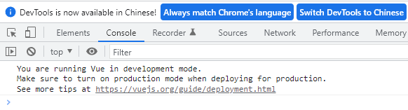
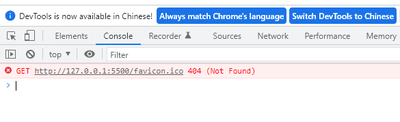

### 全局配置

#### `Vue.config`

`Vue.config` 是一个对象，对`Vue`的全局配置，一次修改，全局都能使用

#### `productionTip`

当我们引入开发版本的`vue`，浏览器会有一个生产提示。使用`productionTip`可以配置是否提示

```
<script src="./js/vue.js"></script>
<script>
	// 配置是否在启动时生成生产提示
	Vue.config.productionTip = false
</script>
```

下图为控制台打印的提示信息：



### 全局 `API`

#### `Vue.use()`

当我们执行 `Vue.use()` 方法时，就会执行 `js` 中的`install` 方法。

`install`方法名是特定的，在此之中可以注册组件等。

### 移动端事件

```
<!-- 触摸  -->
<div @touchstart.prevent=""></div>

<!-- 滑动  -->
<div @touchstart.prevent=""></div>

<!-- 触摸结束  -->
<div @touchend.prevent=""></div>
```

### 命名规则

1）目录名称

```
使用小写，多个单词用 - 隔开
例如： my-project
```

2）组件名称

```
// 使用大驼峰式命名
例如：StuedentLive.vue
```

### 修饰符

#### `.sync` 

1）使用场景

子组件想要直接修改父组件传入的值时，需要对一个 prop 进行双向绑定

2）语法

```
//父组件

// 本质上是这样的：
<text-doucument
	:title = "doc.title"
	@update:title="doc.title = $event"
>
</text-doucument>

// 使用 .sync 语法糖：
<text-doucument :title.sync="doc.title"></doucument>

// 子组件
this.$emit('update:title'，newTitle) // update;title  冒号之间不能存在空格
```

3）用一个对象同时设置多个prop

```
//doc 为一个对象
<text-doucument :title.sync="doc"></doucument>
```

4）注意事项

```
.sync 修饰符的 v-bind 不能与表达式一起使用
```

### 计算属性

#### `setter`

```vue
//监听的值更新了，比如以下的fullName更新，setter就会被调用，若在setter下改变了getter方法计算的值，fullName，也会随着更新。
vm.fullName = 'Job Work'

computed: {
	fullName:{
		get(){
			return this.firstName + this.lastName
		},
		set(newValue){ //newValue 为 fullName 的值
			var name = new Value.split('')
			this.firstName = name[0];
			this.lastName = name[name.length -1]
		}
	}
}
```

##### 传参

```js
:data="computedData(123)"
computed:{
    computedData(val){
        return function(val){
            /** do something */
            retrun val
        }
    }
}
```

##### 返回对象

有时候需要在计算属性中返回对象，适用以下写法

```
// template
// 获取len,并传参
<h3>{{comArray(specialtyOptionCourse).len}}</h3>
// 获取code,并传参
<h3>{{comArray(specialtyOptionCourse).code}}</h3>

// script
comArray(){
	return (arr) => {
		let list = arr.filter(ele => ele.isRecommend)
		let code = list.reduce((pre, cur) => pre + cur.credit, 0)
		return {
			len : list.length,
			code: code        
		}
	}
}
```

### 路由相关

#### 页面置顶

切换组件时，页面默认回到顶部

```
// F12 打开调试工具的时候可能看不到效果
let router = new Router({
  routes: routes,
  scrollBehavior(to, from, savedPosition) {
    if (savedPosition) {
      return savedPosition;
    }
    return { x: 0, y: 0 };
  }
})
```

### 指令

#### `v-html`

##### 常见问题

当 `html `中有换行符时，处理方式

```
// 使用 white-space: pre-wrap 属性

<div style="white-space: pre-wrap" v-html="content"></div>
```

#### `v-model`

实现数据的双向绑定，要存在`value`值

##### 表单元素

###### 基础

1）定义

`v-model` 指令在表单` <input>`、`<textarea>`、`<select>`元素上创建双向数据绑定。

2）实现

```
<input v-model="sth" />
//  等同于
<input :value="sth" oninput="sth = $event.target.value" />
```

`v-model` 在内部为不同的输入元素使用不同的 `property` 并抛出不同的事件：

| 元素                  | 属性(property) | 事件   |
| --------------------- | -------------- | ------ |
| `text` 和 ` textarea` | value          | input  |
| `checkbox` 和 `radio` | checked        | change |
| `select`              | value          | change |

###### 表单组件

1）默认

一个组件上的`v-model`默认会利用名为 `value` 的 `prop` 和名为 `input` 的事件

```
// 名为 base-text 组件
<template>
	<div>
		<input 
			type="text"
			:input="value" 
			@input="$emit('input', $event.target.value)" 
		/>
	</div>
</template>

<script>
	props: {
		value: {}
	}
</script>

// 实现组件双向绑定
<base-text v-model="text" @input="handleInput"></base-text>

此时，组件中的 value 值为 text 传入的值，当 value 值改变时， text 值也会变化
```

2）改变默认属性

使用 `model` 选项修改默认的值

```
<template>
	<div>
		<input
    	type="checkbox"
    	v-bind:checked="checked"
    	v-on:change="$emit('change', $event.target.checked)"
    >
	</div>
</template>

<script>
	model:{
		prop: 'checked',
		event: 'change'
	}
	props: {
		checked: Boolean
	}
</script>

// 
<base-text v-model="text" @input="handleInput"></base-text>
```

##### 自定义组件

###### 组件实现`v-model`

当 `v-model`在非表单组件中使用时

```
// v-model 默认会利用子组件的 props 中绑定的 value 值和触发 input 事件达到双向绑定

// 子组件
<template>
  <div class="base-test">
    <el-button type="primary" @click="toClick">点击加1</el-button>
    <slot></slot>
  </div>
</template>
<script>
export default {
  props: {
    value: { // props 绑定子组件
      type: Number,
      default: 0
    },
  },
  methods: {
    toClick(){
      let val = this.value + 1
      this.$emit('input', val) // 触发的方法
    }
  }
}
</script>

// 父组件 使用 v-model 更新数据
<base-test v-model="initData"> 
	<div>data: {{initData}}</div>
</base-test>
```

### 语法

#### `vue`模板语法

##### 插值语法

```
// 两对花括号
{{}}
```

##### 指令语法

```
v-xxx
```

#### `el`的两种写法

```
// 第一种写法
const vm = new Vue({
	el: '#app'
})

// 第二种写法
const vm = new Vue({
	//这里面不写 el
})
console.log(vm)
//去v实例的原型对象方法进行挂载
vm.$mount('#app')  // 将vue解析的内容挂载到 <div id="app"> 的容器上去
```

#### 关于`data`

##### `data`的两种写法

```
// 对象式
const vm = new Vue({
	data: {
	
	}
})

// 函数式
const vm = new Vue({
	data(){ // 正常是 data:function(){},一般在对象中写方法会删掉:function
		return {
			
		}
	}
})
```

##### `data`不能使用箭头函数

```
// 正确
const vm = new Vue({
	data(){
		console.log('this', this) // 这个this是vue调用的，所以指向vue实例对象
		return {}
	}
})

//错误
const vm = new Vue({
	data:()=>{ // 箭头函数没有自己的 this,会往上级找this
		console.log('this', this) // 这个this指向是全局的window
		return {}
	}
})

// 由vue所管理的函数，不能使用箭头函数
```

#### 数据代理

##### `Object.defineProperty`

```
<script>
	let person = {
		name: 'John',
		sex: '男',
		// age: 30  若在对象中配置，都可以对此属性进行操作
	}

	let number = 19

	// 若使用 Object.defineProperty 定义，则可以自定义配置
	Object.defineProperty(person, 'age', {
		// value: 35,
		// enumerable: true,  // 控制属性是否可以枚举
		// writable: true, // 控制属性是否可以修改， 默认值 false
		// configurable: true, // 控制属性是否可以删除，默认值 false

		// 当有人读取 person 的 age 属性时，get 函数(getter)就会被调用。
		// 且需要放回值，返回值就是 age 的值
		// 如果是读取整个对象,要点击控制台（...)，才会触发
		get(){
			console.log('有人读取age属性了')
			return number
		},
    // 当有人修改 person 的 age 属性时，set 函数(setter)就会被调用。
    // value 就是修改的属性值
    set(value){
      console.log('有人修改 age 属性了，值是', value)
      // 此时修改 number 的值，就可以改变对象中 age 的值了
      number = value
    }
	})

	// enumerable 为 false, 则该属性不能被遍历
	console.log('key', Object.keys(person))

	console.log('person',person)

</script>
```

##### 定义

数据代理：通过一个对象代理对另一个对象中属性操作(读/写)

##### 最简单的数据代理

```
<script>
    const obj = { x: 100}
    const obj2 = {y: 100}

    // 通过修改 obj2 来读取或写入 obj 的 x 值
    Object.defineProperty(obj2, 'x', {
      get(){
        return obj.x
      },
      set(value){
        obj.x = value
      }
    })
  </script>
```

#### 事件处理

##### 事件占位符

```
// $event 可以放置在任何位置
<div @click="to($event)"></div>
```

### `axios`

#### 基础配置

安装

```
yarn add axios
```

引用

```
// main.js
import axios from 'axios'

Vue.prototype.$axios = axios
```

组件使用

```
this.$axios.post('url', data).then(res =>{})
```

### 组件收录

#### `web`端组件

##### 调起打印机

```
// 使用 print.js
https://github.com/Allshadow/vue-components-demo/tree/master/src/components/BasePrint
```

#### 移动端组件

##### 电子签名

基于 `vant` 与`vue-signature`的简单签名组件

```
// 运行此项目，点击电子按钮签名看示例

https://github.com/Allshadow/mobile-demo
```

##### 滑块验证码

```
https://github.com/Allshadow/mobile-demo
```

### 功能

#### 监听关闭

使用 `beforeDestroy` 生命周期

```
// 结合监听来使用可以使窗口关闭操作生效
mounted() {
	window.addEventListener('beforeunload', e => this.cancelSave(e))
},

method:{
	async cancelSave(){
    ...关闭内容
    // const data ={
    //	 exerciseId: this.exerciseId
    // }
    // let res = await this.$api(this.$cfg.API.teacher.exerciseCanel, data)
  }
}，

beforeDestroy(){
	this.cancelSave()
	window.removeEventListener('beforeunload', e => this.cancelSave(e))
}
```

#### 实现置顶功能

##### `scrollIntoView()`

1）简介

 `scrollIntoView()`方法将调用它的元素滚动到浏览器窗口的可见区域

根据其他元素的布局，元素可能无法滚动到顶部或底部。（例如：该元素已经是原素的最底部）

页面可滚动时才有用

2）使用

```
// 正常使用
var element = document.getElementById("box");

element.scrollIntoView();

// vue 中使用
this.$nextTick(() => {
  // 获取 dom 元素
  this.$refs.item.$el.scrollIntoView({
  	behavior: 'smooth' 
  })
})
```

3）当页面上有定位元素时，不想滚动到最顶部，可使用以下方式

##### `scroll`

```
let element = document.getElementById('xx');
let height = document.getElementById('xx').offsetTop; //计算需要向上移动的距离
element.scroll({
  top: height, //向上移动的距离，如果有fixede布局， 直接减去对应距离即可
  behavior: 'smooth', // 平滑移动
});
```

#### `tab` 数据持久化

1）需求

当有多个 ` tab`  切换时, 我们如果切换到某个子项时，此时页面中的操作可能会离开本页面，返回后会刷新页面。必然体验不好。所以，我们需要保存当前的选项

2）处理方式

将现有的`tab` 的名称或 index 存到缓存，通过组件内的路由守卫来判断进来的页面，是否需要此缓存的字段

3）实现

```
// 监听路由进来的页面
beforeRouteEnter(to, from, next) {
	next(vm =>{
		// 判断此页面是否需要操作缓存
		if(from.path == '/course' ){
			let homeWorkCookie = {
        activeName: 'first'
      }
			vm.$Cookies.set('homeWorkCookie', JSON.stringify(homeWorkCookie))
		}
	})
},

// 在页面中获取
mounted(){
	this.$nextTick(()=>{
    let tab = JSON.parse(this.$Cookies.get('homeWorkCookie'))
    if(tab.activeName){
    	this.activeName = tab.activeName
    }
  })
}

// tab 切换时保存当前选项到缓存
handleClick(val) {
  let homeWorkCookie = {
  	activeName: val.name
  }
	this.$Cookies.set('homeWorkCookie', JSON.stringify(homeWorkCookie))
}
```

### 其他

#### 本地服务

##### 图标错误

在本地起服务器时，会有以下错误



由于`Live Server`会在5500端口启动一台小服务器，把整个工程里的所有文件或者文件夹当作根资源来使用，所以，在这个目录下放置一个`.ico`文件即可

