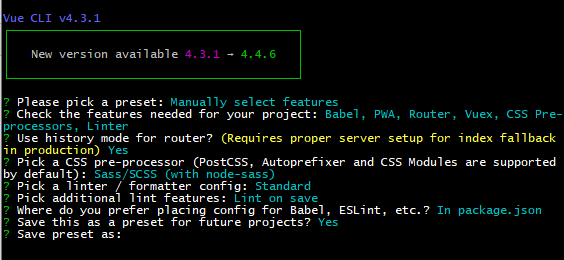

### vue-cli安装

#### 卸载旧版

1）如果有全局安装了旧版本vue-cli (1.x 或者 2.x)，使用以下命令卸载

```
npm uninstall vue-cli -g
# OR
yarn global remove vue-cli
```

#### 安装

1）使用如下命令安装新的包

```npm
npm install -g @vue/cli
# OR
yarn global add @vue/cli
```

####  检查

1）使用一下命令检查安装版本是否正确

```
vue --version
```

### 创建项目

#### vue create

```
//Windows 上通过 minTTY 使用 Git Bash，交互提示符并不工作
$ winpty vue.cmd create [项目名称]
OR
$ vue create [项目名称]
```

#### 预设选择


#### 自定义选择

#使用回车确定

#使用空格选择



#### 启动服务

```
cd [项目名称]
yarn serve
```

1、参考链接

https://www.jb51.net/article/160146.htm

2、config配置

https://juejin.im/post/5bd02f98e51d457a944b634f

### `vue.config.js` 配置

以下为 vue-cli 4 配置

##### 自动打开浏览器

```js
module.exports = {
  devServer: {
    open: true,  //自动开启浏览器
    port：8099 //配置端口号
  }
}
```

##### 反向代理配置

```
// vue.config.js 配置

module.export = {
  devServer: {
		proxy: {
			'/djapi': { // 将以 /djapi 开头的请求转发到 https://danjuanapp.com 底下
        target: 'https://danjuanapp.com',
        changeOrigin: true,
        secure: false,
        // rewrite: (path) => path.replace(/^\/api/, '')
      },
		}
  },
}

// index.vue 使用
<script>
	import axios from 'axios'
	export default {
		mounted(){
			// 发送 axios 请求
      axios.get('/djapi/v3/filter/fund?type=1&order_by=1m&size=10&page=1')
    }
	}
</script>
```

##### 配置 source map

```
module.exports = {
  // 不需要生产环境的 source map
  productionSourceMap: false,
}
```

### 清除 dist 文件

使用到 clean-webpack-plugin 插件

**安装**

```
yarn add --dev clean-webpack-plugin
```

**配置**

```
const { CleanWebpackPlugin } = require('clean-webpack-plugin')

module.exports = {
  configureWebpack: {
    plugins: [
        new CleanWebpackPlugin()
    ],
  }
}
```

### postcss

#### 自动补全 css 前缀插件

1）安装

```
yarn add --dev postcss autoprefixer
```

2）修改 `package.json`  或者 `.browserslistrc`

```
"browserslist": [
    "> 1%",
    "last 3 versions",
    "not ie <= 8",
    "chrome >= 14",
    "safari >= 3",
    "ios >= 8",
    "android >= 4.0"
 ]
```

3）在根目录新建 `postcss.config.js` 文件

```
module.exports = {
	plugins: {
		autoprefixer: {}
	}
}
```

4）重启

##### 常见问题

1）

```
// 问题
Error: PostCSS plugin autoprefixer requires PostCSS 8.Migration

// 解决
yarn add postcss-loader autoprefixer@8.0.0 --dev

重启
```

#### 移动端适配方案

使用`lib-flexible`和`postcss-pxtorem`将`px`单位转化为`rem`单位

1）安装

```
yarn add --dev lib-flexible postcss-pxtorem
```

2）`main.js` 导入 `lib-fiexible`

```
import 'lib-flexible/flexible.js'
```

3）在 `postcss.config.js` 配置

```
module.exports = {
	plugins: {
		autoprefixer: {},
    "postcss-pxtorem": {
      "rootValue": 75,
      "propList": ["*"]
    }
	}
}
```

##### 常见问题

1）

```
//问题
Error: PostCSS plugin postcss-pxtorem requires PostCSS 8.

// 由于 postcss-pxtorem 版本太高
yarn add --dev postcss-pxtorem@5.1.1
```

### `package.json`配置

1）配置局域网访问变量

```
"scripts": {
	// --host 后面为 ip 地址 
	//--port 端口号，可以不用配置，默认端口号
	"dev": "vue-cli-service serve --host 192.168.199.126" --port 9082,
}
```

### 关于 `eslint`

#### 关闭`eslint`

1）配置`vue.config.js`文件

```
module.export = {
	lintOnSave: false, //配置eslint，不生效
	devServer: {
		overlay: {
			warning: false, //配置eslint，不生效
			errors: false //配置eslint，不生效
		}
	},
}

并且注释掉 eslint 配置文件 @vue/standard
"extends": [
	"plugin:vue/essential",
	// "@vue/standard"
],

```

2）注释或删除掉 `eslintrc`配置文件

可能是在`package.json` ，也可能是在  `.eslintrc.js`


