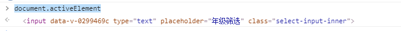

### 标准弹窗模板

```
<template>
  <base-dialog
    :isShow.sync="show"
    title=""
    width="963px"
    :isShowFooter="false"
    :appendToBody="true"
  >
    
  </base-dialog>
</template>

<script>
import BaseDialog from '@/components/common/BaseDialog'

export default {
  
  components: {
    BaseDialog
  },
	data() {
		return {
      show: false,
    };
	},
	computed: {
    
  },
	watch: {
    
  },
	methods: {
    
  },
};
</script>
<style scoped lang="scss">
  
</style>
```

### resource 常用方法

```
async getChangeInfo(){
    try {
    	let res = await this.$api(
    		this.$cfg.API.studentState.getRollWorkSubmit,
    		data
    	);
    } catch (e) {
    	this.$message.error(e.message)
    }
},
```


### input 监听是否已经获取焦点

#### 认识 activeElement 属性

##### 定义

activeElement 属性返回文档中当前获得焦点的元素

document.activeElement 返回什么？

当元素获取焦点时，控制台输入 document.activeElement，返回元素 dom



##### 获取焦点元素

```
document.activeElement.tagName

//返回 'INPUT'
```

#### 在 vue 中使用

在所需要标签上加上 ref 属性

```
<input ref="testInput">
```

在方法中取值, 在对其操作的方法使用

```
showList(isShow){
	//对比两个dom 元素是否相等
	if(this.$refs.testInput === document.activeElement){
		return true
	}else{
		return false
	}
}
```

